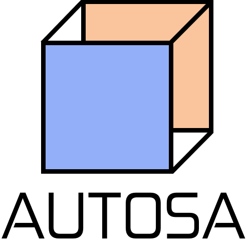
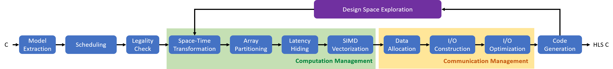
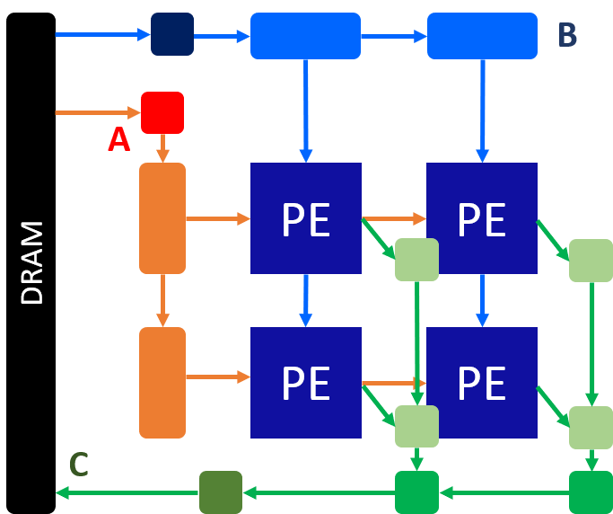

<div align="center">
  
</div>

# AutoSA: Polyhedral-Based Systolic Array Auto-Compilation

This repository includes the code for AutoSA. **AutoSA** is an end-to-end systolic array compiler based on the polyhedral model. It takes algorithms in high-level programming languages (C) as inputs, performs polyhedral transformation and other architecture optimizations to map algorithms to systolic array architecture. The generated designs are in HLS C.

The structure of this repo is as follows:
```

.
|-- README.md: this file
|-- src: directory for AutoSA source code
    |-- isl: directory for Integer Set Library (isl)
    |-- pet: directory for Polyhedral Extraction Tool (pet)
|-- autosa_config: directory for AutoSA configuration files
|-- autosa_scripts: directory for AutoSA scripts
|-- autosa_tests: directory for AutoSA tests
|-- autosa.tmp: directory for temporary file generated by AutoSA
    |-- output: directory for generated code by AutoSA
        |-- src: diretory for generated HLS C kernel code and OpenCL host code
        |-- latency_est: directory for metadata used for latency estimation of the generated design
        |-- resource_est: directory for metadata used for resource estimation of the generated design
    |-- optimizer: directory for intermediate files generated by AutoSA Optimizer
```

## Contents
1. [Latest Features](#latest-features)
2. [Prerequisites](#prerequisites)
3. [Getting Started](#getting-started)
   1. [Compilation](#compilation)
   2. [Use AutoSA to generate HLS code](#use-autosa-to-generate-hls-code)
   3. [Use AutoSA in manual mode](#user-autosa-in-manual-mode)
   4. [AutoSA compilation options](#autosa-compilation-options)
4. [Design Examples](#design-examples)
5. [Send Us Failure Cases and Feedback!](#send-us-failure-cases-and-feedback)
6. [Authors and Contributors](#authors-and-contributors)
7. [Version History](#version-history)

## Latest Features
+ [2020/9/21] Auto-tuner (alpha) is released.
+ [2020/6/21] Intel back-end is added.
+ [2020/6/8] Docker image is released.
+ [2020/5/24] Added HBM support.
+ [2020/5/17] Version 0.01 is released.

## Prerequisites
### PPCG
AutoSA is build upon PPCG 0.08.3 (source repository: http://repo.or.cz/ppcg.git).
Below are the requirements for installing PPCG:
- automake, autoconf, libtool
	(not needed when compiling a release)
- pkg-config (http://www.freedesktop.org/wiki/Software/pkg-config)
	(not needed when compiling a release using the included isl and pet)
- gmp (http://gmplib.org/)
- libyaml (http://pyyaml.org/wiki/LibYAML)
	(only needed if you want to compile the pet executable)
- LLVM/clang libraries, 2.9 or higher (http://clang.llvm.org/get_started.html)
	Unless you have some other reasons for wanting to use the svn version,
	it is best to install the latest release (3.9).
	For more details, see pet/README.

If you are installing on Ubuntu, then you can install the following packages:

automake autoconf libtool pkg-config libgmp3-dev libyaml-dev libclang-dev llvm

Note that you need at least version 3.2 of libclang-dev (ubuntu raring).
Older versions of this package did not include the required libraries.
If you are using an older version of ubuntu, then you need to compile and
install LLVM/clang from source.
### Others
+ Python3.6+ and corresponding `pip`

## Getting Started
### Compilation
```bash
./install.sh
```
Alternatively, we offer a Docker image for quick start. Run the following command to pull the AutoSA Docker image:
```bash
docker pull whbldhwj/autosa:latest
```

### Use AutoSA to Generate HLS Code
1. Annotate the code region to be transformed to HLS C.

Insert a line containing 
```c
#pragma scop
```
before the fragment and add a line containing
```c
#pragma endscop
```
after the fragment.

2. Generate HLS C and OpenCL host code.

Run
```c
./autosa ./autosa_tests/mm/kernel.c --config=./autosa_config/autosa_config.json --target=autosa_hls_c --output-dir=./autosa.tmp/output --sa-sizes="{kernel[]->array_part[16,16,16];kernel[]->latency[8,8];kernel[]->simd[2]}" --simd-info=./autosa_tests/mm/simd_info.json --host-serialize
```
where `kernel.c` is the file containing the fragment. The generated code can be found in `autosa.tmp/output/src/kernel_host.cpp` and `autosa.tmp/output/src/kernel_kernel.cpp`. For detailed explaination of each AutoSA compilation option, please run
```c
./autosa --help
```
or refer to [AutoSA compilation options](#autosa-compilation-options).

3. Generate FPGA bitstream.

Set up the Vitis development kit first, run the following commands.
```
# Set up Xilinx Vitis tools.
source /opt/Xilinx/Vitis/2019.2/settings64.sh
# Set up runtime.
source /opt/xilinx/xrt/setup.sh
```

Execute the makefile to build the design.
```
cp autosa_tests/mm/Makefile autosa.tmp/output/
cp autosa_tests/mm/connectivity.cfg autosa.tmp/output/
cd autosa.tmp/output
make all
```
>**Makefile Options Descriptions**
>
>* `MODE := hw_emu`: Set the build configuration mode to HW Emulation, other modes: sw_emu|hw
>* `PLATFORM := xilinx_u250_xdma_201830_2`: Select the target platform
>* `KERNEL_SRC := src/kernel_kernel.cpp`: List the kernel source files
> * `HOST_SRC := src/kernel_host.cpp`: List the host source files

The `connectivity.cfg` describes the DRAM port mapping. For more details about how to change the DRAM port mapping, please refer to the Xilinx tutorials: [Using Multiple DDR Banks](https://github.com/Xilinx/Vitis-Tutorials/blob/master/docs/mult-ddr-banks/README.md).

4. Generate Xilinx HLS project.

AutoSA also supports generate HLS projects. Add the option
```
--hls
```
to the command when compiling the program.

AutoSA will generate an HLS host file `autosa.tmp/output/src/kernel_host.cpp` instead of the OpenCL host file generated in the previous step. To build the HLS project, run the following commands.
```
cp autosa_scripts/hls_scripts/hls_script.tcl autosa.tmp/output/
cd autosa.tmp/output
vivado_hls -f hls_script.tcl
```

### Use AutoSA in Manual Mode
The figure below depicts the overall compilation flow of AutoSA.
<div align="center">
  
</div>

1. **Model extraction**: This step extracts the polyhedral model from the input C code.
2. **Scheduling**: This step leverages the [isl](http://isl.gforge.inria.fr/) scheduler to construct a new schedule using the Pluto algorithm.
3. **Legality check**: This step checks if the generated schedule is legal to be mapped to systolic arrays.
4. **Computation management**: This step constructs the PE arrays and optimizes the micro-architecture of PEs to improve the compute efficiency.
   1. **Space-time transformation**: This step applies the space-time transformation to transform programs to systolic arrays.
   2. **Array partitioning**: This step partitions the array into smaller sub-arrays.
   3. **Latency hiding**: This step tiles and permutes the parallel loops to the innermost to hide the pipeline latency.
   4. **SIMD vectorization**: This step vectorizes the computation inside PEs.
5. **Communication management**: This step generates and optimizes the I/O network for data communication between PEs and the external memory.
6. **Code generation**: This step generates the HLS C code.
7. **Design space exploration (optional)**: This step searches for the best design (with the least latency) given the hardware constraints.

For step 4, AutoSA can apply the optimization in two modes: *auto* and *manual*. In the auto mode, AutoSA will proceed based on the pre-set policy. In the manual mode, AutoSA will dump out the optimization choices, take the user input, and apply the optimization based on the user specification. To switch between two different modes, modify the knobs in `autosa_config/autosa_config.json`.
For example, modify the content in `autosa_config/autosa_config.json` to:
```json
"array_part": {
  "enable": 1,
  "mode": "auto"
}
```
to enable the array partitioning and execute it in the auto mode.
Modify the content to:
```json
"array_part": {
  "enable": 1,
  "mode": "manual"
}
```
to execute this step in the manual mode.

Below we explain how to use AutoSA in manual mode in detail.

* __Space-time transformation__:
In this step, multiple systolic arrays are generated for the input program. We will need to select one systolic array to proceed. We set this step to manual mode in the AutoSA configuration file. 
```json
"space_time": {  
  "mode": "manual"
}
```
Then run the command:
```c
./autosa ./autosa_tests/mm/kernel.c --config=./autosa_config/autosa_config.json --target=autosa_hls_c --output-dir=./autosa.tmp/output
```
AutoSA will generate a file `autosa.tmp/output/tuning.json` which includes guidance information for further optimization. In this example, we have the content below:
```json
"space_time": {
  "n_kernel": 6
}
```
This tells the user that there are 6 different systolic array candidates that are generated. We may select one of them to proceed. For example, we could select the fourth candidate which is a 2D systolic array with the data from matrix `A` transferred horizontally, and data from matrix `B` transferred vertically. Each PE computes one element of `C[i][j]` locally, which is drained out at last to the external memory. The architecture of this array is depicted below. 
<div align="center">
  
</div>

To guide AutoSA to select this design, we will provide AutoSA with the new argument
```
--sa-sizes="{kernel[]->space_time[3]}"
```
which tells AutoSA to select the fourth array (index starting from 0) during the space-time transformation.

* __Array partitioning__: In this step, we will tile the space loops to partition the original array into smaller ones. The computation is then scheduled onto the sub-arrays in sequence. We first set this step in manual mode. Then run the command:
```c
./autosa ./autosa_tests/mm/kernel.c --config=./autosa_config/autosa_config.json --target=autosa_hls_c --output-dir=./autosa.tmp/output --sa-sizes="{kernel[]->space_time[3]}"
```
The `tuning.json` contains the content below:
```json
"array_part": {
  "tilable_loops": [64, 64, 64]
}
```
This tells users there are three candidate loops that can be tiled. The upper bounds of each loop is 64. We may select any tiling factor no greater than 64. Besides, AutoSA only supports tiling factors as sub-multiples of the loop bounds for now. If the user is interested to understand which three loops are selected as the candidate loops, add the option `--AutoSA-verbose` to the command and run again.
```c
./autosa ./autosa_tests/mm/kernel.c --config=./autosa_config/autosa_config.json --target=autosa_hls_c --output-dir=./autosa.tmp/output --sa-sizes="{kernel[]->space_time[3]}" --AutoSA-verbose
```
AutoSA will print the schedule tree of the program and mark the candidate loops to be optimized. Please refer to the manual of [isl](http://isl.gforge.inria.fr/) for details of the schedule tree.

As an example, we select the tiling factors `[16,16,16]`. Run the command below:
```c
./autosa ./autosa_tests/mm/kernel.c --config=./autosa_config/autosa_config.json --target=autosa_hls_c --output-dir=./autosa.tmp/output --sa-sizes="{kernel[]->space_time[3];kernel[]->array_part[16,16,16]}"
```

* __Latency hiding__: In this step, we will select parallel loops, tile them, permute them to the innermost to hide the computation latency. After the previous step, we will find the content below in the `tuning.json`:
```json
"latency": {
  "tilable_loops": [16, 16]
}
```
We select the tiling factors `[8,8]` to proceeed. Run the command:
```c
./autosa ./autosa_tests/mm/kernel.c --config=./autosa_config/autosa_config.json --target=autosa_hls_c --output-dir=./autosa.tmp/output --sa-sizes="{kernel[]->space_time[3];kernel[]->array_part[16,16,16];kernel[]->latency[8,8]}"
```

* __SIMD vectorization__: In this step, we will select the vectorizable loop, tile them, permute them to the innermost. The point loop will be unrolled by HLS at last. In the current AutoSA, a loop is set as the target loop for vectorization if meeting the following criteria:
  * It is a parallel loop or reduction loop annodated by users. 
  * All array references within the loop are stride-one or stride-zero in regard to this loop.
For the reduction loops, AutoSA requires users to annotate the loop manually. This is done by providing a `simd_info.json` file to the compiler. For our example, we can provide a `simd_info.json` file with the content below:
```json
"kernel3": {
  "reduction": ["y"]
}
```
AutoSA will examine each time loop in the program. For matrix multiplication example, we only have one time loop. This file tells AutoSA that the first non-parallel time loop it encounters is a reduction loop. By supplying this file to AutoSA, AutoSA will take this loop into consideration. Run the command below to proceed:
```c
./autosa ./autosa_tests/mm/kernel.c --config=./autosa_config/autosa_config.json --target=autosa_hls_c --output-dir=./autosa.tmp/output --sa-sizes="{kernel[]->space_time[3];kernel[]->array_part[16,16,16];kernel[]->latency[8,8]}" --simd-info=./autosa_tests/mm/simd_info.json
```
And we can find the updated `tuning.json`:
```json
"simd": {
  "tilable_loops": [16],
  "scores": [15],
  "legal": [1],
  "sa_dims": [2, 2]
}
```
This tells us that the candidate loop has the upper bound of 16. We assign a score based on heuristics to each candidate loop. The higher the score is, the more hardware-friendly it is when being selected as the SIMD loop. The item `legal` indicates that this loop can be directly used for optimization. Otherwise, we will need to perform further layout transformation on the arrays used by the program to expose the SIMD opportunity. AutoSA will automatically print out how to perform the layout transformation for such loops.

We select the tiling factor `[2]` and proceed. Run the command:
```c
./autosa ./autosa_tests/mm/kernel.c --config=./autosa_config/autosa_config.json --target=autosa_hls_c --output-dir=./autosa.tmp/output --sa-sizes="{kernel[]->space_time[3];kernel[]->array_part[16,16,16];kernel[]->latency[8,8];kernel[]->simd[2]}" --simd-info=./autosa_tests/mm/simd_info.json
```
After this step, you should be able to find the files of the generated arrays in `autosa.tmp/output/src`.

### AutoSA Compilation Options
* __`--autosa`__: Use AutoSA to generate systolic arrays. Default: yes.
* __`--config=<config>`__: AutoSA configuration file.
* __`--data-pack`__: Enable data packing for data transfer. Default: yes.
* __`--data-pack-sizes=<sizes>`__: Data packing factors for L1/L2/L3 I/O modules. Default: `kernel[]->data_pack[8,32,64]`
* __`--double-buffer`__: Enable double-buffering for data transfer. Default: yes.
* __`--double-buffer-style=<id>`__: Choose the double buffer coding style: 0 - while loop 1 - for loop. Default: 1.
* __`--fifo-depth=<depth>`__: FIFO depth. Default: 2.
* __`--hbm`__: Use multi-port DRAM/HBM (Alpha). Default: no.
* __`--hbm-port-num=<num>`__: Default HBM port number. Default: 2.
* __`--hls`__: Generate Xilinx HLS host, otherwise, OpenCL host is generated. Default: no.
* __`--host-serialize`__: Serialize the data on the host side to improve the effective DRAM BW (Alpha). Default: no.
* __`--insert-hls-dependence`__: Insert Xilinx HLS dependence pragma (Alpha). Default: no.
* __`--int-io-dir=<dir>`__: Set the default interior I/O direction: 0 - [1,x] 1 - [x,1]. Default: 0.
* __`--loop-infinitize`__: Apply loop inifinitization optimization (Intel OpenCL only). Default: no.
* __`--local-reduce`__: Generate non-output-stationary array with local reduction (Alpha). Default: no.
* __`--reduce-op=<op>`__: Reduction operator (must be used with local-reduce together).
* __`--lower-int-io-L1-buffer`__: Lower the L1 I/O buffer for interior I/O modules. Default: no.
* __`--max-sa-dim=<dim>`__: Maximal systolic array dimension. Default: 2.
* __`--output-dir=<dir>`__: AutoSA output directory. Default: `./autosa.tmp/output`
* __`--sa-sizes=<sizes>`__: Computation management options.
* __`--sa-tile-size=<size>`__: Default tile size in computation management. Default: 4.
* __`--sa-type=sync|async`__: Systolic array type. Default: async.
* __`--simd-info=<info>`__: SIMD information.
* __`--simd-touch-space`__: Taking space loops into consideration for SIMD vectorization. Default: no.
* __`--two-level-buffer`__: Enable two-level buffering in I/O modules. Default: No.
* __`--uram`__: Use Xilinx FPGA URAM. Default: No.
* __`--use-cplusplus-template`__: Use C++ template in codegen (necessary for irregular PEs). Default: no.
* __`--AutoSA-verbose`__: Print verbose compilation information. Default: No.

## Design Examples
No. | Design Example | Description    | Board        | Software Version
----|----------------|----------------|--------------|------------------
1   | [autosa_tests/mm](autosa_tests/mm/) | Small-size matrix multiplication | Xilinx Alveo U250 | Xilinx Vitis 2019.2
2   | [autosa_tests/mm_hbm](autosa_tests/mm_hbm/) | Small-size matrix multiplication using HBM | Xilinx Alveo U280 | Xilinx Vitis 2019.2
3   | [autosa_tests/mm_int16](autosa_tests/mm_int16/) | Small-size matrix multiplication using int16 datatype | Xilinx Alveo U250 | Xilinx Vitis 2019.2
4   | [autosa_tests/cnn](autosa_tests/cnn/) | Small-size single layer of convolutional neural network | Xilinx Alveo U250 | Xilinx Vitis 2019.2
5   | [autosa_tests/lu](autosa_tests/lu/) | Small-size LU decomposition | Xilinx Alveo U250 | Xilinx Vitis 2019.2
6   | [autosa_tests/large/mm](autosa_tests/large/mm/) | Large-size matrix multiplication | Xilinx Alveo U250 | Xilinx Vitis 2019.2
7   | [autosa_tests/large/mm_int16](autosa_tests/large/mm_int16/) | Large-size matrix multiplication using int16 datatype| Xilinx Alveo U250 | Xilinx Vitis 2019.2
8   | [autosa_tests/large/mm_int8](autosa_tests/large/mm_int8/) | Large-size matrix multiplication using int8 datatype | Xilinx Alveo U250 | Xilinx Vitis 2019.2
9   | [autosa_tests/large/cnn](autosa_tests/large/cnn/) | Large-size single layer of convolutional neural network | Xilinx Alveo U250 | Xilinx Vitis 2019.2
10  | [autosa_tests/large/ttmc](autosa_tests/large/ttmc/) | Large-size chain of tensor-matrix multiplications (TTMc)| Xilinx Alveo U250 | Xilinx Vitis 2019.2
11  | [autosa_tests/large/mttkrp](autosa_tests/large/mttkrp/) | Large-size matricized tensor times Khatri-Rao product (MTTKRP)| Xilinx Alveo U250 | Xilinx Vitis 2019.2

## Send Us Failure Cases and Feedback!
AutoSA is open source for research purposes, and we would like to continously improve it! Please let us know if...

1. you find any bug in the AutoSA code.
2. you find any application that fails the compilation flow of AutoSA.
3. you know how to further help improve any part of the compiler.
4. etc.

## Authors and Contributors
AutoSA is currently maintained by [Jie Wang](http://cadlab.cs.ucla.edu/~jaywang/).
Besides, we gratefully acknowledge the authors of PPCG for developing and actively maintaining PPCG as an open-source project.

## Citation
If you find AutoSA useful in your research projects, please consider kindly citing our work.
```
@inproceedings{autosa,
author = {Jie Wang and Licheng Guo and Jason Cong},
title = {AutoSA: A Polyhedral Compiler for High-Performance Systolic Arrays on FPGA},
booktitle = {Proceedings of the 2021 ACM/SIGDA International Symposium on Field Programmable Gate Arrays},
year = {2021}
}
```
You may find our paper [here](http://cadlab.cs.ucla.edu/~jaywang/papers/fpga21-autosa.pdf).

## Version History
+ [2020/5/17] Version 0.01 is released.
