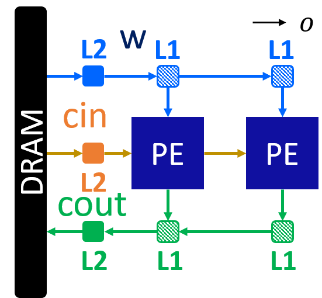
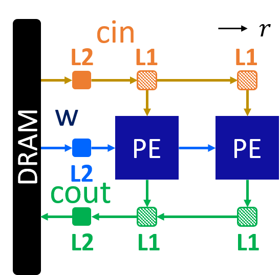
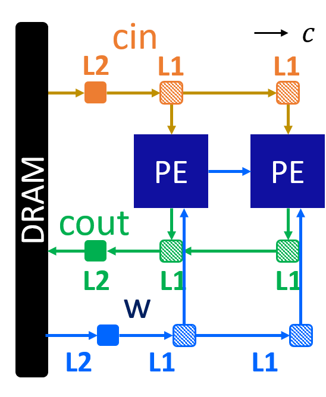
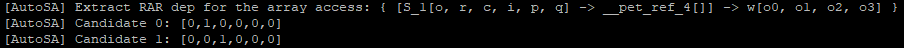
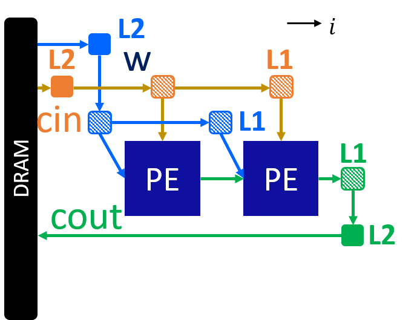
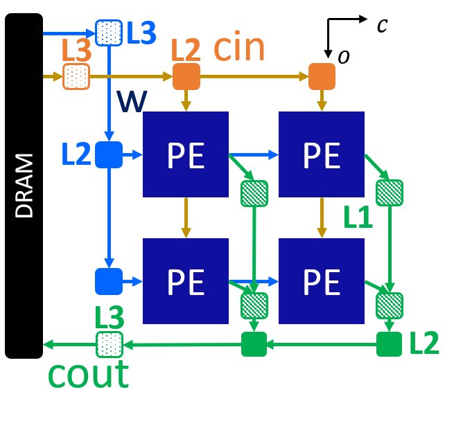
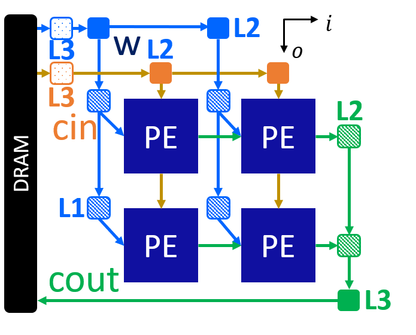
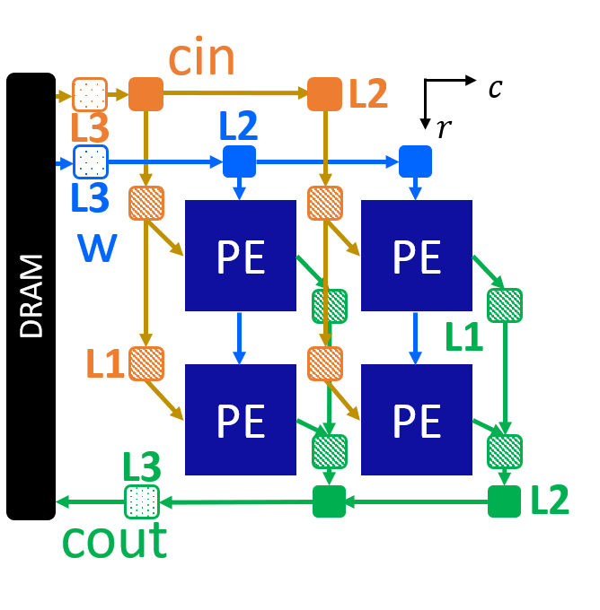

Convolutional Neural Network (Single Layer, Small)
==================================================

**Author**: Jie Wang (jiewang@cs.ucla.edu)

This is an example of small-size CNN. 
The design files can be found at ``${AUTOSA_ROOT}/autosa_tests/cnn``.
The testing environment is summarized in the table below.

+--------------------------+-----------------------------------------------+
| **Target FPGA**          | Xilinx Alveo U250                             |
+--------------------------+-----------------------------------------------+
| **FPGA Synthesis Tools** | Xilinx Vivado HLS 2019.2, Xilinx Vitis 2019.2 |
+--------------------------+-----------------------------------------------+
| **CPU**                  | Intel(R) Xeon(R) CPU E5-2699 v3 @ 2.30GHz     |
+--------------------------+-----------------------------------------------+

C Simulation
------------

Run the following example command to generate one design with HLS host code.

.. code:: bash

    ./autosa ./autosa_tests/cnn/kernel.c \
    --config=./autosa_config/autosa_config.json \
    --target=autosa_hls_c \
    --output-dir=./autosa.tmp/output \
    --sa-sizes="{kernel[]->space_time[4];kernel[]->array_part[8,8,4,8];kernel[]->latency[4,2,4];kernel[]->simd[1,1,1,2]}" \
    --simd-info=./autosa_tests/cnn/simd_info.json \
    --host-serialize \
    --no-reverse-order \
    --hls

After compilation, you will find all generated files under the directory 
``${AUTOSA_ROOT}/autosa.tmp/output/src``. 
Copy the ``hls_script.tcl`` to the directory ``autosa.tmp/output``.

.. code:: bash

    cp ${AUTOSA_ROOT}/autosa_tests/cnn/hls_script.tcl ${AUTOSA_ROOT}/autosa.tmp/output/

Run the TCL script to perform C simulation.

.. code:: bash

    cd ${AUTOSA_ROOT}/autosa.tmp/output/
    vivado_hls -f hls_script.tcl

You should see ``Passed`` printed out in your terminal showing that 
C simulation is performed successfully.    

Bitstream Generation
--------------------

If you need to generate the bitstream for on-board testing, simply remove the ``--hls``
flag from the previous AutoSA command.

.. code:: bash

    ./autosa ./autosa_tests/cnn/kernel.c \
    --config=./autosa_config/autosa_config.json \
    --target=autosa_hls_c \
    --output-dir=./autosa.tmp/output \
    --sa-sizes="{kernel[]->space_time[4];kernel[]->array_part[8,8,4,8];kernel[]->latency[4,2,4];kernel[]->simd[1,1,1,2]}" \
    --simd-info=./autosa_tests/cnn/simd_info.json \
    --host-serialize \
    --no-reverse-order

Now instead of HLS host code, an OpenCL host code is generated.    

We have prepared a template Makefile for Xilinx Vitis tools.

.. code:: bash

    cp ${AUTOSA_ROOT}/autosa_tests/cnn/Makefile ${AUTOSA_ROOT}/autosa.tmp/output/
    cp ${AUTOSA_ROOT}/autosa_tests/cnn/connectivity.cfg ${AUTOSA_ROOT}/autosa.tmp/output/

Set the proper ``PLATFORM`` in the Makefile. 
By default, we set it to ``xilinx_u250_xdma_201830_2``.
You may notice that we also copy a file ``connectivity.cfg`` here.
This file assigns the DDR bank mapping for the design. 
By default, we map pointers A, B, C to DDR bank 0, 1, 2.
Lastly, modify the ``MODE`` in the Makefile for performing different tasks.

* ``sw_emu``: C simulation
* ``hw_emu``: RTL simulation
* ``hw``: Bitstream generation

.. note:: 

    When using Vitis flow to perform RTL simulation, nothing needs to change in the source code.
    You may directly set the ``MODE`` to ``hw_emu`` and perform RTL simulation.
    However, by default, we will run the kernel 10 times to collect the average runtime.
    This may significantly prolong the simulation time. Consider reducing the kernel
    launching times to 1 before using RTL simulation.

To generate the bitstream, set the ``MODE`` to ``hw`` and use the command below.

.. code:: bash

    make all

It will take a few hours to finish. After the bitstream is generated,
use the following command to run it on-board.    

.. code:: bash

    make check

Dataflow Exploration
--------------------

Simialar to GEMM example, we provide a more detailed discussion of different 
dataflows for this application generated by AutoSA. T
The parameters used in this program include: 

* `o`, `i`: output/input channel
* `r`, `c`: output image row/column
* `p`, `q`: kernel height/width

Array 1: [o]
^^^^^^^^^^^^

This is an output-stationary array that chooses the loop o as the space loop.
The input feature map cin is reused across PEs, weights w are sent directly to each PE.
Data are computed locally and drained out from each PE.

Here is an example command for this design.

.. code:: bash

    ./autosa ./autosa_tests/cnn/kernel.c \
    --config=./autosa_config/autosa_config.json \
    --target=autosa_hls_c \
    --output-dir=./autosa.tmp/output \
    --sa-sizes="{kernel[]->space_time[0];kernel[]->array_part[8,4,4,8];kernel[]->latency[4,2,4];kernel[]->simd[1,1,1,2]}" \
    --simd-info=./autosa_tests/cnn/simd_info.json \
    --host-serialize \
    --hls    

Array 2: [r]
^^^^^^^^^^^^

This is an output-stationary array that chooses the loop r as the space loop.
The wights w is reused across PEs, input feature maps cin are sent directly to each PE.
Data are computed locally and drained out from each PE.

Here is an example command for this design.

.. code:: bash

    ./autosa ./autosa_tests/cnn/kernel.c \
    --config=./autosa_config/autosa_config.json \
    --target=autosa_hls_c \
    --output-dir=./autosa.tmp/output \
    --sa-sizes="{kernel[]->space_time[1];kernel[]->array_part[4,8,4,8];kernel[]->latency[2,4,2];kernel[]->simd[1,1,1,2]}" \
    --simd-info=./autosa_tests/cnn/simd_info.json \
    --host-serialize \
    --hls        

Array 3: [c]
^^^^^^^^^^^^

This is an output-stationary array that chooses the loop c as the space loop.
The weights and input feature maps are sent directly to each PE.
Data are computed locally and drained out from each PE.

Here is an example command for this design.

.. code:: bash

    ./autosa ./autosa_tests/cnn/kernel.c \
    --config=./autosa_config/autosa_config.json \
    --target=autosa_hls_c \
    --output-dir=./autosa.tmp/output \
    --sa-sizes="{kernel[]->space_time[2];kernel[]->array_part[4,8,4,8];kernel[]->latency[2,4,2];kernel[]->simd[1,1,1,2]}" \
    --simd-info=./autosa_tests/cnn/simd_info.json \
    --host-serialize \
    --hls

In this design, weights are sent directly to each PE. This is due to the reason that 
AutoSA uses the data reuse along the r-axis of the weight access. 
As can be found in the printed compilation information on the screen, there are two reuse 
vector candidates for the weight access ``w[o][i][p][q]``.

By default, AutoSA chose the first candidate that reuse the data along the r-axis.
You may alter this choice by supplying the argument ``--select-rar-dep="{kernel[]->__pet_ref_4[1]}"``.
Here, we instruct AutoSA to select the candidate 1 for the array reference ``__pet_ref_4``.
``__pet_ref_4`` is the unique ID the polyhedral front-end assigned to this reference.
Using the following command, we could generate a different array that reuses the 
weights across PEs.

.. code:: bash

    ./autosa ./autosa_tests/cnn/kernel.c \
    --config=./autosa_config/autosa_config.json \
    --target=autosa_hls_c \
    --output-dir=./autosa.tmp/output \
    --sa-sizes="{kernel[]->space_time[2];kernel[]->array_part[4,8,4,8];kernel[]->latency[2,4,2];kernel[]->simd[1,1,1,2]}" \
    --simd-info=./autosa_tests/cnn/simd_info.json \
    --host-serialize \
    --hls \
    --select-rar-dep="{kernel[]->__pet_ref_4[1]}"

Array 4: [i]
^^^^^^^^^^^^    

This is an input-stationary array that chooses the loop i as the space loop.
The weights and input feature maps are sent directly to each PE.
Data are accumulated across PEs.

.. code:: bash

    ./autosa ./autosa_tests/cnn/kernel.c \
    --config=./autosa_config/autosa_config.json \
    --target=autosa_hls_c \
    --output-dir=./autosa.tmp/output \
    --sa-sizes="{kernel[]->space_time[3];kernel[]->array_part[4,8,4,4];kernel[]->latency[2,2,2];kernel[]->simd[1,1,2]}" \
    --simd-info=./autosa_tests/cnn/simd_info.json \
    --host-serialize \
    --hls \
    --local-reduce \
    --reduce-op="+" \
    --simd-touch-space

Array 5: [o,r]
^^^^^^^^^^^^^^

This is an output-stationary array that chooses the loop o and r as the space loops.
The weights are reused horizontally, and the input feature maps are reused vertically.

.. code:: bash

    ./autosa ./autosa_tests/cnn/kernel.c \
    --config=./autosa_config/autosa_config.json \
    --target=autosa_hls_c \
    --output-dir=./autosa.tmp/output \
    --sa-sizes="{kernel[]->space_time[4];kernel[]->array_part[8,4,4,8];kernel[]->latency[4,2,2];kernel[]->simd[1,1,1,2]}" \
    --simd-info=./autosa_tests/cnn/simd_info.json \
    --host-serialize \
    --hls

Array 6: [o,c]
^^^^^^^^^^^^^^    

This array is similar to array 5.
We could also add the additional argument as array 3 
to choose a better reuse vector for weights to exploit more data reuse.

.. code:: bash

    ./autosa ./autosa_tests/cnn/kernel.c \
    --config=./autosa_config/autosa_config.json \
    --target=autosa_hls_c \
    --output-dir=./autosa.tmp/output \
    --sa-sizes="{kernel[]->space_time[5];kernel[]->array_part[8,4,4,8];kernel[]->latency[4,2,2];kernel[]->simd[1,1,1,2]}" \
    --simd-info=./autosa_tests/cnn/simd_info.json \
    --host-serialize \
    --hls \
    --select-rar-dep="{kernel[]->__pet_ref_4[1]}"

Array 7: [o,i]
^^^^^^^^^^^^^^     

This is an input-stationary array.
The input feature maps are reused vertically. Weights are directly sent to each PE.

.. code:: bash

    ./autosa ./autosa_tests/cnn/kernel.c \
    --config=./autosa_config/autosa_config.json \
    --target=autosa_hls_c \
    --output-dir=./autosa.tmp/output \
    --sa-sizes="{kernel[]->space_time[6];kernel[]->array_part[8,4,4,4];kernel[]->latency[2,2,4];kernel[]->simd[1,1,2]}" \
    --simd-info=./autosa_tests/cnn/simd_info.json \
    --host-serialize \
    --hls \
    --local-reduce \
    --reduce-op="+" \
    --simd-touch-space

Array 8: [r,c]
^^^^^^^^^^^^^^

This is an output-stationary array. Input feature maps are directly sent to each PE.
Weights are reused vertically.

.. code:: bash

    ./autosa ./autosa_tests/cnn/kernel.c \
    --config=./autosa_config/autosa_config.json \
    --target=autosa_hls_c \
    --output-dir=./autosa.tmp/output \
    --sa-sizes="{kernel[]->space_time[7];kernel[]->array_part[4,4,8,8];kernel[]->latency[2,2,2];kernel[]->simd[1,1,1,2]}" \
    --simd-info=./autosa_tests/cnn/simd_info.json \
    --host-serialize \
    --hls

Array 9: [r,i]
^^^^^^^^^^^^^^ 

This is an input stationary array.
Weights are reused vertically. Input feature maps are sent to each PE.

.. image:: images/cnn8_array.png
    :width: 300
    :align: center    

.. code:: bash

    ./autosa ./autosa_tests/cnn/kernel.c \
    --config=./autosa_config/autosa_config.json \
    --target=autosa_hls_c \
    --output-dir=./autosa.tmp/output \
    --sa-sizes="{kernel[]->space_time[8];kernel[]->array_part[4,8,8,4];kernel[]->latency[2,2,2];kernel[]->simd[1,1,2]}" \
    --simd-info=./autosa_tests/cnn/simd_info.json \
    --host-serialize \
    --hls \
    --local-reduce \
    --reduce-op="+" \
    --simd-touch-space

Array 10: [c,i]
^^^^^^^^^^^^^^^

This is an input stationary array. 
Weights are reused vertically. Input feature maps are sent to each PE.

.. image:: images/cnn9_array.png
    :width: 300
    :align: center    

.. code:: bash

    ./autosa ./autosa_tests/cnn/kernel.c \
    --config=./autosa_config/autosa_config.json \
    --target=autosa_hls_c \
    --output-dir=./autosa.tmp/output \
    --sa-sizes="{kernel[]->space_time[9];kernel[]->array_part[4,8,8,4];kernel[]->latency[2,2,2];kernel[]->simd[1,1,2]}" \
    --simd-info=./autosa_tests/cnn/simd_info.json \
    --host-serialize \
    --hls \
    --local-reduce \
    --reduce-op="+" \
    --simd-touch-space \
    --select-rar-dep="{kernel[]->__pet_ref_4[1]}"