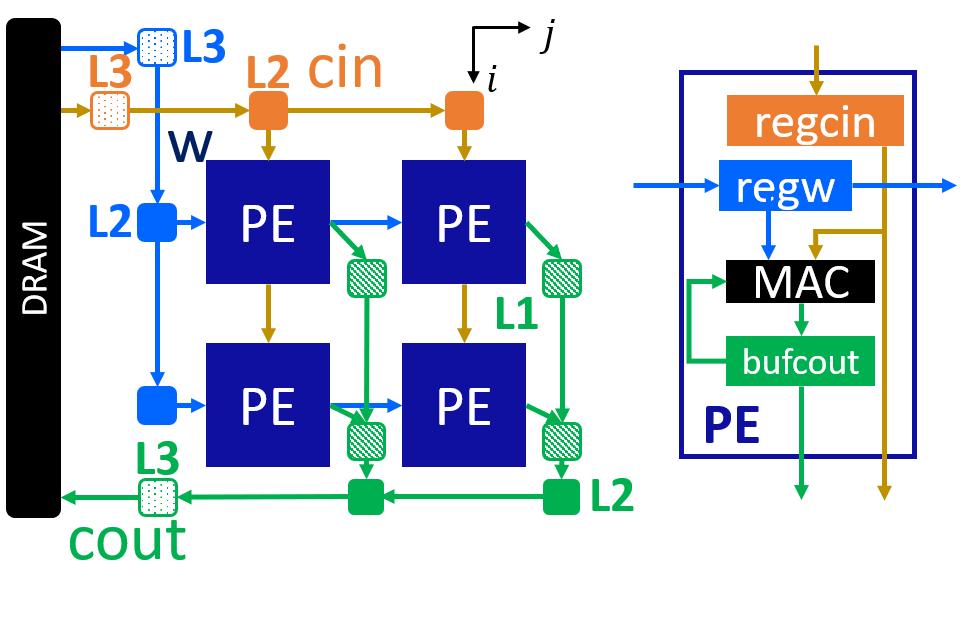
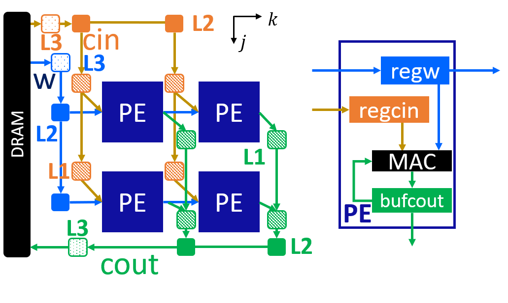
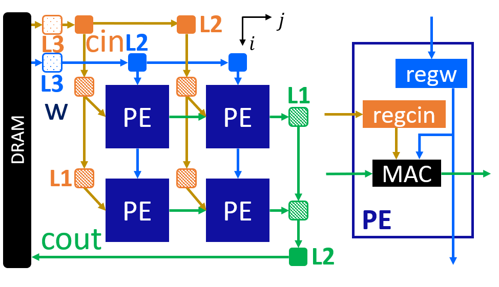

DNN Operators (Small)
=====================

**Author**: Jie Wang (jiewang@cs.ucla.edu)

We demonstrate three operators using in the DNN, including:
depth-wise convolution, point-wise convolution, and fully-connected layers.
The design files can be found at ``${AUTOSA_ROOT}/autosa_tests/dnn_ops``.
The testing environment is summarized in the table below.

+--------------------------+-----------------------------------------------+
| **Target FPGA**          | Xilinx Alveo U250                             |
+--------------------------+-----------------------------------------------+
| **FPGA Synthesis Tools** | Xilinx Vivado HLS 2019.2, Xilinx Vitis 2019.2 |
+--------------------------+-----------------------------------------------+
| **CPU**                  | Intel(R) Xeon(R) CPU E5-2699 v3 @ 2.30GHz     |
+--------------------------+-----------------------------------------------+

Point-wise Convolution
----------------------

In ``${AUTOSA_ROOT}/autosa_tests/dnn_ops/kernel.h``, uncomment the macro:

.. code:: c

    #define PC

Run the following command to generate a design with HLS host.

.. code:: bash

    ./autosa ./autosa_tests/dnn_ops/kernel.c \
    --config=./autosa_config/autosa_config.json \
    --target=autosa_hls_c \
    --output-dir=./autosa.tmp/output \
    --sa-sizes="{kernel[]->space_time[4];kernel[]->array_part[8,8,4,8];kernel[]->latency[4,4,4];kernel[]->simd[1,1,1,2]}" \
    --simd-info=./autosa_tests/dnn_ops/pc_simd_info.json \
    --host-serialize \
    --no-reverse-order \
    --hls

This leads to a 2x2 systolic array.
The figure below shows the array architecture.

You will find all generated files under the directory
``${AUTOSA_ROOT}/autosa.tmp/output/src``. 
Copy the ``hls_script.tcl`` to the directory ``autosa.tmp/output``.

.. code:: bash

    cp ${AUTOSA_ROOT}/autosa_tests/dnn_ops/hls_script.tcl ${AUTOSA_ROOT}/autosa.tmp/output/

Run the TCL script to perform C simulation.

.. code:: bash

    cd ${AUTOSA_ROOT}/autosa.tmp/output/
    vivado_hls -f hls_script.tcl

You should see ``Passed`` printed out in your terminal showing that 
C simulation is performed successfully.    

Depth-wise Convolution
----------------------

In ``${AUTOSA_ROOT}/autosa_tests/dnn_ops/kernel.h``, uncomment the macro:

.. code:: c

    #define DC

Run the following command to generate a design with HLS host.

.. code:: bash

    ./autosa ./autosa_tests/dnn_ops/kernel.c \
    --config=./autosa_config/autosa_config.json \
    --target=autosa_hls_c \
    --output-dir=./autosa.tmp/output \
    --sa-sizes="{kernel[]->space_time[4];kernel[]->array_part[4,4,4,3];kernel[]->latency[1,2,1];kernel[]->simd[1,2,1,1]}" \
    --simd-info=./autosa_tests/dnn_ops/dc_simd_info.json \
    --host-serialize \
    --no-reverse-order \
    --simd-touch-space \
    --hls

This leads to a 2x2 systolic array.
The figure below shows the array architecture.

You will find all generated files under the directory
``${AUTOSA_ROOT}/autosa.tmp/output/src``. 
Copy the ``hls_script.tcl`` to the directory ``autosa.tmp/output``.

.. code:: bash

    cp ${AUTOSA_ROOT}/autosa_tests/dnn_ops/hls_script.tcl ${AUTOSA_ROOT}/autosa.tmp/output/

Run the TCL script to perform C simulation.

.. code:: bash

    cd ${AUTOSA_ROOT}/autosa.tmp/output/
    vivado_hls -f hls_script.tcl

You should see ``Passed`` printed out in your terminal showing that 
C simulation is performed successfully. 

Fully-Connected Layer
---------------------

In ``${AUTOSA_ROOT}/autosa_tests/dnn_ops/kernel.h``, uncomment the macro:

.. code:: c

    #define FC

Run the following command to generate a design with HLS host.

.. code:: bash

    ./autosa ./autosa_tests/dnn_ops/kernel.c \
    --config=./autosa_config/autosa_config.json \
    --target=autosa_hls_c \
    --output-dir=./autosa.tmp/output \
    --sa-sizes="{kernel[]->space_time[2];kernel[]->array_part[8,4];kernel[]->latency[4];kernel[]->simd[2]}" \
    --simd-info=./autosa_tests/dnn_ops/fc_simd_info.json \
    --host-serialize \
    --no-reverse-order \
    --simd-touch-space \
    --local-reduce \
    --reduce-op="+" \
    --hls

This leads to a 2x2 systolic array.
The figure below shows the array architecture.

You will find all generated files under the directory
``${AUTOSA_ROOT}/autosa.tmp/output/src``. 
Copy the ``hls_script.tcl`` to the directory ``autosa.tmp/output``.

.. code:: bash

    cp ${AUTOSA_ROOT}/autosa_tests/dnn_ops/hls_script.tcl ${AUTOSA_ROOT}/autosa.tmp/output/

Run the TCL script to perform C simulation.

.. code:: bash

    cd ${AUTOSA_ROOT}/autosa.tmp/output/
    vivado_hls -f hls_script.tcl

You should see ``Passed`` printed out in your terminal showing that 
C simulation is performed successfully. 

Discussion
----------

Instead of generating three seperate systolic arrays for each operator, an ideal case would be 
using one systolic array to support all three operators at the same time.
One of the solutions is to fuse the generated designs from AutoSA manually with proper 
code optimization.
The other solution would be fusing the space loops during the polyhedral compilation, which is left 
as future work of AutoSA.