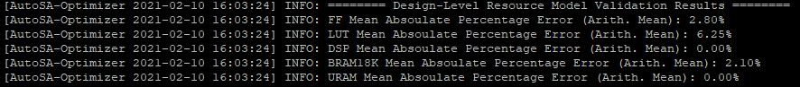
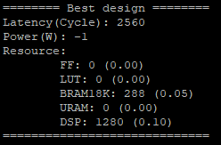
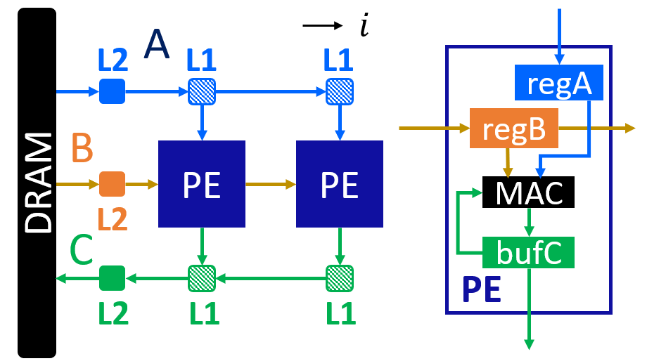
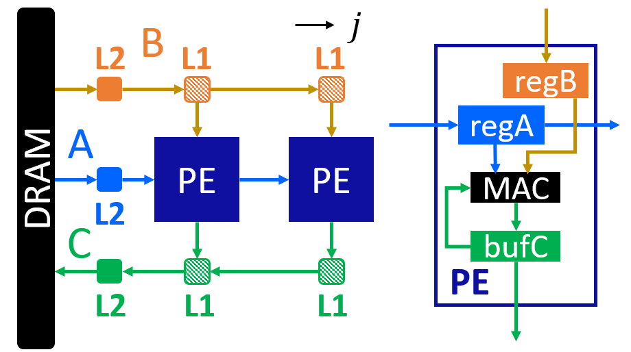
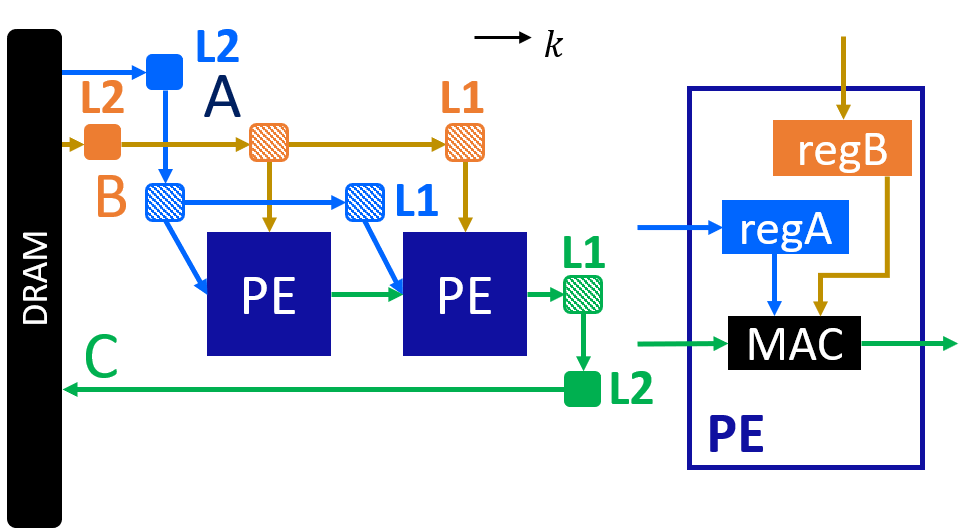
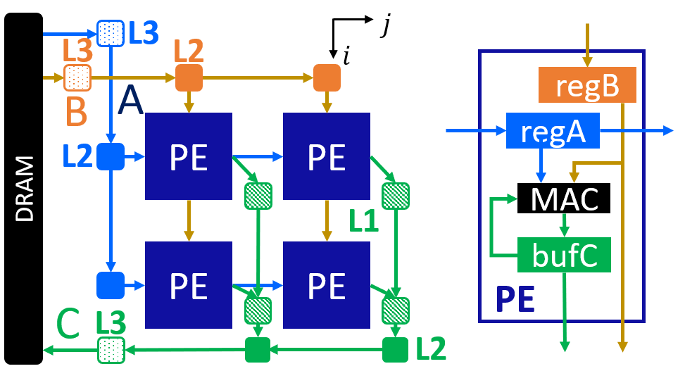
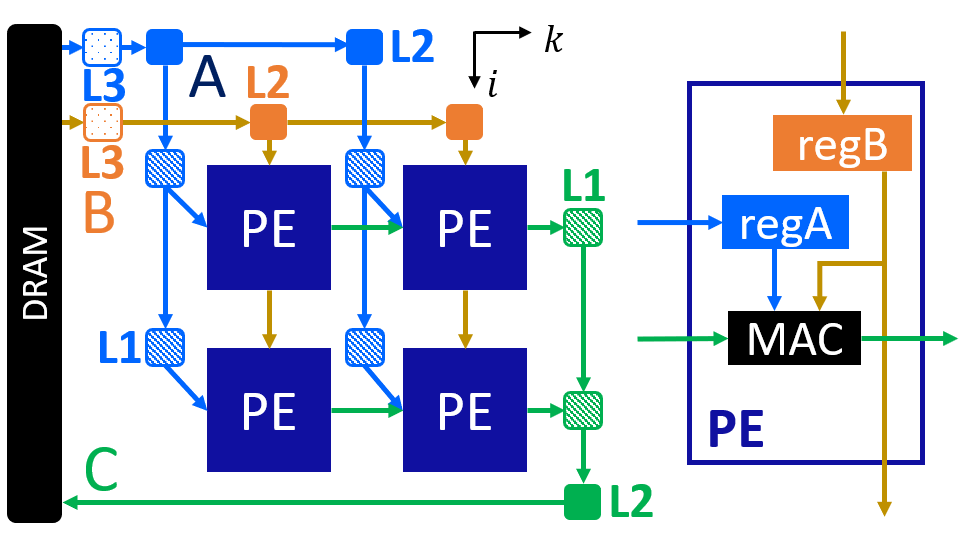
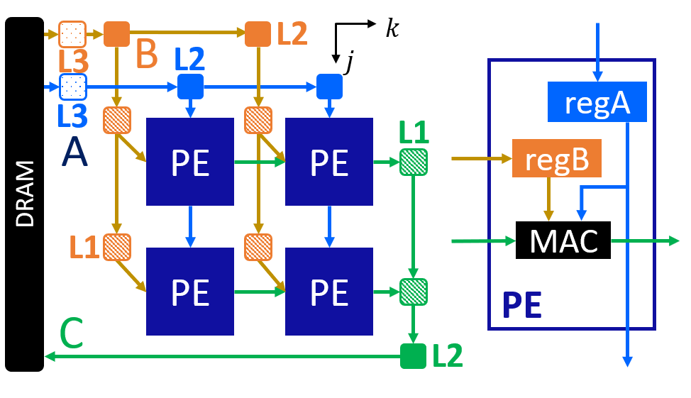

Matrix Multiplication (Small)
=============================

**Author**: Jie Wang (jiewang@cs.ucla.edu)

This is an example of small-size matrix multiplication. 
The design files can be found at ``${AUTOSA_ROOT}/autosa_tests/mm``.
The testing environment is summarized in the table below.

+--------------------------+-----------------------------------------------+
| **Target FPGA**          | Xilinx Alveo U250                             |
+--------------------------+-----------------------------------------------+
| **FPGA Synthesis Tools** | Xilinx Vivado HLS 2019.2, Xilinx Vitis 2019.2 |
+--------------------------+-----------------------------------------------+
| **CPU**                  | Intel(R) Xeon(R) CPU E5-2699 v3 @ 2.30GHz     |
+--------------------------+-----------------------------------------------+

C Simulation
------------

Run the following example command to generate one design with HLS host code.

.. code:: bash

    ./autosa ./autosa_tests/mm/kernel.c \
    --config=./autosa_config/autosa_config.json \
    --target=autosa_hls_c \
    --output-dir=./autosa.tmp/output \
    --sa-sizes="{kernel[]->space_time[3];kernel[]->array_part[16,16,16];kernel[]->latency[8,8];kernel[]->simd[2]}" \
    --simd-info=./autosa_tests/mm/simd_info.json \
    --host-serialize \
    --hls

After compilation, you will find all generated files under the directory 
``${AUTOSA_ROOT}/autosa.tmp/output/src``. 
Copy the ``hls_script.tcl`` to the directory ``autosa.tmp/output``.

.. code:: bash

    cp ${AUTOSA_ROOT}/autosa_tests/mm/hls_script.tcl ${AUTOSA_ROOT}/autosa.tmp/output/

Run the TCL script to perform C simulation.

.. code:: bash

    cd ${AUTOSA_ROOT}/autosa.tmp/output/
    vivado_hls -f hls_script.tcl

You should see ``Passed`` printed out in your terminal showing that 
C simulation is performed successfully.

RTL Simulation
--------------

If you need to verify the design using RTL simulation.
There are two more jobs to do.

Modify the Kernel Code
^^^^^^^^^^^^^^^^^^^^^^

Open the kernel code ``${AUTOSA_ROOT}/autosa.tmp/output/src/kernel_kernel.cpp``.
Locate to the top function ``void kernel0(A_t16 *A, B_t16 *B, C_t16 *C)``.
You should see the following directives for mapping three global pointers to 
different AXI buses.

.. code:: c

    #pragma HLS INTERFACE m_axi port=A offset=slave bundle=gmem_A
    #pragma HLS INTERFACE m_axi port=B offset=slave bundle=gmem_B
    #pragma HLS INTERFACE m_axi port=C offset=slave bundle=gmem_C

To run RTL simulation, we will need to assign the *depth* of each AXI bus explictly.
Refer to the host code ``kernel_host.cpp`` for the size of each array.
As we have applied host serialization, the array size might be slightly larger than 
the original array. In this example, the array A, B, C are allocated with sizes of 
16384, 16384, and 4096. Since each array is packed by 16 elements,
the depths of each array are 16384/16=1024, 16384/16=1024, 4096/16=256, respectively.
Modify the directives above to:

.. code:: c

    #pragma HLS INTERFACE m_axi port=A offset=slave bundle=gmem_A depth=1024
    #pragma HLS INTERFACE m_axi port=B offset=slave bundle=gmem_B depth=1024
    #pragma HLS INTERFACE m_axi port=C offset=slave bundle=gmem_C depth=256

Modify the TCL script
^^^^^^^^^^^^^^^^^^^^^

Open the TCL script ``hls_script.tcl``.
Uncomment the last a few steps:

.. code:: tcl

    csim_design
    csynth_design
    cosim_design

* ``csim_design`` is for C simulation.
* ``csynth_design`` is for C synthesis that synthesizes C code to RTL.
* ``cosim_design`` is for RTL simulation.

We have also provided two more options in the TCl script.

* ``cosim_design -trace_level all`` is for RTL simulation while dumping out all waveforms.
* ``cosim_design -setup -trace_level all`` is for RTL simulation that only prepares the 
  simulation scripts without actually launching the simulation.

Now run the TCL script again.

.. code:: bash

    vivado_hls -f hls_script.tcl

We will perform C simulation, C synthesis, RTL simulation in order.
It will take a few minutes to finish the entire flow.
You should be able to see the following information printed in your terminal showing 
that RTL simulation finishes successfully.

.. code:: bash

    INFO: [COSIM 212-1000] *** C/RTL co-simulation finished: PASS ***

Bitstream Generation
--------------------

If you need to generate the bitstream for on-board testing, simply remove the ``--hls``
flag from the previous AutoSA command.

.. code:: bash

    ./autosa ./autosa_tests/mm/kernel.c \
    --config=./autosa_config/autosa_config.json \
    --target=autosa_hls_c \
    --output-dir=./autosa.tmp/output \
    --sa-sizes="{kernel[]->space_time[3];kernel[]->array_part[16,16,16];kernel[]->latency[8,8];kernel[]->simd[2]}" \
    --simd-info=./autosa_tests/mm/simd_info.json \
    --host-serialize

Now instead of HLS host code, an OpenCL host code is generated.

We have prepared a template Makefile for Xilinx Vitis tools.

.. code:: bash

    cp ${AUTOSA_ROOT}/autosa_tests/mm/Makefile ${AUTOSA_ROOT}/autosa.tmp/output/
    cp ${AUTOSA_ROOT}/autosa_tests/mm/connectivity.cfg ${AUTOSA_ROOT}/autosa.tmp/output/

Set the proper ``PLATFORM`` in the Makefile. 
By default, we set it to ``xilinx_u250_xdma_201830_2``.
You may notice that we also copy a file ``connectivity.cfg`` here.
This file assigns the DDR bank mapping for the design. 
By default, we map pointers A, B, C to DDR bank 0, 1, 2.
Lastly, modify the ``MODE`` in the Makefile for performing different tasks.

* ``sw_emu``: C simulation
* ``hw_emu``: RTL simulation
* ``hw``: Bitstream generation

.. note:: 

    When using Vitis flow to perform RTL simulation, nothing needs to change in the source code.
    You may directly set the ``MODE`` to ``hw_emu`` and perform RTL simulation.
    However, by default, we will run the kernel 10 times to collect the average runtime.
    This may significantly prolong the simulation time. Consider reducing the kernel
    launching times to 1 before using RTL simulation.

To generate the bitstream, set the ``MODE`` to ``hw`` and use the command below.

.. code:: bash

    make all

It will take a few hours to finish. After the bitstream is generated,
use the following command to run it on-board.    

.. code:: bash

    make check

Auto-Tuning
-----------

We have provided an auto-tuner in the alpha version. 
The auto-tuner builds analytical models for resource usage and latency. 
Based on these models, the auto-tuner looks for designs with the least latency 
under the resource constraints.

Training Resource Models
^^^^^^^^^^^^^^^^^^^^^^^^

To use the auto-tuner, the first step is to train te resource models.
Run the command below to train the resoruce model.

.. code:: bash

    export AUTOSA_ROOT=$(pwd)
    python3 ./autosa_scripts/optimizer.py \
    -c './autosa ./autosa_tests/mm/kernel.c --target=autosa_hls_c --simd-info=./autosa_tests/mm/simd_info.json --host-serialize --hls --sa-sizes="{kernel[]->space_time[3]}"' \
    --info autosa_config/hw_info.json \
    -s autosa_config/optimizer_settings.json \
    --train \
    -p xilinx

.. note:: 

    Please don't forget to set up the environment variable ``AUTOSA_ROOT`` to your 
    AutoSA root directory before running the auto-tuner.

The auto-tuner requires a minimal AutoSA compilation command to start.
We use the command below.

.. code:: bash

    ./autosa ./autosa_tests/mm/kernel.c --target=autosa_hls_c --simd-info=./autosa_tests/mm/simd_info.json --host-serialize --hls --sa-sizes="{kernel[]->space_time[3]}"

As you may notice, we will need to assign the ``space_time`` to select the exact 
dataflow for auto-tuning. This is due to the reason that compiling different dataflows 
requires some additional flags as we will discuss in the next section.
As for now, we use the output-stationary 2D array with the argument ``--sa-sizes="{kernel[]->space_time[3]``.

``hw_info.json`` sepecifies the hardware resource constraints of the target FPGA board.
``optimizer_settings.json`` is the auto-tuner configuration file. 
More details about these options are covered in :ref:`auto-tuning-label`.

As the training phase will allocate many temporary files, you may consider 
adding the flag ``--tmp-dir`` to store the intermediate files in some other directories.

Once you launch the auto-tuner in the trainning phase, the auto-tuner will randomly
sample the design space and collect a few training samples. These training samples 
will be synthesized using HLS. We will then build resource models using linear regression
with these training samples.

This script will launch multiple processes to synthesize HLS designs. 
By default, we use 16 processes.
The training process takes around 10 minutes to finish on our workstation.

We also evaluate the resource models on the test sets. 
You will see the resource model accuracy results like below printed on your terminal once this step is finished.

Design Space Exploration
^^^^^^^^^^^^^^^^^^^^^^^^

In the next step, we will perform an exaustive search with pruning to find the design 
with the least latency given the resource constraints. 
We will improve the DSE with more efficient methods in the future.

The pruning strategies are set in ``optimizer_settings.json``. 
Details about this file are covered in :ref:`auto-tuning-label`.
Depending on the hardware and application, the pruning strategies might be changed.
We provide an example file for this application in ``${AUTOSA_ROOT}/autosa_config/optimizer_settings_libs/mm_small.json``.

Now use the following command to perform DSE.

.. code:: bash

    python3 ./autosa_scripts/optimizer.py \
    -c './autosa ./autosa_tests/mm/kernel.c --target=autosa_hls_c --simd-info=./autosa_tests/mm/simd_info.json --host-serialize --hls --sa-sizes="{kernel[]->space_time[3]}"' \
    --info autosa_config/hw_info.json \
    -s autosa_config/optimizer_settings_libs/mm_small.json \
    --search \
    -p xilinx

This script will launch multiple processes to search the design space.
By default, we use 32 processes.
The searching process takes around 3 minutes on our workstation.

You should see the detailed information about the best design printed out in your terminal like below.

The auto-tuner will dump out the best design found during the DSE in the file 
``DSE.log``. By default, we will record the top-10 designs found by DSE.

Dataflow Exploration
--------------------

AutoSA can help you explore different dataflow choices.
As for matrix multiplication, AutoSA finds six different systolic arrays in total.
They use loop pair [i], [j], [k], [i,j], [i,k], [j,k] as space loops, respectively.
We show each of them in detail below.

Array 1: [i]
^^^^^^^^^^^^

This is a 1D systolic array using the loop i as the space loop.
The figure below shows the architecture of this array.

This is an output-stationary array. Elements of matrix C are computed locally inside 
each PE. Data of matrix B are reused across PEs. Data of matrix A are sent 
directly into each PE.

Here is an example command to compile such a design.
Note that we use ``kernel[]->space_time[0]`` to select the first design.

.. code:: bash

    ./autosa ./autosa_tests/mm/kernel.c \
    --config=./autosa_config/autosa_config.json \
    --target=autosa_hls_c \
    --output-dir=./autosa.tmp/output \
    --sa-sizes="{kernel[]->space_time[0];kernel[]->array_part[32,32,32];kernel[]->latency[8,8];kernel[]->simd[2]}" \
    --simd-info=./autosa_tests/mm/simd_info.json \
    --host-serialize \
    --hls

This command leads to a 1x4 1D systolic array.    

Array 2: [j]
^^^^^^^^^^^^

As you may expect, this is also an output-stationary array with loop j as the space loop.
This array is symmetric to the first array. 
The figure below shows the detailed architecture.

Elements of matrix C are computed locally inside each PE. Data of matrix A are reused 
across PEs. Data of matrix B are sent directly to each PE.

Here is an example command to compile such a design.
Note that we use ``kernel[]->space_time[1]`` to select the second design.

.. code:: bash

    ./autosa ./autosa_tests/mm/kernel.c \
    --config=./autosa_config/autosa_config.json \
    --target=autosa_hls_c \
    --output-dir=./autosa.tmp/output \
    --sa-sizes="{kernel[]->space_time[1];kernel[]->array_part[32,32,32];kernel[]->latency[8,8];kernel[]->simd[2]}" \
    --simd-info=./autosa_tests/mm/simd_info.json \
    --host-serialize \
    --hls

This command leads to a 1x4 1D systolic array.    

Array 3: [k]
^^^^^^^^^^^^

This array uses loop k as the space loop.
The figure below depicts the array architecture.

This is an input-stationary array. Elements of matrix C are accumulated along 
the PEs. Data of matrix A and B need to be sent to PEs directly.

Use the command below to generate such a design.
We use ``kernel[]->space_time[2]`` to select the third design.
In addition, as AutoSA has no analysis power for reduction loops. We will 
also need to provide additional information about the reduction property. 
Note that we add the argument ``--local-reduce --reduce-op="+"`` to let AutoSA know that 
this design perform the reduction along PEs, and the reduction operator is ``+``.

By default, when searching for SIMD loops, AutoSA only considers the time loops.
As the loop k is used as the space loop, we add the flag ``--simd-touch-space`` to 
add space loops into consideration in the previous command.

.. code:: bash

    ./autosa ./autosa_tests/mm/kernel.c \
    --config=./autosa_config/autosa_config.json \
    --target=autosa_hls_c \
    --output-dir=./autosa.tmp/output \
    --sa-sizes="{kernel[]->space_time[2];kernel[]->array_part[4,32,32];kernel[]->latency[8,8];kernel[]->simd[2]}" \
    --simd-info=./autosa_tests/mm/simd_info.json \
    --host-serialize \
    --hls \
    --local-reduce \
    --reduce-op="+" \
    --simd-touch-space \
    --no-isl-sink

This leads to a 1x2 1D array.

One more thing to notice here is that inside each PE, AutoSA only allocates a single register 
``local_C[1][1]`` for storing the local elements of array C. 
This is based on the facts that all time loops are parallel loops which means that 
the PE never works on the same element again. 
In this case, AutoSA performs array contraction automatically to reduce the local buffer size.
You may turn off this optimization by adding the argument ``--no-array-contraction`` 
to the compilation command.
When automatic array contraction is turned off, a local buffer ``local_C[32][32]``
is allocated inside each PE.

Array 4: [i,j]
^^^^^^^^^^^^^^

This is the 2D output-stationary array as used previously. 
The figure below shows the detailed architecture.

In this array, data of matrix C are computed locally inside PEs.
Data of matrix A are reused horizontally.
Data of matrix B are reused vertically.

Below is an example command to compile such a design.
Note that we use ``kernel[]->space_time[3]`` to select the fourth design.

.. code:: bash

    ./autosa ./autosa_tests/mm/kernel.c \
    --config=./autosa_config/autosa_config.json \
    --target=autosa_hls_c \
    --output-dir=./autosa.tmp/output \
    --sa-sizes="{kernel[]->space_time[3];kernel[]->array_part[16,16,16];kernel[]->latency[8,8];kernel[]->simd[2]}" \
    --simd-info=./autosa_tests/mm/simd_info.json \
    --host-serialize \
    --hls

This command leads to a 2x2 2D systolic array.   

Array 5: [i,k]
^^^^^^^^^^^^^^

This array uses loops i and k as the space loops.
The figure below depicts the array architecture.

In this array, data of matrix C are reduced horizontally. 
Data of matrix B are reused vertically. Data of matrix A are sent directly into 
each PE.

Use the command below to generate one example array.
Note that we use ``kernel[]->space_time[4]`` to select the fifth design.

.. code:: bash

    ./autosa ./autosa_tests/mm/kernel.c \
    --config=./autosa_config/autosa_config.json \
    --target=autosa_hls_c \
    --output-dir=./autosa.tmp/output \
    --sa-sizes="{kernel[]->space_time[4];kernel[]->array_part[32,4,32];kernel[]->latency[16,16];kernel[]->simd[2]}" \
    --simd-info=./autosa_tests/mm/simd_info.json \
    --host-serialize \
    --hls \
    --local-reduce \
    --reduce-op="+" \
    --simd-touch-space \
    --no-isl-sink

This command leads to a 2x2 2D array.
Similar as array 3, we add additional information about reduction properties of the application
to the compiler. To let AutoSA explore the space loop as SIMD loop, we also add the flag 
``--simd-touch-space``.

Array 6: [j,k]
^^^^^^^^^^^^^^

This array uses loops i and k as the space loops.
The figure below depicts the array architecture.
This architecture is symmetric to array 5.

In this array, data of matrix C are reduced horizontally.
Data of matrix A are reused vertically. Data of matrix B are sent directly into 
each PE.

Use the command below to generate one example array.
Note that we use ``kernel[]->space_time[5]`` to select the fifth design.

.. code:: bash

    ./autosa ./autosa_tests/mm/kernel.c \
    --config=./autosa_config/autosa_config.json \
    --target=autosa_hls_c \
    --output-dir=./autosa.tmp/output \
    --sa-sizes="{kernel[]->space_time[5];kernel[]->array_part[32,4,32];kernel[]->latency[16,16];kernel[]->simd[2]}" \
    --simd-info=./autosa_tests/mm/simd_info.json \
    --host-serialize \
    --hls \
    --local-reduce \
    --reduce-op="+" \
    --simd-touch-space \
    --no-isl-sink

This command leads to a 2x2 2D array.