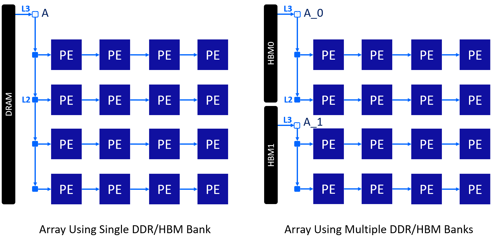

Matrix Multiplication with HBM (Small) 
======================================

**Author**: Jie Wang (jiewang@cs.ucla.edu)

This is an example of a small-size matrix multiplication in using high-bandwidth memory (HBM).
The design files can be found at ``${AUTOSA_ROOT}/autosa_tests/mm_hbm``.
The testing environment is summarized in the table below.

+--------------------------+-----------------------------------------------+
| **Target FPGA**          | Xilinx Alveo U280                             |
+--------------------------+-----------------------------------------------+
| **FPGA Synthesis Tools** | Xilinx Vivado HLS 2019.2, Xilinx Vitis 2019.2 |
+--------------------------+-----------------------------------------------+
| **CPU**                  | Intel(R) Xeon(R) CPU E5-2699 v3 @ 2.30GHz     |
+--------------------------+-----------------------------------------------+

C Simulation
------------

Run the following example command to generate one design with HLS host code.

.. code:: bash

    ./autosa ./autosa_tests/mm_hbm/kernel.c \
    --config=./autosa_config/autosa_config.json \
    --target=autosa_hls_c \
    --output-dir=./autosa.tmp/output \
    --sa-sizes="{kernel[]->space_time[3];kernel[]->array_part[32,32,32];kernel[]->latency[8,8];kernel[]->simd[2];kernel[]->hbm_A[2];kernel[]->hbm_B[2];kernel[]->hbm_C_drain[2]}" \
    --simd-info=./autosa_tests/mm_hbm/simd_info.json \
    --hbm \
    --hls

.. note::

    Host serialization is not supported for HBM designs.

After compilation, you will find all generated files under the directory 
``${AUTOSA_ROOT}/autosa.tmp/output/src``. 
Copy the ``hls_script.tcl`` to the directory ``autosa.tmp/output``.    

.. code:: bash

    cp ${AUTOSA_ROOT}/autosa_tests/mm_hbm/hls_script.tcl ${AUTOSA_ROOT}/autosa.tmp/output/

Run the TCL script to perform C simulation.

    cd ${AUTOSA_ROOT}/autosa.tmp/output/
    vivado_hls -f hls_script.tcl

You should see ``Passed`` printed out in your terminal showing that 
C simulation is performed successfully.

To utilize the HBM, currently, we simply partition the I/O modules for each I/O group 
and assign them to multiple HBM ports. As you may notice, we add the argument
``--sa-sizes="{kernel[]->hbm_A[2];kernel[]->hbm_B[2];kernel[]->hbm_C_drain[2]}"``
to assign the I/O group ``A``, ``B``, ``C_drain`` to 2 HBM ports each.

The figure below shows the array architectures using one or two HBM/DDR banks. 

Notice that please use the I/O group name when assigning the HBM ports.
During the compilation, AutoSA will print all the I/O groups in the array.
For more information about I/O groups, please refer to :ref:`construct-and-optimize-array-label`.    

Bitstream Generation
--------------------

If you need to generate the bitstream for on-board testing, simply remove the ``--hls``
flag from the previous AutoSA command.

.. code:: bash

    ./autosa ./autosa_tests/mm_hbm/kernel.c \
    --config=./autosa_config/autosa_config.json \
    --target=autosa_hls_c \
    --output-dir=./autosa.tmp/output \
    --sa-sizes="{kernel[]->space_time[3];kernel[]->array_part[32,32,32];kernel[]->latency[8,8];kernel[]->simd[2];kernel[]->hbm_A[2];kernel[]->hbm_B[2];kernel[]->hbm_C_drain[2]}" \
    --simd-info=./autosa_tests/mm_hbm/simd_info.json \
    --hbm

We have prepared a template Makefile for Xilinx Vitis tools.

.. code:: bash

    cp ${AUTOSA_ROOT}/autosa_tests/mm_hbm/Makefile ${AUTOSA_ROOT}/autosa.tmp/output/
    cp ${AUTOSA_ROOT}/autosa_tests/mm_hbm/connectivity.cfg ${AUTOSA_ROOT}/autosa.tmp/output/

Set the proper ``PLATFORM`` in the Makefile. 
By default, we set it to ``xilinx_u280_xdma_201920_3``.
You may notice that we also copy a file ``connectivity.cfg`` here.
This file assigns the HBM bank mapping for the design. 
As we partition the array A, B, C to 2 HBM banks each,
we assign the newly generated pointers A_0, A_1, B_0, B_1, C_0, C_1 to 
HBM bank 0, 1, 2, 3, 4, 5.
Lastly, modify the ``MODE`` in the Makefile for performing different tasks.

* ``sw_emu``: C simulation
* ``hw_emu``: RTL simulation
* ``hw``: Bitstream generation

To generate the bitstream, set the ``MODE`` to ``hw`` and use the command below.

.. code:: bash

    make all

It will take a few hours to finish. After the bitstream is generated,
use the following command to run it on-board.    

.. code:: bash

    make check