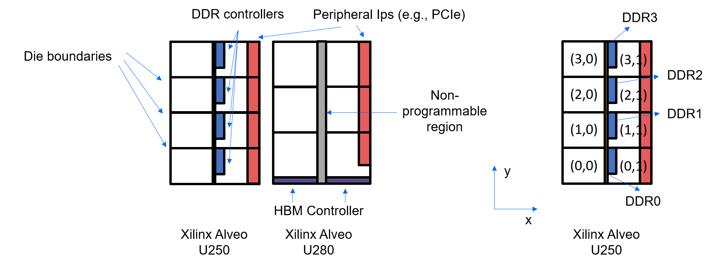

.. _use-autobridge-label:

Leveraging AutoBridge to Boost the Design Frequency
===================================================

**Author**: Jie Wang (jiewang@cs.ucla.edu)

AutoBridge is an automation framework to boost the FPGA design frequency. 
This page explains how to leverage AutoBridge to further boost the systolic array 
frequency on Xilinx FPGAs.

The testing environment of all the designs presented in this tutorial is described by the table below.

+--------------------------+-----------------------------------------------+
| **Target FPGA**          | Xilinx Alveo U250                             |
+--------------------------+-----------------------------------------------+
| **FPGA Synthesis Tools** | Xilinx Vivado HLS 2019.2, Xilinx Vitis 2019.2 |
+--------------------------+-----------------------------------------------+
| **CPU**                  | Intel(R) Xeon(R) CPU E5-2699 v3 @ 2.30GHz     |
+--------------------------+-----------------------------------------------+

Introduction of AutoBridge
--------------------------

AutoBridge is a floorplanning tool based on the Vivado HLS design flow. It parses the 
Xilinx HLS designs and generates the floorplanning constraints to help boost the design frequency.
More details about this tool can be found at:

* `Github repo <https://github.com/Licheng-Guo/AutoBridge>`_
* `Paper <https://vast.cs.ucla.edu/sites/default/files/publications/AutoBridge_FPGA2021.pdf>`_

Using AutoBridge to Boost the Frequency
---------------------------------------

Please follow the instructions on AutoBrige's Github repo to install the tool.

The design example used for this tutorial can be found at the directory ``${AUTOSA_ROOT}/autosa_tests/large/mm``.

Step 0: Generating the Reference Design
^^^^^^^^^^^^^^^^^^^^^^^^^^^^^^^^^^^^^^^

First of all, let's generate a design directly without using AutoBridge.
Use the following command to generate the systolic array design.

.. code:: bash

    ./autosa ./autosa_tests/large/mm/kernel.c \
    --config=./autosa_config/autosa_config.json \
    --target=autosa_hls_c \
    --output-dir=./autosa.tmp/output \
    --sa-sizes="{kernel[]->space_time[3];kernel[]->array_part[260,256,512];kernel[]->latency[20,16];kernel[]->simd[8]}" \
    --simd-info=./autosa_tests/large/mm/simd_info.json \
    --host-serialize

The generated designs can be found at ``${AUTOSA_ROOT}/autosa.tmp/output/src``.

Copy the Makefile and the DRAM connectivity configuration file to the project directory.

.. code:: bash

    cp ${AUTOSA_ROOT}/autosa_tests/large/mm/Makefile ${AUTOSA_ROOT}/autosa.tmp/output/
    cp ${AUTOSA_ROOT}/autosa_tests/large/mm/connectivity.cfg autosa.tmp/output/

Set up your local Xilinx Vitis environment. Note that we target the Xilinx Alveo U250 in the Makefile.
Change the Makefile and connectivity file accordingly if you target a different FPGA board. 
You may also need to change the design parameters described by ``--sa-sizes`` if your target FPGA board has 
less resource than Xilinx Alveo U250.

Run the following command to synthesize the design into bitstream.

.. code:: bash

    cd ${AUTOSA_ROOT}/autosa.tmp/output
    make all

.. note::

    As the example design is rather large, it takes approximately 40 hours to finish the synthesis on our workstation.
    
After the synthesis is completed, you can check the design resource and frequency.
Below is the resource and frequency information we collected for this design.

+-----+-----------------+------------------+--------------+---------------+
| MHz | LUT             | REG              | BRAM         | DSP           |
+-----+-----------------+------------------+--------------+---------------+
| 146 | 804517 (52.69%) | 1360681 (43.17%) | 953 (40.80%) | 8320 (67.78%) |
+-----+-----------------+------------------+--------------+---------------+

You could also test the generated design on board. We have listed the performance of the design 
in the table below.

+-----------------+---------------+---------+
| Kernel Time (s) | Host Time (s) | GFLOPs  |
+-----------------+---------------+---------+
| 0.00548694      | 0.0113009     | 397.496 |
+-----------------+---------------+---------+

Step 1: Compiling the Design Using Vivado HLS
^^^^^^^^^^^^^^^^^^^^^^^^^^^^^^^^^^^^^^^^^^^^^

Now let's use AutoBridge to generate a design with higher frequency. 

Before synthesizing the HLS design, add the pragma ``#pragma HLS dataflow disable_start_propagation`` at the top function.
In our example, open the file ``${AUTOSA_ROOT}/autosa.tmp/output/src/kernel_kernel.cpp``.
You will find the definition of the top function ``kernel0`` starting from the line 1204.

.. code:: c

    extern "C" {
    void kernel0(A_t16 *A, B_t16 *B, C_t16 *C)
    {
    #pragma HLS INTERFACE m_axi port=A offset=slave bundle=gmem_A
    #pragma HLS INTERFACE m_axi port=B offset=slave bundle=gmem_B
    #pragma HLS INTERFACE m_axi port=C offset=slave bundle=gmem_C
    #pragma HLS INTERFACE s_axilite port=A bundle=control
    #pragma HLS INTERFACE s_axilite port=B bundle=control
    #pragma HLS INTERFACE s_axilite port=C bundle=control
    #pragma HLS INTERFACE s_axilite port=return bundle=control

    #pragma HLS DATAFLOW
    ...

Add the pragma ``#pragma HLS dataflow disable_start_propagation`` into the top function.
The modified code looks like below.

.. code:: c

    extern "C" {
    void kernel0(A_t16 *A, B_t16 *B, C_t16 *C)
    {
    #pragma HLS INTERFACE m_axi port=A offset=slave bundle=gmem_A
    #pragma HLS INTERFACE m_axi port=B offset=slave bundle=gmem_B
    #pragma HLS INTERFACE m_axi port=C offset=slave bundle=gmem_C
    #pragma HLS INTERFACE s_axilite port=A bundle=control
    #pragma HLS INTERFACE s_axilite port=B bundle=control
    #pragma HLS INTERFACE s_axilite port=C bundle=control
    #pragma HLS INTERFACE s_axilite port=return bundle=control

    #pragma HLS DATAFLOW
    #pragma HLS dataflow disable_start_propagation
    ...

Next, copy the Xilinx HLS TCL file from the AutoBridge repo to the project directory to synthesize the C code 
to RTL using Xilinx HLS.

.. code:: bash

    cp ${AUTOBRIDGE_ROOT}/reference-scripts/step1-run-hls.tcl ${AUTOSA_ROOT}/autosa.tmp/output/

Modify the TCL file to add the information for our project. 
Specifically, modify the first four lines of ``step1-run-hls.tcl`` from

.. code:: tcl

    open_project PROJECT_NAME
    set_top TOP_FUNCTION_NAME
    add_files PATH_TO_SRC_FILE
    add_files -tb PATH_TO_TESTBENCH_FILE

to

.. code:: tcl

    open_project kernel0
    set_top kernel0
    add_files "src/kernel_kernel.cpp"
    #add_files -tb PATH_TO_TESTBENCH_FILE

Modify lines 25-26 of ``step1-run-hls.tcl`` from

.. code:: tcl

    csim_design
    csynth_design    

to 

.. code:: tcl

    #csim_design
    csynth_design    

Note that we define the target FPGA board at line 9 to Xilinx Alveo U250.
Modify it accordingly for your project.

Now call Xilinx Vivado HLS to synthesize the design.

.. code:: bash

    cd ${AUTOSA_ROOT}/autosa.tmp/output
    vivado_hls -f step1-run-hls.tcl

Step 2: Invoking AutoBridge to Generate Floorplanning Configuration for the Target Design
^^^^^^^^^^^^^^^^^^^^^^^^^^^^^^^^^^^^^^^^^^^^^^^^^^^^^^^^^^^^^^^^^^^^^^^^^^^^^^^^^^^^^^^^^

After the design is synthesized by HLS, we will invoke AutoBridge to analyze the project and generate 
the floorplanning constraints for the project.

AutoBridge provides a Python script for processing the HLS project automatically, which 
can be found at ``${AUTOBRIDGE_ROOT}/reference-scripts/step2-autobridge.py``.

Please refer to AutoBridge's `repo <https://github.com/Licheng-Guo/AutoBridge>`_ for more details about this script.

Normally, before running this script, we will have to modify the following fields in the script.

``project_math``: Modify it to the directory of the HLS project. As for our example, we set it as:

.. code:: Python

    project_path = '${AUTOSA_ROOT}/autosa.tmp/output/kernel0'

``top_name``: Modify it the top function of the HLS project.

.. code:: Python

    top_name = 'kernel0'

``board_name``: Modify it to the target FPGA board. AutoBridge currently supports Xilinx Alveo U250 and U280.
We use the U250 by default.

.. code:: Python

    board_name = 'u250'

``DDR_loc_2d_y``, ``DDR_loc_2d_x``: Modify them to assign the locations of the AXI modules.

In the generated HLS code, we have assigned diffrent global pointers to different AXI buses by default.
In lines 1204-1212, we have the following code:

.. code:: c

    void kernel0(A_t16 *A, B_t16 *B, C_t16 *C)
    {
    #pragma HLS INTERFACE m_axi port=A offset=slave bundle=gmem_A
    #pragma HLS INTERFACE m_axi port=B offset=slave bundle=gmem_B
    #pragma HLS INTERFACE m_axi port=C offset=slave bundle=gmem_C
    #pragma HLS INTERFACE s_axilite port=A bundle=control
    #pragma HLS INTERFACE s_axilite port=B bundle=control
    #pragma HLS INTERFACE s_axilite port=C bundle=control
    #pragma HLS INTERFACE s_axilite port=return bundle=control

We have assigned the three global pointers ``A``, ``B``, ``C`` to three different AXI buses 
``gmem_A``, ``gmem_B``, and ``gmem_C``.

There are four DDR controllers available on U250. In this design, we will assign 
``gmem_A`` to ``DDR0``, ``gmem_B`` to ``DDR1``, and ``gmem_C`` to ``DDR3``.
We have already assigned this DDR configuration in the connectivity file ``connectivity.cfg`` we mentioned previously.

We will have to modify the AutoBridge script to reflect this mapping as well.

Modify the lines 84-111 of ``step2-autobridge.py`` as follows:

.. code:: Python

    DDR_loc_2d_y['A_IO_L3_in_serialize_U0'] = 0
    DDR_loc_2d_x['A_IO_L3_in_serialize_U0'] = 0
    DDR_loc_2d_y['kernel0_gmem_A_m_axi_U'] = 0
    DDR_loc_2d_x['kernel0_gmem_A_m_axi_U'] = 0

    DDR_loc_2d_y['B_IO_L3_in_serialize_U0'] = 1
    DDR_loc_2d_x['B_IO_L3_in_serialize_U0'] = 0
    DDR_loc_2d_y['kernel0_gmem_B_m_axi_U'] = 1
    DDR_loc_2d_x['kernel0_gmem_B_m_axi_U'] = 0

    DDR_loc_2d_y['C_drain_IO_L3_out_serialize_U0'] = 3
    DDR_loc_2d_x['C_drain_IO_L3_out_serialize_U0'] = 0
    DDR_loc_2d_y['kernel0_gmem_C_m_axi_U'] = 3
    DDR_loc_2d_x['kernel0_gmem_C_m_axi_U'] = 0

    DDR_loc_2d_y['kernel0_control_s_axi_U'] = 0

    DDR_enable = [1, 1, 0, 1]

For each AXI bus, HLS generates two modules that are associated with it.
First, the hardware module in the user code that accesses the data via this bus.
As for our example, in ``kernel_kernel.cpp``, the global pointer ``A`` is used by the function
``A_IO_L3_in_serialize``. Xilinx HLS will rename to the function name to ``A_IO_L3_in_serialize_U0`` after 
synthesis. AutoBridge requires the RTL module name in the script. 
You may refer to the HLS report or generated RTL to find the exact RTL module name for your design.
The second module is the AXI bus module that connects the user logic to the DDR controller. 
In our design, it is named ``kernel0_gmem_A_m_axi_U``.

AutoBridge divides the FPGA on-chip area to multiple regions. The figure below shows the 
partitioned regions for both Xilinx Alveo U250 and U280 boards.

As we can see from the figure, the on-chip logic is physically scattered by die boundaries, DDR/HBM controllers,
non-programmable logic, and other peripheral IPs. AutoBridge partitions the on-chip logic based on 
these modules. 
The partitioned regions and indices are shown in the figure on the right.

As the ``gmem_A`` is connected to ``DDR0``, we assign the locations for these modules as:

.. code:: Python

    DDR_loc_2d_y['A_IO_L3_in_serialize_U0'] = 0
    DDR_loc_2d_x['A_IO_L3_in_serialize_U0'] = 0
    DDR_loc_2d_y['kernel0_gmem_A_m_axi_U'] = 0
    DDR_loc_2d_x['kernel0_gmem_A_m_axi_U'] = 0

Similarly, we add the locations for other AXI buses as shown in the code above.

For each kernel, there is a controller with S_AXI interface.
By the recommendation of AutoBridge, we will assign it to the bottom SLR as it 
talks to the PCIe IP.

.. code:: Python
    
    DDR_loc_2d_y['kernel0_control_s_axi_U'] = 0

Lastly, we will also need to update the variable ``DDR_enable`` to reflect the DDR controllers in use.
In our example, since we only use the first, second, and fourth DDR channel, we set it as:

.. code:: Python

    DDR_enable = [1, 1, 0, 1]

We are almost done here, the final step, is to specify the maximal resource utilization ratio of each region.
As an example, we set the variable ``max_usage_ratio_2d`` as:

.. code:: Python

    max_usage_ratio_2d = [ [0.8, 0.7], [0.85, 0.75], [0.85, 0.85], [0.85, 0.7] ]

Please feel free to adjust these ratios according to the resource usage of your design.
Setting the upper bound of resource usage for each region helps guide AutoBridge to scatter 
the logic across chip which helps improve the timing. AutoBridge might fail in the case where we 
set the upper bounds lower than the required resource of the design. In that case, try to increase the 
ratio until AutoBridge can successfully place the design.
Besides, as AutoBridge uses the estimated resource from HLS reports which might 
be inconsistant with the syntheized resource usage. You may need to re-adjust these values 
if the design fails routing in the later stages.

Until now, you have a modified AutoBridge script customized for our design.
We also provide an example script at ``${AUTOSA_ROOT}/autosa_tests/large/mm/step2-autobridge.py``.

Now, execute the Python script to run AutoBridge.

.. code:: bash

    cp ${AUTOSA_ROOT}/autosa_tests/large/mm/step2-autobridge.py ${AUTOBRIDGE_ROOT}/reference-scripts/
    cd ${AUTOBRIDGE_ROOT}/reference-scripts
    ./step2-autobridge.py | tee autobridge.log

After it finishes, you should see a folder named ``autobridge`` in the same directory.
It contains the modified RTL code and the floorplanning constraint ``constraint.tcl``.
The AutoBridge-generated information is printed to ``autobridge.log``.

.. note:: 

    If AutoBridge fails, modify the ``max_usage_ratio_2d`` accordingly to make sure 
    there is enough area allocated for the design.

Step 3: Packing the Design
^^^^^^^^^^^^^^^^^^^^^^^^^^

AutoBridge modifies the HLS generated RTL. 
In this step, we will pack the modified design into an ``xo`` file that can be synthesized by Xilinx Vitis.
AutoBridge provides a TCL file for packing the design. Run the following command to pack the design.

.. code:: bash

    cp ${AUTOBRIDGE_ROOT}/reference-scripts/step3-pack-xo.tcl ${AUTOBRIDGE_ROOT}/reference-scripts/autobridge/
    
Now modify the this TCL file according to your project.

Modify the line 1 from

.. code:: tcl

    open_project PROJECT_NAME

to 

.. code:: tcl

    open_project kernel0

Modify the line 3 from 

.. code:: tcl

    export_design -rtl verilog -format ip_catalog -xo XO_NAME.xo

to 

.. code:: tcl

    export_design -rtl verilog -format ip_catalog -xo kernel0.xo

.. note::

    We also provide an example TCL file ``step3-pack-xo.tcl`` under the design example directory ``${AUTOSA_ROOT}/autosa_tests/large/mm/pack_xo.tcl``.

Before running the TCL script, we will need to copy the original HLS source files to the working directory.

.. code:: bash

    cp -r ${AUTOSA_ROOT}/autosa.tmp/output/src cd ${AUTOBRIDGE_ROOT}/reference-scripts/autobridge/

Now, run the TCL script.

.. code:: bash

    cd ${AUTOBRIDGE_ROOT}/reference-scripts/autobridge
    vivado_hls -f step3-pack-xo.tcl

After Vivado HLS finishes the packing process, you will find a file named ``kernel0.xo`` under the working directory.

Step 4: Synthesizing the Design
^^^^^^^^^^^^^^^^^^^^^^^^^^^^^^^

The last step will be synthesizing the design to bitstream using Xilinx Vitis.
Copy the script for synthesizing the design to the working directory.

.. code:: bash

    cp ${AUTOBRIDGE_ROOT}/reference-scripts/step4-run-vitis.sh ${AUTOBRIDGE_ROOT}/reference-scripts/autobridge/

Modify the file ``step4-run-vitis.sh`` according to the design configuration.
For this example, modify line 4 from 

.. code:: bash
    
    TOP="YOUR_TOP_NAME"

to 

.. code:: bash
    
    TOP=kernel0

Modify line 10 from 

.. code:: bash
    
    XO="$(pwd)/YOUR_XO_NAME"

to 

.. code:: bash
    
    XO="$(pwd)/kernel0.xo"

Modify lines 32-35 from

.. code:: bash

    ARG_FOR_DDR_1="YOUR_HLS_ARGUMENT_NAME_FOR_DDR_1"
    ARG_FOR_DDR_2="YOUR_HLS_ARGUMENT_NAME_FOR_DDR_2"
    ARG_FOR_DDR_3="YOUR_HLS_ARGUMENT_NAME_FOR_DDR_3"
    ARG_FOR_DDR_4="YOUR_HLS_ARGUMENT_NAME_FOR_DDR_4"

to 

.. code:: bash

    ARG_FOR_DDR_1=A
    ARG_FOR_DDR_2=B
    #ARG_FOR_DDR_3="YOUR_HLS_ARGUMENT_NAME_FOR_DDR_3"    
    ARG_FOR_DDR_4=C

Modify lines 58-61 from 

.. code:: bash

    --connectivity.sp ${TOP}_1.${ARG_FOR_DDR_1}:DDR[0] \
    --connectivity.sp ${TOP}_1.${ARG_FOR_DDR_2}:DDR[1] \
    --connectivity.sp ${TOP}_1.${ARG_FOR_DDR_3}:DDR[2] \
    --connectivity.sp ${TOP}_1.${ARG_FOR_DDR_4}:DDR[3] \

to 

.. code:: bash

    --connectivity.sp ${TOP}_1.${ARG_FOR_DDR_1}:DDR[0] \
    --connectivity.sp ${TOP}_1.${ARG_FOR_DDR_2}:DDR[1] \    
    --connectivity.sp ${TOP}_1.${ARG_FOR_DDR_4}:DDR[3] \

An example script of this project can be also found at ``${AUTOSA_ROOT}/autosa_tests/large/mm/step4-run-vitis.tcl``.

Now set up the Xilinx Vitis environment and run the script.

.. code:: bash

    chmod u+x ./step4-run-vitis.sh
    ./step4-run-vitis.sh

Please wait until the synthesis process is finished.    

Results Comparsion
^^^^^^^^^^^^^^^^^^

We could now compare the designs unoptimized and optimized by AutoBridge.
The tables below show the detailed comparison results.

+-------------+-----+-----------------+------------------+--------------+---------------+
| Designs     | MHz | LUT             | REG              | BRAM         | DSP           |
+-------------+-----+-----------------+------------------+--------------+---------------+
| Unoptimized | 146 | 804517 (52.69%) | 1360681 (43.17%) | 953 (40.80%) | 8320 (67.78%) |
+-------------+-----+-----------------+------------------+--------------+---------------+
| Optimized   | 300 | 803752 (52.64%) | 1325480 (42.05%) | 952 (40.75%) | 8320 (67.78%) |
+-------------+-----+-----------------+------------------+--------------+---------------+

+-------------+-----------------+---------------+---------+
| Designs     | Kernel Time (s) | Host Time (s) | GFLOPs  |
+-------------+-----------------+---------------+---------+
| Unoptimized | 0.00548694      | 0.0113009     | 397.496 |
+-------------+-----------------+---------------+---------+
| Optimized   | 0.00232357      | 0.0371066     | 938.658 |
+-------------+-----------------+---------------+---------+

    
Credit: Young-kyu Choi (ykchoi@cs.ucla.edu)