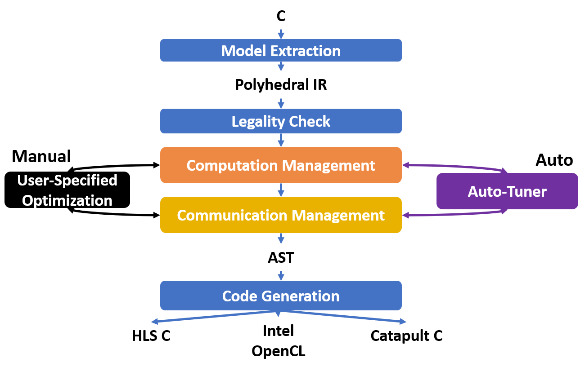
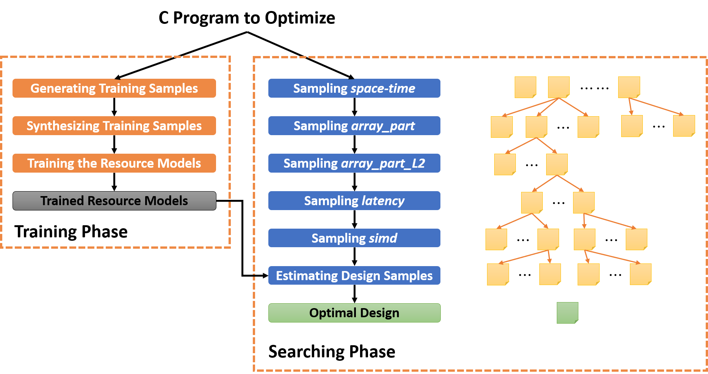

.. _auto-tuning-label:

Auto-Tuning
===============================================================

**Author**: Jie Wang (jiewang@cs.ucla.edu)

AutoSA introduces many tuning knobs during the compilation process, which form a large 
design space. To search for designs with good performance, we introduce a simple 
auto-tuner. This page introduces the basics of the auto-tuner and shows how to use
it for tuning arbitrary programs.

How Auto-Tuning Works
---------------------

First, let's take a look at the AutoSA compilation flow again, as shown in the figure below.

There are multiple optimization passes in the stages of computation and communication management. 
For each pass, they can either be run in the manual or auto mode.
In the manual mode, users will need to supply AutoSA with specific optimization strategies to apply on the 
program. In the auto mode, AutoSA will proceed based on the preset policy.

In the AutoSA configuration file ``${AUTOSA_ROOT}/autosa_config/autosa_config.json``, we list the steps 
that can be tunally tuned.

* **space_time**: 
  This step applies the space-time transformation to transform algorithms to systolic arrays. 
  By default, for each algorithm, multiple systolic arrays will be generated. In the auto mode,
  AutoSA will select one array based on the heuristics. In the manual mode, users will select the 
  array to be processed in the following steps.
* **array_part**: 
  This step partitions the aray into smaller sub-arrays. In the auto mode, all tilable loops 
  that can be used as array partitioning loops will be tiled with a fixed factor. In the manual mode,
  users can select loops to be tiled and provide the compiler with specific tiling factors.
* **array_part_L2**:
  AutoSA allows to generate up to two levels of array partitioning loops. This is helpful to architectures
  with many levels of memory hierarchy. Similarly, in the auto mode, AutoSA decides which loops to be further tiled and 
  selects a fixed tiling factor. Users can make such choices in the manual mode.
* **latency**:
  This step performs the latency hiding in case the innermost loop in the program carries
  dependence which prevents the design to be fully pipelined. Parallel loops in the program can be 
  used as the latency hiding candidate loops. In the auto mode, all parallel loops will be tiled and 
  the point loops will be permuted innermost. In the manual mode, users will have to specify which loops 
  to be chosen and the corresponding tiling factors.
* **simd**:
  This step vectorizes the computation inside PEs. In the auto mode, AutoSA analyzes the program
  and selects the best vectorizable loop with heuristics. In the manual mode, users will select the 
  vectorizable loop.
* **hbm**:
  AutoSA also supports HBM memory. The systolic array will be connected to multiple HBM ports.
  In the auto mode, AutoSA allocates each array to a fixed number of HBM banks. 
  In the manual mode, users select the number of HBM banks to be connected to each array.

The auto-tuner of AutoSA takes advantage of the manual modes and will explore all the possible 
combinations of the optimization strategies to search for designs with good performance.
At present, the auto-tuner supports exploration of all the stages above except the hbm stage. 
And only the Xilinx HLS C back-end is supported.

The figure below shows the working flow of the auto-tuner.

There are two phases in the auto-tuner: *training* and *searching*.

In the training phase, the auto-tuner will generate random sample designs from the input program,
synthesizing designs using Xilinx HLS, and use them as training samples to train the resource models. 

In the searching phase, the auto-tuner will explore the design space by enumerating different
optimization strategies at each stage with pruning. The design space is explored step by step following the 
sequence of the optimization steps in the compilation flow. After the final design samples are generated, 
the auto-tuner will estimate the latency and resource usage of the design samples and update the searching record.
Eventually, the design with the best performance is selected and outputed.

In the next subsection, we will show how to use the auto-tuner to perform the design space exploration 
with the example of matrix multiplication.

Auto-Tuning Example
-------------------

The auto-tuner is written as a Python script ``${AUTOSA_ROOT}/autosa_scripts/optimizer.py``.
It can be configured by the file ``${AUTOSA_ROOT}/autosa_config/optimizer_settings.json``.

Auto-Tuner Configuration
^^^^^^^^^^^^^^^^^^^^^^^^

The configuration file ``${AUTOSA_ROOT}/autosa_config/optimizer_settings.json`` looks like below:

.. code:: json

    "training": {
      "sample": {
        "space_time": {
          "mode": "exhaustive",
          "n": -1
        },
        "array_part": {
          "mode": "random",
          "n": 2,
          "loop_limit": -1
        },
        "latency_hiding": {
          "mode": "random",
          "n": 2,
          "loop_limit": 64
        }
        ...
      },
      "pruning": {
        "array_part": {
          "enable": 1,
          "PE_num": [8, 32]
        },
        ...
        "latency_hiding": {
          "enable": 1,
          "reg_size": [16, 256]
        },
        "SIMD_vectorization": {
          "enable": 1,
          "PE_num": [8, 32],
          "PE_ratio": 2
        }
      },
      "multiprocess": {
        "n_job": 1
      }
    },    
    "synth": {
      "multiprocess": {
        "n_job": 16
      },
      "sample": {
        "n": 16
      }
    },
    "search": {
      "metric": "latency",
      "cycle_period": 5,
      "mode": "customized",
      "n_random": 5,
      "log": {
        "n_record": 10
      },
      "resource_target": ["BRAM18K", "DSP"],
      "time_out": -1,
      "update_time_interval": 2,
      "multiprocess": {
        "n_job": 32
      },
      "sample": {
        "space_time": {
          "mode": "exhaustive",
          "n": -1
        },
        ...
        "SIMD_vectorization": {
          "mode": "exhaustive",
          "n": -1,
          "loop_limit": 8
        }
      },
      "pruning": {
        "random_start": {
          "enable": 1,
          "n_trial": 3,
          "n_random": 3
        },
        "resource": {
          "range": {
            "FF": [0.25, 0.7],
            ...
            "URAM": [0, 0.6]
          }
        },
        "array_part": {
          "enable": 1,
          "PE_num": [190, 210]
        },
        ...
        "latency_hiding": {
          "enable": 1,
          "reg_size": [64, 1280]
        },
        "SIMD_vectorization": {
          "enable": 1,
          "PE_num": [190, 210],
          "PE_ratio": 3
        }
      }
    }

We will explain the configuration in detail now. At the top level, there are three sections: 
``training``, ``synth``, and ``search``.

* ``training``: configures how the auto-tuner generates the training samples for resource models.
* ``synth``: configures how the auto-tuner synthesizes the training samples.
* ``search``: configures how the auto-tuner searches the design space.

Training
""""""""

Under the subsection of ``training``, there are three fields:
``sample``, ``pruning``, and ``multiprocess``.

* ``sample``: configures how the auto-tuner samples the design space to generate training samples.
* ``pruning``: configures how the auto-tuner prunes the design space while generating the training samples.
* ``multiprocess``: The sampling step can be multiprocessed. This field configures how many processes to be used to execute the sampling step.

As for the ``sample`` field, we could configure how we sample the design space at each optimization step.
The table below summarizes the available attributes for each step.

+---------------+---------------------------+----------------------------------------------------------------+
| Attributes    | Values                    | Explanations                                                   |
+===============+===========================+================================================================+
| ``mode``      | ``exhaustive``, ``random``| This attributes specifies how we are generating the tiling     |
|               |                           |                                                                |
|               |                           | factors for each candidate loop. When using ``exhaustive``,    |
|               |                           |                                                                |
|               |                           | we will generate a list of all the sub-multiples of the loop   |
|               |                           |                                                                |
|               |                           | bound as the the tiling factors. When using ``random``, we     |
|               |                           |                                                                |
|               |                           | will randomly sample ``n`` factors from all the feasible tiling|
|               |                           |                                                                |
|               |                           | factors.                                                       |
+---------------+---------------------------+----------------------------------------------------------------+
| ``n``         | ``int``                   | The default value is -1. If the ``mode`` is set in ``random``, |
|               |                           |                                                                |
|               |                           | this value sets the number of candidate tiling factors         |
|               |                           |                                                                | 
|               |                           | generated for each loop.                                       |
+---------------+---------------------------+----------------------------------------------------------------+
| ``loop_limit``| ``int``                   | The default value is -1. It sets the upper bound of the tiling |
|               |                           |                                                                |
|               |                           | factors.                                                       |
+---------------+---------------------------+----------------------------------------------------------------+

For the ``pruning``, we implement several pruning options considering the characteristics of the systolic array architecture.
The table below explains these pruning options.

+--------------------+-------------+--------------------+-------------------------------------------------+
| Stage              | Attributes  | Values             | Explanations                                    |
+====================+=============+====================+=================================================+
| array_part         | ``enable``  | ``0``, ``1``       | Turn off/on the pruning at this step.           |
|                    +-------------+--------------------+-------------------------------------------------+
|                    | ``PE_num``  | [``int``, ``int``] | We prune the design space by restraining the    |
|                    |             |                    |                                                 |
|                    |             |                    | range of number of PEs of the design.           |
+--------------------+-------------+--------------------+-------------------------------------------------+
| latency_hiding     | ``enable``  | ``0``, ``1``       | Turn off/on the pruning at this step.           |
|                    +-------------+--------------------+-------------------------------------------------+
|                    | ``reg_size``| [``int``, ``int``] | Latency hiding creates local storage for storing|
|                    |             |                    |                                                 |
|                    |             |                    | the intermediate results. This attribute limits |
|                    |             |                    |                                                 | 
|                    |             |                    | the size of local storage introduced by latency |
|                    |             |                    |                                                 | 
|                    |             |                    | hiding.                                         | 
+--------------------+-------------+--------------------+-------------------------------------------------+
| SIMD_vectorization | ``enable``  | ``0``, ``1``       | Turn off/on the pruning at this step.           |
|                    +-------------+--------------------+-------------------------------------------------+
|                    | ``PE_num``  | [``int``, ``int``] | This attribute restrains the number of PEs.     |
|                    +-------------+--------------------+-------------------------------------------------+
|                    | ``PE_ratio``| ``int``            | This attribute restrains the width/height ratio |
|                    |             |                    |                                                 | 
|                    |             |                    | of the generated design. Default value is -1.   |
+--------------------+-------------+--------------------+-------------------------------------------------+ 

Lastly, for the ``multiprocess``, the field of ``n_job`` specifies how many processes to be used for the 
samping process. The default value is 1.

Synth
"""""

After generating the sample designs, we will start to synthesize these designs using 
Xilinx HLS for training the resource models.
The fields under the subsection ``synth`` configure how we synthesize the sample designs.
There are two fields for this subsection.

* ``multiprocess``: configures the number of processes used to synthesize the sample designs.
* ``sample``: configures the number of designs selected for synthesizing, default value as 16.

Search
""""""

Under the subsection of ``search``, there are the following fields:

* ``metric``: The default value is ``latency``. It specifies the metric the auto-tuner
  uses to evluate the optimal design. At present, only ``latency`` is supported. 
  The auto-tuner will select the design with the least latency.
* ``cycle_period``: The default value is ``5``, which stands for 5ns. 
  It specifies the cycle period of the designs for estimating the runtime in seconds.
* ``log``: During the design space exploration, the auto-tuner will keep the top-k designs 
  found during the searching process. This field specifies the number of records to keep.
* ``resource_target``: This a list containing the types of resources that the auto-tuner 
  will evaluate for each design point. Users may choose among ``BRAM18K``, ``DSP``, ``FF``,
  ``LUT``, and ``URAM``.
* ``time_out``: It specifies the number of minutes after which the DSE process will time out.
  When setting to -1, the DSE will terminate until the whole DSE is completed.
* ``update_time_interval``: The auto-tuner can print out the best search results found so far
  during the DSE process. This field specifies the time period that the auto-tuner updates the 
  searching progress,
* ``multiprocess``: When the multi-processing is enabled, the design space is partitioned and 
  searched by multiple processes. This field specifies the number of processes to be used 
  for searching.
* ``mode``: The searching processes can be executed in three modes: ``random``, ``exhaustive``, and 
  ``customized``. In the exhaustive mode, all the possible tiling factors will be explored during the 
  searching process. In the random mode, for each loop to be tiled, a number of random tiling factors 
  are picked. The number of random tiling factors can be specified in the following ``n_random`` field. 
  The default value will be 2. In the customized mode, the auto-tuner will use the sampling policy
  specified in the ``sample`` field below.
* ``n_random``: It specifies the number of random tiling factors to be picked per loop.
* ``sample``: It specifies the sampling policy during the DSE. The format is similar to the 
  sampling policy used during the training step. Please refer to the training subsection for details.
* ``pruning``: The auto-tuner applies multi-level pruning to speed up the searching process. We will
  cover the details of this field below.

The field of ``pruning`` contains the following attributes.

* ``random_start``: Before we start the search process, we can first perform a quick random search.
  The best design found during this phase will be used as a baseline to prune away worse designs during 
  the later stage. This step can be configured by three attributes:
  * ``enable``: configures to turn on/off this step.
  * ``n_trial``: We could run random search multiple times. This attribute configures the number of times 
    we will run the random search.
  * ``n_random``: configures the number of random tiling factors to be chosen for each loop.
* ``resource``: We can also prune designs based on the resource usage. This attribute restrains the range 
  of resource usage for valid designs.
* The rest of fields are similar to pruning fields under the subsection ``training``.

Run the Auto-Tuner
^^^^^^^^^^^^^^^^^^

After configuring the auto-tuner properly, we may start to use the auto-tuner for DSE.
The first step is to train the resource models, for the matrix multiplication example, run this
command to train the resource models.

.. code:: bash

    python3 ./autosa_scripts/optimizer.py \
    -c './autosa ./autosa_tests/mm/kernel.c --target=autosa_hls_c --simd-info=./autosa_tests/mm/simd_info.json --host-serialize --hls --sa-sizes="{kernel[]->space_time[3]}"' \
    --info autosa_config/hw_info.json \
    -s autosa_config/optimizer_settings.json \-
    -train \
    -p xilinx

The table below explains each argument of the command.

+---------------+---------------------------+----------------------------------------------------------------+
| Arguments     | Values                    | Explanations                                                   |
+===============+===========================+================================================================+
| ``-c``        | ``str``                   | This argument is the basic AutoSA compilation command for the  |
|               |                           |                                                                |
|               |                           | target kernel. Please note that the space_time step should be  |
|               |                           |                                                                |
|               |                           | specified explictly in the current version.                    |
+---------------+---------------------------+----------------------------------------------------------------+
| ``-i``        | ``json``                  | A JSON file that states the resource upper bound for the target|
|               |                           |                                                                |
|               |                           | FPGA board.                                                    |
+---------------+---------------------------+----------------------------------------------------------------+
| ``-s``        | ``json``                  | A JSON file specifying the auto-tuner configuration.           |
+---------------+---------------------------+----------------------------------------------------------------+
| ``-p``        | ``xilinx``                | Configures the target hardware. Currently only Xilinx FPGAs are|
|               |                           |                                                                |
|               |                           | supported.                                                     |
+---------------+---------------------------+----------------------------------------------------------------+
| ``--training``|                           | Execute the auto-tuner in training phase.                      |
+---------------+---------------------------+----------------------------------------------------------------+
| ``--search``  |                           | Execute the auto-tuner in search phase.                        |
+---------------+---------------------------+----------------------------------------------------------------+
| ``--tmp-dir`` | ``str``                   | Configures the directory to store the temporary files during   |
|               |                           |                                                                |
|               |                           | the DSE.                                                       |
+---------------+---------------------------+----------------------------------------------------------------+

After resource models are trained, run the following command to search for the best design.

.. code:: bash

    python3 ./autosa_scripts/optimizer.py \
    -c './autosa ./autosa_tests/mm/kernel.c --target=autosa_hls_c --simd-info=./autosa_tests/mm/simd_info.json --host-serialize --hls --sa-sizes="{kernel[]->space_time[3]}' \
    --info autosa_config/hw_info.json \
    -s autosa_config/optimizer_settings.json \
    --search \
    -p xilinx    