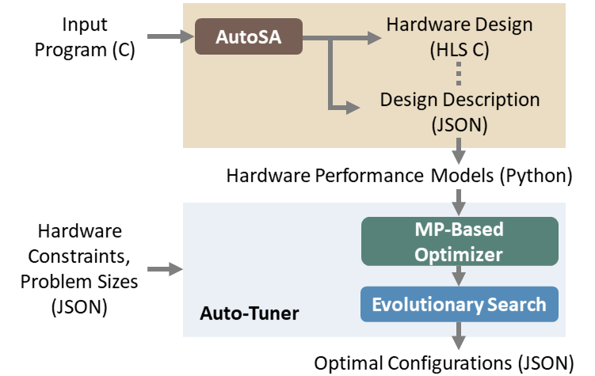

Auto-Tuning (Genetic Search)
===============================================================

**Author**: Jie Wang (jiewang@cs.ucla.edu)

This page introduces an alternative auto-tuning appraoch in addition to the exhaustive search.
This approach leverages genetic search and provides a much faster convergence speed
than the exhaustive search. 

Auto-Tuner Overview
-------------------

Our auto-tuner is named Odyssey (abbreviated from AUtomatic DEsign space exploration for SYstolic arrays). The figure above 
depicts the tuning flow.
Odyssey leverages AutoSA to construct the design space automatically. 
AutoSA takes in a C program that describes the target algorithm to map to systolic arrays and generates the systolic array designs in Xilinx HLS C.
We extend the AutoSA framework to generate a design description file that covers the full details of the generated hardware. 
Odyssey uses this file to create hardware performance models as symbolic expressions of the tuning parameters that can be used by the auto-tuner. 
Inside the auto-tuner, Odyssey implements a two-stage flow that starts with a mathematical programming (MP)-based optimizer that leverages 
optimization solvers with a simplified objective function to produce an initial high-quality design, followed by the evolutionary search with 
the accurate performance models.

Auto-Tuning Example
-------------------
To tune a certain design, we will first use AutoSA to generate a description file in JSON
format. For the matrix multiplication example, use the following command.

.. code:: bash

    ./autosa ./autosa_tests/mm/kernel.c \
    --config=./autosa_config/autosa_config.json \
    --target=autosa_hls_c \
    --output-dir=./autosa.tmp/output \
    --sa-sizes="{kernel[]->space_time[3]}" \
    --simd-info=./autosa_tests/mm/simd_info.json \
    --host-serialize \
    --hls \
    --tuning-method=1 \
    --param-names=./autosa_tests/mm/param_names.json

Note that we will only need to specify the array to be explored using the argument 
``--sa-sizes="{kernel[]->space_time[3]}"``, and we add a new flag ``--tuning-method=1``
to instruct AutoSA to generate the required description file.

You will find a description file ``kernel3.json`` under the directory ``autosa.tmp/output/tuning``.
This file describes all the necessary information about the design used during the auto-tuning, including
the memory and computation information.

Next, we will call the auto-tuner to search the optimal configuration for this design.
Switch to the directory ``autosa_scripts/odyssey``.

.. code:: bash

    cd autosa_scripts/odyssey

Copy the design description file to the tuner directory.

.. code:: bash

    cp ${AUTOSA_ROOT}/autosa.tmp/output/tuning/kernel3.json ${AUTOSA_ROOT}/autosa_scripts/odyssey/designs/

Then call the tuner to start the searching.

.. code:: bash

    python main.py --workload=mm --stop-after-time=20 --cst=hw_cst

The flag ``stop-after-time=20`` tells the tuner to stop searching after 20 seconds.
The flag ``cst=hw_cst`` points to the hardware constraints file ``cst/hw_cst.json``.
The flag ``workload=mm`` points to the task configuration file ``workload/mm.json`` which describes the 
matrix dimensions of the problem. For this example, we set ``i=j=k=1024``.

You will find the detailed information of the optimal design found by the auto-tuner 
printed in the screen.