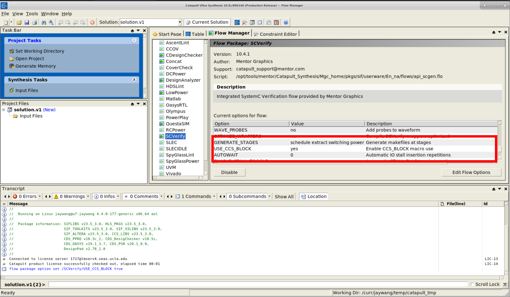
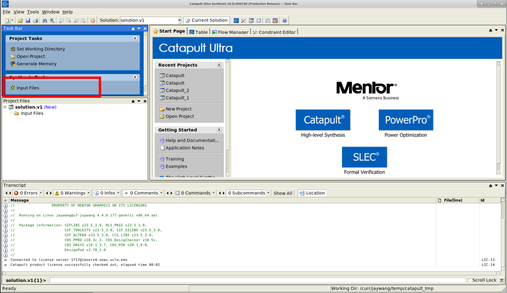
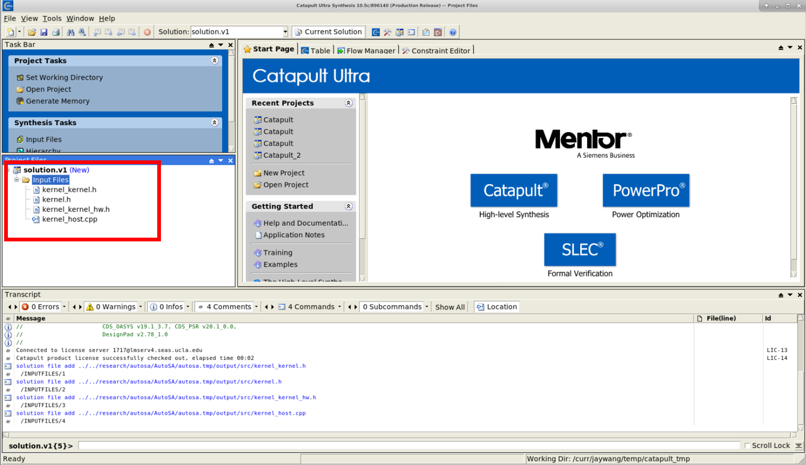
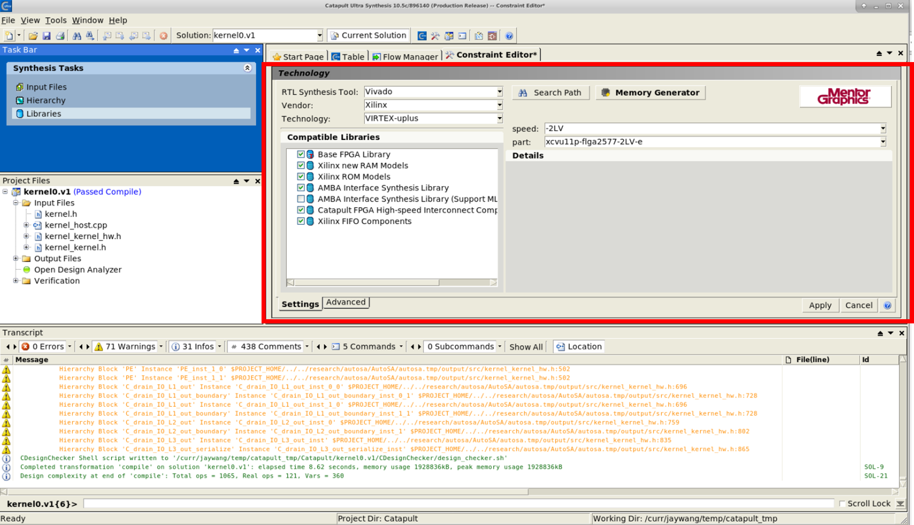
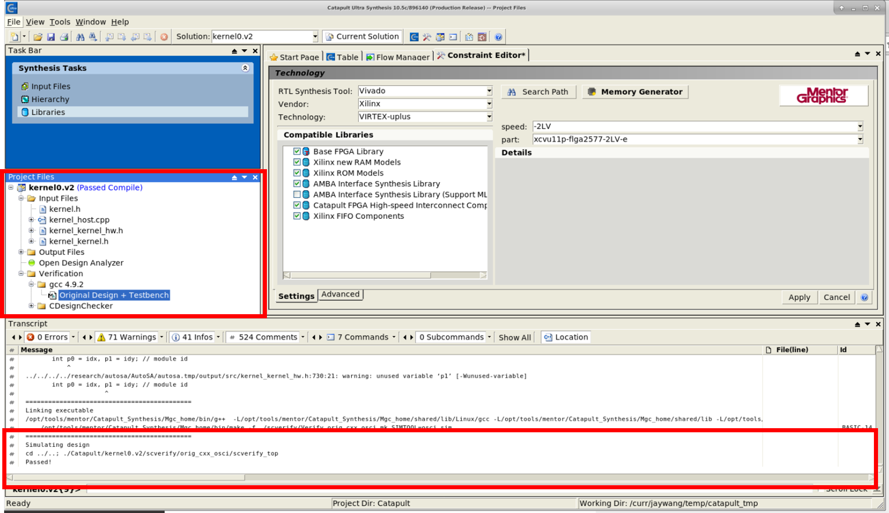
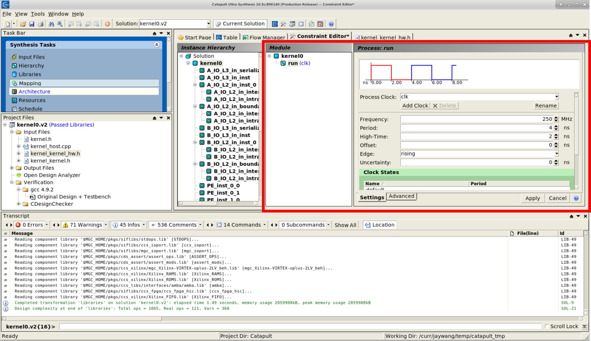
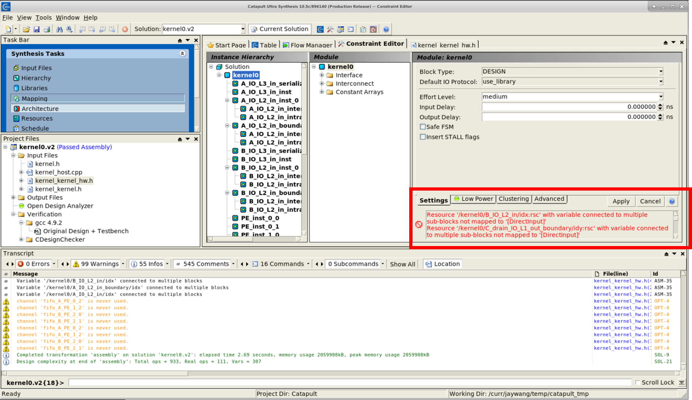
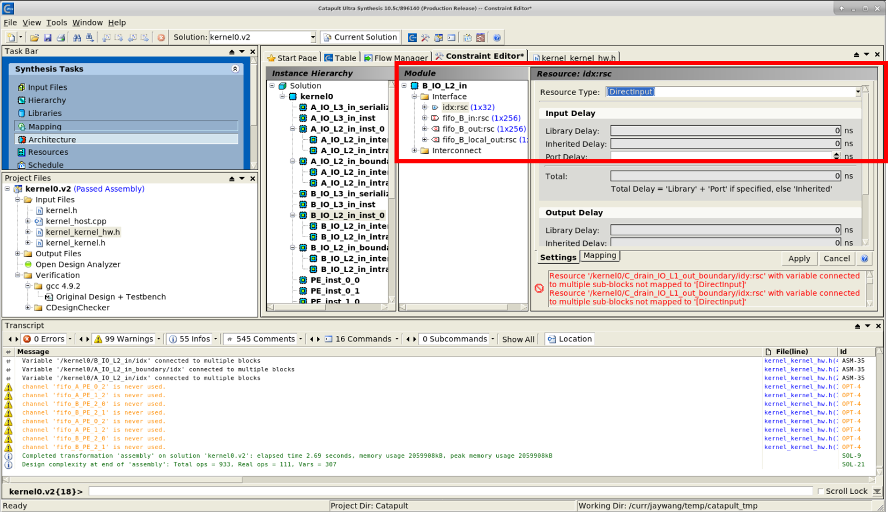
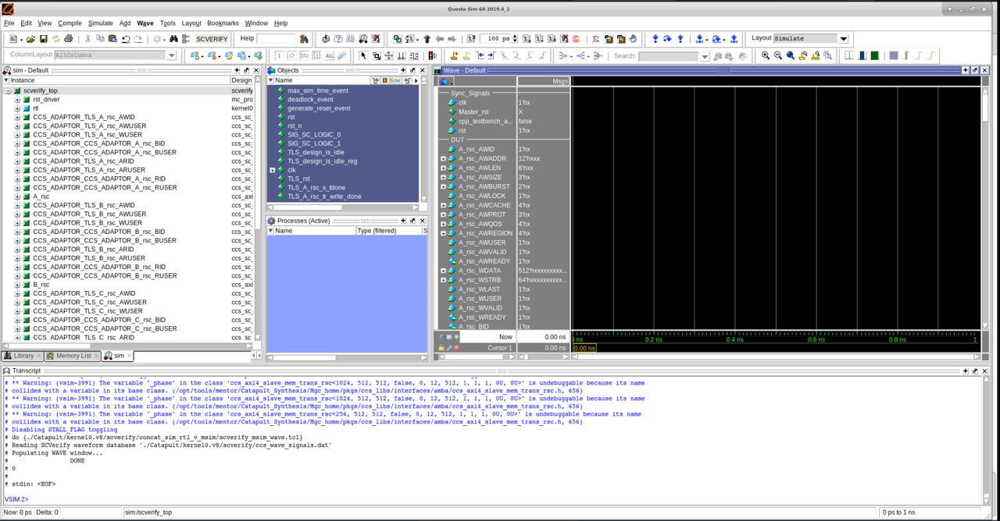

Generating Catapult HLS Design
==============================

**Author**: Jie Wang (jiewang@cs.ucla.edu)

AutoSA can generate systolic arrays in Mentor Graphics HLS C. This page shows an example 
about generating a systolic array design in Mentor Graphics HLS C.

.. note::

    * The current Catapult HLS C back-end only supports two data types ``unsigned short`` and ``unsigned int``.    

Generating the Design
---------------------

`Catapult HLS <https://www.mentor.com/hls-lp/catapult-high-level-synthesis/>`_ is a HLS 
synthesis tool provided by Mentor Graphics which can target both FPGAs and ASICs.
AutoSA can generate the systolic array described in Catapult HLS C.
You may find more details about Catapult HLS at their website (`link <https://www.mentor.com/hls-lp/catapult-high-level-synthesis/>`_).

Generating the Source Code
^^^^^^^^^^^^^^^^^^^^^^^^^^
The example design used in this tutorial can be found at ``${AUTOSA_ROOT}/autosa_tests/mm_catapult``.

To generate the design in Catapult HLS C, use the following command:

.. code:: bash

    ./autosa ./autosa_tests/mm_catapult/kernel.c \
    --config=./autosa_config/autosa_config.json \
    --target=autosa_catapult_c \
    --output-dir=./autosa.tmp/output \
    --sa-sizes="{kernel[]->space_time[3];kernel[]->array_part[16,16,16];kernel[]->latency[8,8];kernel[]->simd[2]}" \
    --simd-info=./autosa_tests/mm/simd_info.json \
    --host-serialize

The generated design files can be found at ``${AUTOSA_ROOT}/autosa,tmp/output/src``.
Note that apart from the C files describing the systolic array, AutoSA also emits one TCL file ``kernel_directives.tcl``.
This file is a template TCL file that covers the most instructions that will be used when compiling using Catapult HLS.
Users still need to modify it according to their own designs to achieve the best performance.

To generate and optimize a design, programmers can either do it in GUI or use the TCL file.
We will first demonstrate the GUI approach, and show a complete TCL file later.

.. note::

    Unlike Xilinx Vivado HLS or Intel OpenCL SDK, Catapult HLS encouranges programmers 
    to use GUI to develop their designs.

Using Catapult in GUI Mode
^^^^^^^^^^^^^^^^^^^^^^^^^^

After setting up your local environment for Catapult HLS properly, launch the software.

.. code:: bash

    catapult &

In the GUI window, open **Flow Manager** and select **SCVerify**, set **USE_CCS_BLOCK** to ``yes``,
as shown in the figure below.

In the GUI window, add the following design files into the project. 

* ``kernel.h``: The original input kernel header file.
* ``kernel_host.cpp``: The host code for testing and verifying the design.
* ``kernel_kernel.h``: The header file for the host code.
* ``kernel_kernel_hw.h``: The design code describing the systolic array kernel.

Click **Input Files** in the **Synthesis Tasks** panel to add the design files in the directory ``${AUTOSA_ROOT}/autosa,tmp/output/src``.

Next, click **Libraries** in the **Synthesis Tasks** to proceed to the library selection step.
Select the FPGA library properly based on your target device.
Here we select the Xilinx FPGA library and target ``Virtex-uplus`` device family. 

At this stage, you should be able to verify your design using software simulation.
However, the current code can't be directly used for software simulation due to some limitations of Catapult.
Open the source file ``kernel_kernel_hw.h`` and locate to line 28. Note the code:

.. code:: c:

    // while () // Please add the fifo check for C sim.

That's it. All the modules use FIFOs to transfer data between each other.
To correctly model the FIFO transactions, Catapult HLS requires us to specify the amount of 
input FIFO transactions so that this function only starts to be executed when all the 
input data are ready. Currently AutoSA is unable to generate this part automatically, 
users need to modify this code manually based on the design.

As an example, for this function ``A_IO_L3_in.run``, we have the input FIFO ``fifo_A_serialize``.
We can locate the read transaction of this FIFO at line 40. 
This transaction is surrounded by loops;

.. code:: c

    for (ac_int<3, false> c0 = 0; c0 <= 3; c0 += 1)
      for (ac_int<3, false> c1 = 0; c1 <= 3; c1 += 1)
        for (ac_int<3, false> c2 = 0; c2 <= 3; c2 += 1)
          for (ac_int<2, false> c3 = 0; c3 <= 1; c3 += 1)
            for (ac_int<4, false> c4 = 0; c4 <= 7; c4 += 1)
              for (ac_int<2, false> c5 = 0; c5 <= 1; c5 += 1)

We could calculate the number of read transactions as :math:`4\times 4\times 4\times 2\times 8\times 2 = 2048`.

Now, replace the line 28 from

.. code:: c

    // while () // Please add the fifo check for C sim.

to 

.. code:: c

    while (fifo_A_serialize.available(2048))

We will have to modify all the functions with FIFO read transactions in the source code.

Another issue to mention is that the current coding style of AutoSA may lead to scheduling failure in the later 
stages in Catapult HLS. To be more specific, the following coding style generated by AutoSA by default 
is not friendly to Catapult.

.. code:: c

    for (int c0 = 0; ...)
      if (c0 == p0) {
        for (int c1 = 0; ...) {
          // logic 1
          ...
        }
      } else {
        for (int c1 = 0; ...) {
          // logic 2
          ...
        }
      }

In the code above, ``if`` branch contains sub loops to be computed. 
Such coding style could lead to scheduling failure with long feedback paths.
You might see the error message below when synthesizing this design in Catapult HLS in the later steps.

.. code:: bash

    Feedback path is too long to schedule design with current pipeline and clock constraints.

To get around this problem, we need to modify the code to lower the ``if`` branch inside the sub loops.

.. code:: c

    for (int c0 = 0; ...)
      for (int c1 = 0; ...)
        if (c0 == p0) {
          // logic 1
          ...
        } else {
          // logic 2
          ...
        }

We have provided a modified example at ``${AUTOSA_ROOT}/autosa_tests/mm_catapult/kernel_kernel_hw.h``    
This file has solved above two issues including adding the FIFO guards and modifying the ``if`` branch.
We will work to automate this process in the future.

To save the time, add this file into the project to replace the original one.

To perform software emulation, expand the folder of **Verification** in the **Project Files** panel and 
click **Original Design + Testbench**. Catapult HLS will compile and execute the design.
You should be able to see the message ``Passed`` in the **Message** panel if everything goes normally.

In the next step, click **Mapping** in the **Synthesis Tasks** panel.
This step asks you to specify the frequency target of the design.
Let's set it to 250MHz for now.

Click the **Apply** in the frequency setting panel to proceed.
Then click **Architecture** in the **Synthesis Tasks** panel.
Catapult HLS will infer the hierarchy of the design.
You will see a list of warning messages in the **Constraint Editor**. 
Let's fix them now.

These warning messages are of the same type. For example, the first warning message reads:

.. code:: text

    Resource '/kernel0/B_IO_L2_in/idx:rsc' with variable connected to multiple sub-blocks not mapped to '[DirectInput]'

Select the module ``B_IO_L2_in_inst_0`` in the **Instance Hierarchy**, expand the **Interface** folder in 
the **Module** panel. Select the interface ``idx:rsc`` and set the **Resource Type** on the right to 
``[DirectInput]``. Then click the **Apply** to apply the changes.

Specifically, for all the moduls generated by AutoSA, we may generate an index argument if there are 
multiple instances of this module to help distinguish between each other.
Catapult HLS requires us to map such scalar arguments to ``[DirectInput]`` explicitly.

You will need to apply these modifications one by one until all the warning messages disappear to be 
able to proceed to the next step. Here is a list of modules that need modifications:

* ``A_IO_L2_in_inst_0``
* ``A_IO_L2_in_boundary_inst_1``
* ``B_IO_L2_in_inst_0``
* ``B_IO_L2_in_boundary_inst_1``
* ``PE_inst_0_0``, ``PE_inst_0_1``, ``PE_inst_1_0``, ``PE_inst_1_1``
* ``C_drain_IO_L1_out_inst_0_0``, ``C_drain_IO_L1_out_inst_1_0``
* ``C_drain_IO_L1_out_boundary_inst_0_1``, ``C_drain_IO_L1_out_boundary_inst_1_1``
* ``C_drain_IO_L2_out_inst_0``
* ``C_drain_IO_L2_out_boundary_inst_1``

There is another type of resources we need to specify explicitly, the local buffers.
I/O modules generated by AutoSA might contain local buffers.
For example, click the module ``A_IO_L2_in_inst_0`` and expand the **Interconnect** folder 
in the **Module** panel, you will find the local buffer named ``A_IO_L2_in_local_A_inst:cns``.
We will need to assign it to FPGA BRAM explicitly. Select the **Resource Type** and select 
``Xilinx_RAMS.BLOCK_1R1W_RBW`` to map it to a dual-port BRAM. By default, Catapult HLS
will assign the property **Stage Replication** to 2, which means that the buffer will be duplicated to generate 
the double buffer logic. Please refer to the Catapult HLS document for more details about these configurations.
If you want to disable the automatic double buffer inferring, modify the **Stage Replication** to 1.

As for our design, we will need to modify the local buffers inside the following modules with **Stage Replication** as 2.

* ``A_IO_L2_in_inst_0``
* ``A_IO_L2_in_boundary_inst_1``
* ``B_IO_L2_in_inst_0``
* ``B_IO_L2_in_boundary_inst_1``

And the following modules with **Stage Replication** as 1.

* ``C_drain_IO_L1_out_inst_0_0``, ``C_drain_IO_L1_out_inst_1_0``
* ``C_drain_IO_L1_out_boundary_inst_0_1``, ``C_drain_IO_L1_out_boundary_inst_1_1``

Click the **RTL** in **Synthesis Tasks** to proceed.

Catapult HLS will schedule the design and generate RTL. 
However, the scheduler of Catapult HLS is limited and you might encounter the following scheduling failure.

.. code:: bash

    Feedback path is too long to schedule design with current pipeline and clock constraints.
    Schedule failed, sequential delay violated. List of sequential operations and dependencies:
      MEMORYREAD "for#1:for:for:for:for#2:read_mem(local_C:rsc.@)" kernel_kernel_hw.h(564,41,15)
      MEMORYWRITE "for#1:for:for:for:for#2:write_mem(local_C:rsc.@)" kernel_kernel_hw.h(564,22,15)
    Feedback path is too long to schedule design with current pipeline and clock constraints.      

Catapult fails to successfully schedule certain loops in the design. 
Now let's take a look at this loop.

.. code-block:: c
    :linenos:

    class PE {
      ...
      for (ac_int<3, false> c2 = 0; c2 <= 3; c2 += 1)
        for (ac_int<4, false> c5 = 0; c5 <= 7; c5 += 1)
          for (ac_int<4, false> c6 = 0; c6 <= 7; c6 += 1)
            for (ac_int<4, false> c7 = 0; c7 <= 7; c7 += 1) {
              ...
              #pragma unroll yes
              for (ac_int<2, false> c8 = 0; c8 <= 1; c8 += 1) 
                local_C[c7][c6] = (local_C[c7][c6] + (local_A[0][c8] * local_B[0][c8]));
            }
      ...
    }

This loop is inside the PE function to update the local variable ``local_C[c7][c6]``.
However, Catapult HLS fails to pipeline the loop and complains the dependence between the 
write access of ``local_C[c7][c6]`` at line 10 and the read access of ``local_C[c7][c6]`` at 
the same line.
However, if we take a closer look at this loop, as we have performed latency hiding by tiling and permuting 
two parallel loops ``c6`` and ``c7`` inside, and as the loop ``c8`` is unrolled, 
there shouldn't be any dependence here and the loop should be fully pipelined, as observed when 
using Xilinx HLS. 

However, since the scheduling algorithms are more conservative compared to Xilinx HLS, to 
achieve fully pipelining, we will have to mark this dependence false explicitly in Catapult HLS.
To do this, we have to modify the TCL script when compiling the design.

Catapult HLS already generated a TCL file containing all the instructions we have applied 
in the previous steps in ``${CATAPULT_PRJ}/kernel0.v1/directives.tcl``. Open the file and the edit the last line from 

.. code:: tcl

    go architect
    go allocate

to 

.. code:: tcl

    go architect
    directive set /kernel0/PE/run/for#1:for:for:for:for#2:read_mem(local_C:rsc.@) -IGNORE_DEPENDENCY_FROM {for#1:for:for:for:for#2:write_mem(local_C:rsc.@)}
    go allocate

Note that we add a directive to let Catapult ignore this dependence.
Now let's use this TCL script to recompile the design.

First, move out this TCL script

.. code:: bash

  mv ${CATAPULT_PRJ}/kernel0.v1/directives.tcl ${CATAPULT_PRJ}/

Then in the Catapult GUI, click **File** -> **Run Script**. And select the ``directives.tcl``.
Catapult HLS will recompile the design using this TCL file.

You should see the design successfully scheduled without any errors.
Now click **RTL** in the **Task Bar** panel to generate the final RTL.

One more optional step is using Catapult HLS to perform RTL simulation. This requires proper 
simulation tools installed on your workstation. Please refer to Catapult manuals for 
supported simulators. Here we use the Mentor QuestaSim. To perform RTL simulation, 
click **Verification** -> **QuestaSIM** -> **Concat RTL Verilog output 'concat_sim_rtl.v' vs Untimed C++**.

Catapult HLS will launch QuestaSIM simulator as shown in the figure below.

Type in ``run -all`` to start the simulation, as shown in the figure below.

.. image:: images/catapult_sim2.png
    :align: center   

Phew! Up to now we have finished the complete flow in GUI. 
Just a few things to keep in mind when using the Catapult flow:

* Specify the FIFO guards for C simulation.
* Modify the ``if`` coding style for better scheduling.
* Explicitly specify the false dependence for better scheduling.

Using Catapult in TCL Mode
^^^^^^^^^^^^^^^^^^^^^^^^^^

All the steps we have presented in the previous sub seciton can be executed through a TCL script.
A complete TCL file for this flow can be found at ``${AUTOSA_ROOT}/autosa_tests/mm_catapult/directives.tcl``.

Note that we have generated a template TCL file in the source directory 
``${AUTOSA_ROOT}/autosa,tmp/output/src/kernel_directives.tcl``. 
It cover the most boilerplate code. However, you will still need to modify some parts of the file such as 
the source code path and inserting the dependence assertation to successfully schedule the design.

To use TCL file for compilation, open the Catapult GUI,
click **File** -> **Run Script**, and select the TCL file.
Catapult HLS will compile the design and generate RTL.