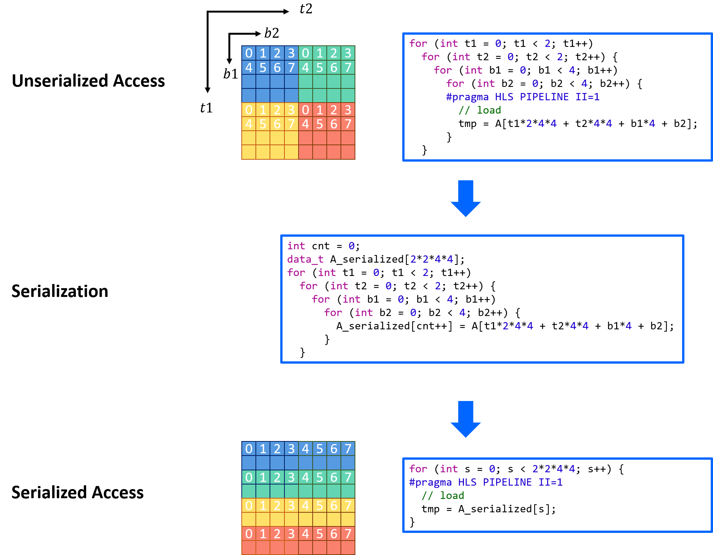
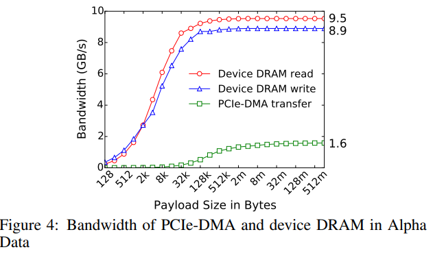
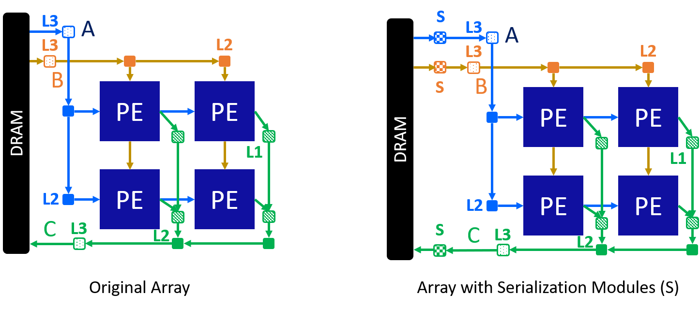
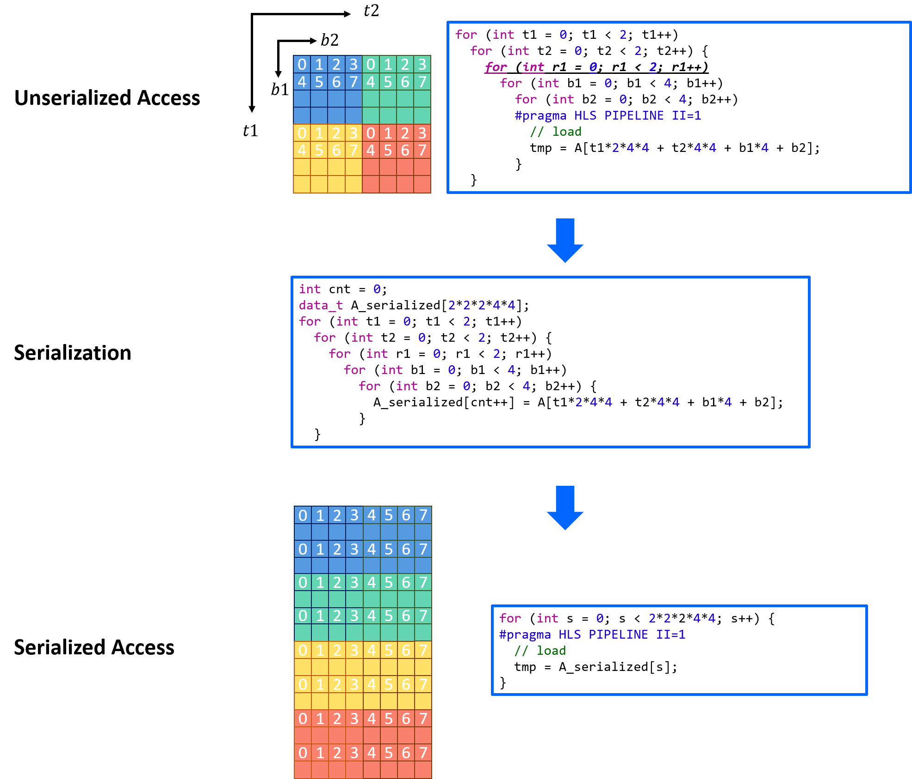

Understanding Host Serialization
================================

**Author**: Jie Wang (jiewang@cs.ucla.edu)

AutoSA supports serializing the data on the host side to increase the memory burst length.
This technique is important in achieving high effective DRAM bandwidth. 
This page explains the mechanisms of host serialization.

How It Works
------------

Host serialization is enabled by supplying AutoSA with the flag ``--host-serialize``.
The figure below explains the current mechanisms of serialization.

The upper part of the figure shows a piece of code that accesses a tiled matrix block by block.
Inside each block, data are loaded sequentially in row major.
We pipeline the innermost loop. The array ``A`` is stored in DRAM.

When synthesizing such a code in Xilinx HLS, HLS will automatically infer a burst length of :math:`4\times 4` for the DRAM 
access based on the inner loops.
However, this burst length is rather small to make use of the DRAM bandwidth.

The figure below from the paper [CHOI16]_ shows the profiled effective DRAM bandwidth versus burst length on Xilinx FPGAs.

As can be seen in the figure above, a minimal burst length of 128KB is required to reach the maximal effective bandwidth 
on Xilinx devices. The low burst length in the current design will lead to a rather 
low DRAM effective bandwidth that will eventually limit the performance.

This phenomemon makes it critical to perform data serialization.
The code in the middle shows the current method of data serialization implemented in AutoSA.
Simply, we will allocate a new array to hold the serialized data. The new array is filled 
based on the original data access pattern with an increasing counter.

This leads to a new matrix as shown in the bottom part of the figure. Now we can simply 
replace the original code that accesses DRAM with this new code.
HLS will then infer the burst length of :math:`2\times 2\times 4\times 4`, which is the maximal burst length 
we can achieve for this design.

As for the systolic array design, after supplying AutoSA with the flag ``--host-serialize``, 
you will notice a separate serialization module (S) created between the original outermost I/O module and the DRAM.
The figure below compares the systolic array architecture w/o and w/ data serialization.

We plug in the serialized data access logic into these serialization modules to achieve the maximal burst length.

Pitfalls
--------

The current serialization appraoch is a temporary solution, as it will create 
redundant data in the serialized matrix which bloats the size of this matrix.
The figure below shows one of such examples.

In this example, when accessing the matrix, we introduce one addition level of loop ``r1`` to 
visit each tile twice before moving to the next tile.
In such a case, using the current method, we will generate a serialized matrix which is 
two times larger than the original matrix. Things will become worse if such reuse happens more often.
Please keep in mind of this shortcoming of serialization when using it in AutoSA.
We will improve it in the future.

Bibliography
------------

.. [CHOI16] Choi, Young-kyu, et al. "A quantitative analysis on microarchitectures of modern CPU-FPGA platforms." Proceedings of the 53rd Annual Design Automation Conference. 2016.