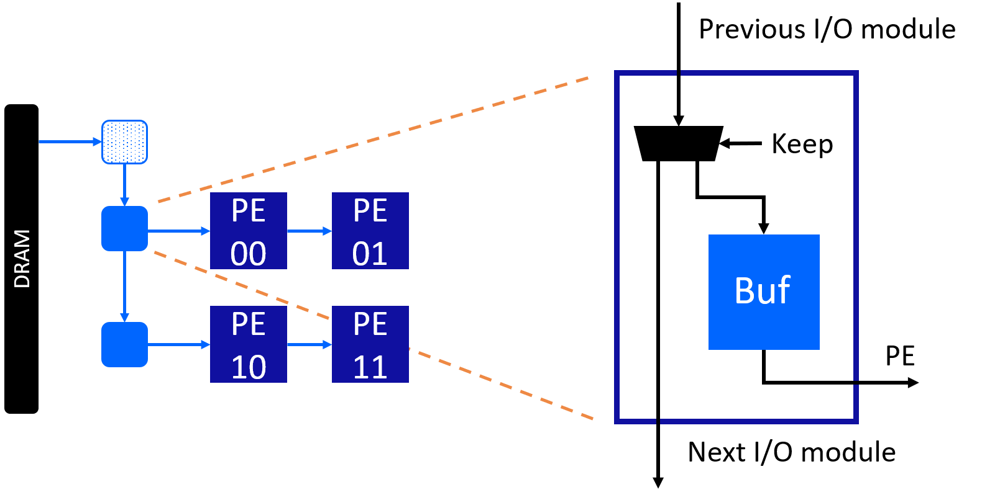

How Systolic Array Works: A Case Study on Matrix Multiplication
===============================================================

**Author**: Jie Wang (jiewang@cs.ucla.edu)

This page gives a detailed explanation about the AutoSA generated systolic array architecture
for matrix multiplication.

Generating the Systolic Array
-----------------------------

We will use the example code in ``${AUTOSA_ROOT}/autosa_tests/mm/kernel.c``.

.. code:: c

    #pragma scop
    for (int i = 0; i < 64; i++)
      for (int j = 0; j < 64; j++) {
        C[i][j] = 0;
        for (int k = 0; k < K64; k++)
          C[i][j] = C[i][j] + A[i][k] * B[j][k];
      }
    #pragma endscop

Use the following command to generate the systolic array.

.. code:: bash

    ./autosa ./autosa_tests/mm/kernel.c --config=./autosa_config/autosa_config.json --target=autosa_hls_c --output-dir=./autosa.tmp/output --sa-sizes="{kernel[]->space_time[3];kernel[]->array_part[16,16,16];kernel[]->latency[8,8];kernel[]->simd[2]}" --simd-info=./autosa_tests/mm/simd_info.json --hls

This will generate a :math:`2\times 2` 2D systolic array as shown below.

.. image:: images/mm_array_opt.png
    :width: 300
    :align: center

Understanding the Systolic Array
--------------------------------

The systolic array architecture is composed of two parts: the processing elements (PE) and the 
I/O network. We will explain these two components in sequence.

Processing Elements (PE)
^^^^^^^^^^^^^^^^^^^^^^^^

Below is the AutoSA generated HLS code for the PE.

.. code-block:: c
    :linenos:

    /* Module Definition */
    void PE(int idx, int idy, hls::stream<A_t2> &fifo_A_in, hls::stream<A_t2> &fifo_A_out, hls::stream<B_t2> &fifo_B_in, hls::stream<B_t2> &fifo_B_out, hls::stream<float> &fifo_C_drain_out) {
    #pragma HLS INLINE OFF
      /* Variable Declaration */
      int p0 = idx, p1 = idy; // module id
      A_t1 local_A[1][2];
      #pragma HLS ARRAY_PARTITION variable=local_A dim=0 complete
      B_t1 local_B[1][2];
      #pragma HLS ARRAY_PARTITION variable=local_B dim=0 complete
      C_t1 local_C[8][8];
      #pragma HLS RESOURCE variable=local_C core=RAM_2P_BRAM
      /* Variable Declaration */

      for (ap_uint<3> c0 = 0; c0 <= 3; c0 += 1)
        for (ap_uint<3> c1 = 0; c1 <= 3; c1 += 1) {
          // array
          // pe
          // latency
          for (ap_uint<4> c6 = 0; c6 <= 7; c6 += 1) {
            // latency
            for (ap_uint<4> c7 = 0; c7 <= 7; c7 += 1) {
            #pragma HLS PIPELINE II=1
              // simd
              // hls_unroll
              local_C[c7][c6] = 0;
            }
          }
          for (ap_uint<3> c2 = 0; c2 <= 3; c2 += 1) {
            // array
            // pe
            for (ap_uint<4> c5 = 0; c5 <= 7; c5 += 1) {
              // latency
              for (ap_uint<4> c6 = 0; c6 <= 7; c6 += 1) {
                // latency
                for (ap_uint<4> c7 = 0; c7 <= 7; c7 += 1) {
                #pragma HLS PIPELINE II=1
                  {
                    {
                      A_t2 fifo_data;
                      fifo_data = fifo_A_in.read();
                      for (ap_uint<2> n = 0; n < 2; n++) {
                      #pragma HLS UNROLL
                        union {unsigned int ui; float ut;} u;
                        u.ui = (unsigned int)fifo_data(31, 0);
                        local_A[0][n] = u.ut;
                        fifo_data = fifo_data >> 32;
                      }
                    }
                    {
                      B_t2 fifo_data;
                      fifo_data = fifo_B_in.read();
                      for (ap_uint<2> n = 0; n < 2; n++) {
                      #pragma HLS UNROLL
                        union {unsigned int ui; float ut;} u;
                        u.ui = (unsigned int)fifo_data(31, 0);
                        local_B[0][n] = u.ut;
                        fifo_data = fifo_data >> 32;
                      }
                    }
                    // simd
                    for (ap_uint<2> c8 = 0; c8 <= 1; c8 += 1) {
                    #pragma HLS UNROLL
                      local_C[c7][c6] = (local_C[c7][c6] + (local_A[0][c8] * local_B[0][c8]));
                    }
                    if (c2 == 3 && c5 == 7)
                      fifo_C_drain_out.write(local_C[c7][c6]);
                    {
                      B_t2 fifo_data;
                      union {unsigned int ui; float ut;} u1, u0;
                      u1.ut = local_B[0][1];
                      u0.ut = local_B[0][0];
                      fifo_data = (ap_uint<32>(u1.ui), ap_uint<32>(u0.ui));
                      fifo_B_out.write(fifo_data);
                    }
                    {
                      A_t2 fifo_data;
                      union {unsigned int ui; float ut;} u1, u0;
                      u1.ut = local_A[0][1];
                      u0.ut = local_A[0][0];
                      fifo_data = (ap_uint<32>(u1.ui), ap_uint<32>(u0.ui));
                      fifo_A_out.write(fifo_data);
                    }
                  }
                }
              }
            }
          }
        }
    }
    /* Module Definition */

In this 2D systolic array, data of matrix A are reused horizontally across PEs, data of matrix B are reused vertically. Each PE computes elements of matrix C locally. After the computation is done, final results of matrix C will be drained out to the external memory.

The PE interface (line 2) contains the following components:

* Module index (``idx``, ``idy``): Indices of the PE module.
* FIFO (``fifo_A_in``, ``fifo_A_out``, ``fifo_B_in``, ``fifo_B_out``, ``fifo_C_drain_out``): FIFOs for transfering data.

While generating this array, we applied latency hiding on the orginal loops :math:`i` and :math:`j` with the factor :math:`(8,8)`, and SIMD vectorization on the loop :math:`k` with a factor of 2. With the latency hiding, each PE will compute a tile of :math:`8\times 8` of the matrix C. With the SIMD vectorization, at each cycle, two elements of matrix A and two elements of matrix B are required to update the local elements of matrix C.

With this knowledge, we could take a look at the local variable declarations in lines 5-11 now. Line 5 is simply storing the module indices. Lines 6-11 allocate local storage inside PEs for storing the data of matrix A, B, and C.

The rest of the code performs the computation. At each cycle, PE reads data of matrix A and B from neighbor PEs at lines 38-59 and passes the data to neighbor PEs at lines 67-82. PE performs the computation at lines 61-64. 
When the final results of matrix C are derived, PE writes out the final results at lines 65-66.

I/O Network
^^^^^^^^^^^

I/O network is composed of a series of I/O modules for transferring data between the external memory and PEs. We will use the I/O modules of array A as an example.

There are two types of I/O modules for array A: 

* Level-3 (L3) I/O modules: modules that read data from the external memory and send to the array.
* Level-2 (L2) I/O modules: modules that pass data between each other. Data that belong to the PEs that the module is connected to are kept locally, the rest data are passed to the downstreaming I/O modules.

Below is the code of the L3 I/O module.

.. code-block:: c
    :linenos:

    /* Module Definition */
    void A_IO_L3_in(A_t8 *A, hls::stream<A_t8> &fifo_A_local_out) {
    #pragma HLS INLINE OFF
      /* Variable Declaration */
      /* Variable Declaration */

      for (ap_uint<3> c0 = 0; c0 <= 3; c0 += 1)
        for (ap_uint<3> c1 = 0; c1 <= 3; c1 += 1)
          for (ap_uint<3> c2 = 0; c2 <= 3; c2 += 1) {
            // array
            // io_L3
            for (ap_uint<2> c3 = 0; c3 <= 1; c3 += 1) {
              // io_L2
              for (ap_uint<4> c4 = 0; c4 <= 7; c4 += 1) {
                // access_coalesce
                for (ap_uint<2> c5 = 0; c5 <= 1; c5 += 1) {
                #pragma HLS PIPELINE II=1
                {
                  A_t8 fifo_data;
                  fifo_data = A[128*c0 + 2*c2 + 64*c3 + 8*c4 + c5];
                  fifo_A_local_out.write(fifo_data);
                }
                }
              }
            }
          }
    }
    /* Module Definition */   

In this design, we apply the array partitioning on the original loops :math:`i`, :math:`j`, and :math:`k` with the factors :math:`(16,16,16)`. The orignal loop bounds for these three loops are :math:`(64,64,64)`. 
Therefore, array partitioning loops at lines 7-9 have loop bounds of :math:`(4,4,4)`. 

When transferring the data to the PEs, we will pass data through the chain of L2 I/O modules. In this design, there are two such modules. The loop for traversing the L2 I/O modules is at line L2. 
Inside each L2 I/O module, we will need to load the data tile required by the PEs that it is connected to. 

With the array partitioning factors :math:`(16,16,16)`, at each array partition, a sub tile of matrix A with the size :math:`16\times 16` is loaded from the external memory. As this array have the dimension of :math:`2\times 2`, each L2 I/O module will store a tile with the size :math:`8\times 16`.
The loops for loading the data tiles for each I/O modules can be found at lines 14-16. Note that AutoSA will pack data together to increase the I/O througput. In this case, every 8 elements are packed together. Therefore, the size of the local tile is :math:`8\times 2`, with a data width of 8 data elements.

Next, we will look at the L2 I/O module. The figure below shows the micro-architecture of the L2 I/O module.

L2 I/O module loads data from the upstream I/O modules, keeps the data that belong to it, and sends the rest to the downstream modules. 
For I/O modules with local buffers inside, AutoSA automatically applies double buffering to overlap the data transfer betwen the I/O modules and data transfer to/from PEs. 

Below is the code of L2 I/O module.

.. code-block:: c
    :linenos:

    /* Module Definition */
    void A_IO_L2_in(int idx, hls::stream<A_t8> &fifo_A_in, hls::stream<A_t8> &    fifo_A_out, hls::stream<A_t2> &fifo_A_local_out) {
    #pragma HLS INLINE OFF
      /* Variable Declaration */
      int p0 = idx; // module id
      A_t8 local_A_ping[8][2];
      #pragma HLS RESOURCE variable=local_A_ping core=RAM_2P_BRAM
      A_t8 local_A_pong[8][2];
      #pragma HLS RESOURCE variable=local_A_pong core=RAM_2P_BRAM
      bool arb = 0;
      bool inter_trans_en = 1;
      bool intra_trans_en = 0;
      int c0, c0_prev;
      int c1, c1_prev;
      int c2, c2_prev;
      /* Variable Declaration */

      {
        for (ap_uint<3> c0 = 0; c0 <= 3; c0 += 1)
          for (ap_uint<3> c1 = 0; c1 <= 3; c1 += 1)
            for (ap_uint<3> c2 = 0; c2 <= 3; c2 += 1) {
              // array
              // io_L3
              {
                if (arb == 0) {
                  A_IO_L2_in_inter_trans(
                    /* module id */ idx, 
                    /* host iter */ c0, 
                    /* host iter */ c1, 
                    /* host iter */ c2, 
                    /* array */ local_A_pong, 
                    /* fifo */ fifo_A_in, 
                    /* fifo */ fifo_A_out, 
                    /* enable */ inter_trans_en
                  );
                  A_IO_L2_in_intra_trans(
                    /* module id */ idx, 
                    /* host iter */ c0_prev, 
                    /* host iter */ c1_prev, 
                    /* host iter */ c2_prev, 
                    /* array */ local_A_ping, 
                    /* fifo */ fifo_A_local_out, 
                    /* enable */ intra_trans_en
                  );
                } else {
                  A_IO_L2_in_inter_trans(
                    /* module id */ idx, 
                    /* host iter */ c0, 
                    /* host iter */ c1, 
                    /* host iter */ c2, 
                    /* array */ local_A_ping, 
                    /* fifo */ fifo_A_in, 
                    /* fifo */ fifo_A_out, 
                    /* enable */ inter_trans_en
                  );
                  A_IO_L2_in_intra_trans(
                    /* module id */ idx, 
                    /* host iter */ c0_prev, 
                    /* host iter */ c1_prev, 
                    /* host iter */ c2_prev, 
                    /* array */ local_A_pong, 
                    /* fifo */ fifo_A_local_out, 
                    /* enable */ intra_trans_en
                  );
                }
                intra_trans_en = 1;
                arb = !arb;
                c0_prev = c0;
                c1_prev = c1;
                c2_prev = c2;
              }
            }
        if (arb == 0) {
          A_IO_L2_in_intra_trans(
            /* module id */ idx, 
            /* host iter */ c0_prev, 
            /* host iter */ c1_prev, 
            /* host iter */ c2_prev, 
            /* array */ local_A_ping, 
            /* fifo */ fifo_A_local_out, 
            /* enable */ intra_trans_en
          );
        } else {
          A_IO_L2_in_intra_trans(
            /* module id */ idx, 
            /* host iter */ c0_prev, 
            /* host iter */ c1_prev, 
            /* host iter */ c2_prev, 
            /* array */ local_A_pong, 
            /* fifo */ fifo_A_local_out, 
            /* enable */ intra_trans_en
          );
        }
      }
    }
    /* Module Definition */    

Lines 6-9 define the double buffers inside the I/O module.
Lines 19-95 performs the double buffering to overlap the data transfer between I/O modules (defined in the function ``A_IO_L2_in_inter_trans``) and data transfer to/from PEs (defined in the function ``A_IO_L2_in_intra_trans``).

Please refer to the generated code for more details of the functions ``A_IO_L2_in_inter_trans`` and ``A_IO_L2_in_intra_trans``.

The similar principles apply to the other I/O modules. Together with both the I/O modules and PEs, we have a complete functional systolic array that can be synthesized and executed on FPGAs.

.. note:: 

    When adding the argument ``--host-serialize`` to the AutoSA command, the data of each array will be serialized on the host and transfered to the systolic array. AutoSA will introduce an additional I/O module for loading/writing the serialized data from/to the external memory before the original I/O modules. Feel free to try it out and compare with the code without serialization. The major benefit of using host serialization is to increase the DDR bus width and burst length to improve the effective DRAM bandwidth.