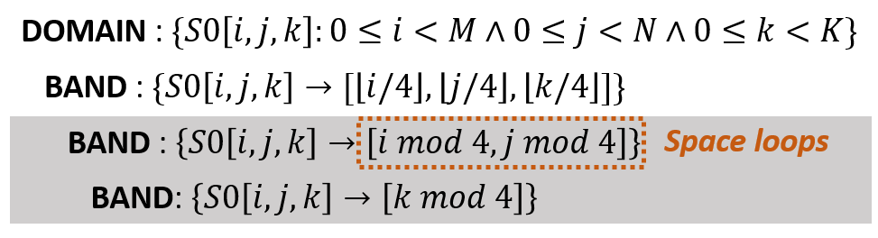
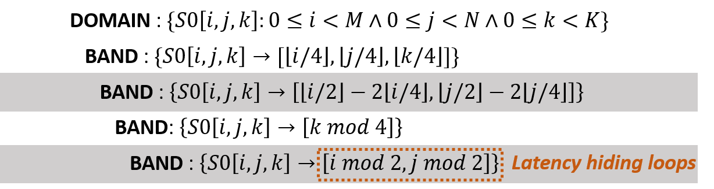
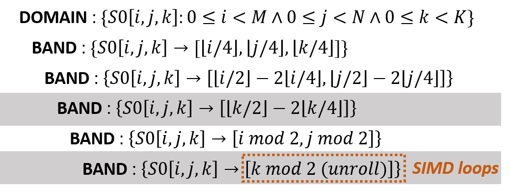
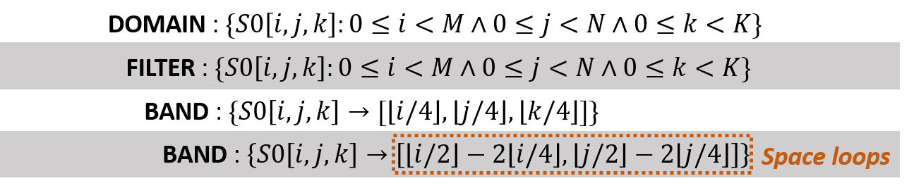
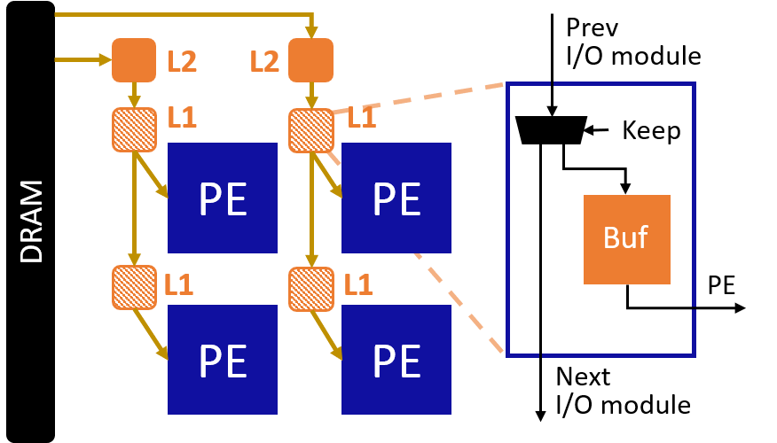
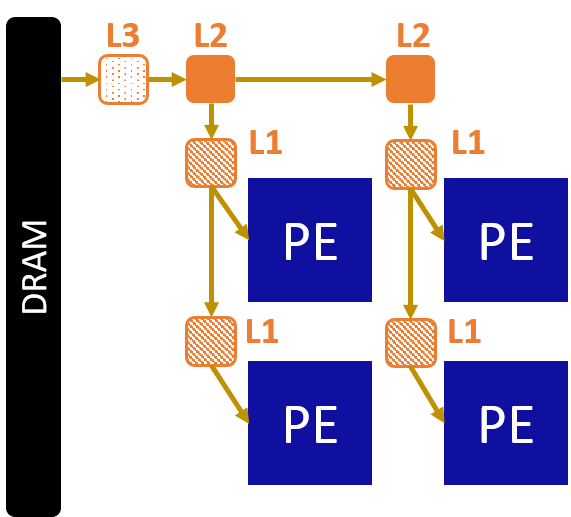
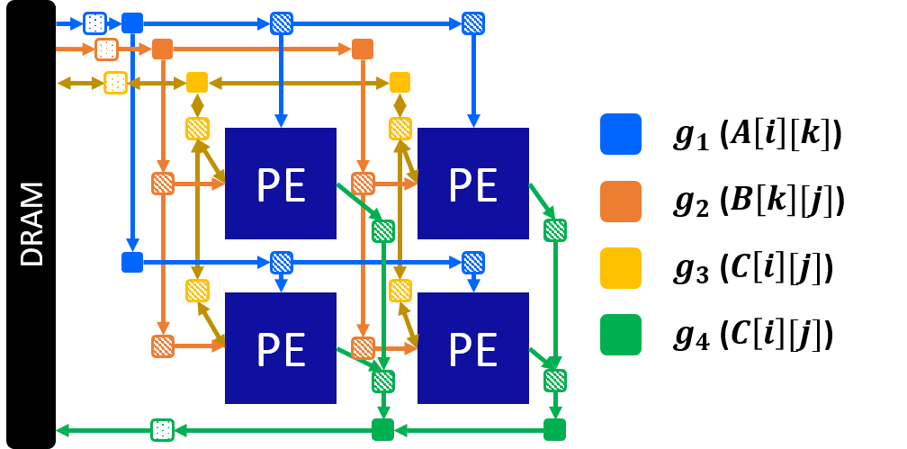
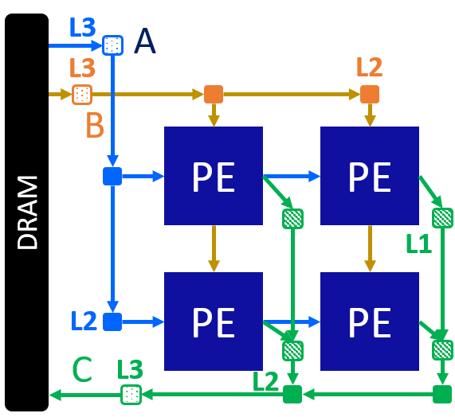

.. _construct-and-optimize-array-label:

Constructing and Optimizing a Systolic Array
============================================

**Author**: Jie Wang (jiewang@cs.ucla.edu)

This page takes an in-depth look at how AutoSA constructs and optimizes a systolic array to 
achieve high performance on FPGAs. 

.. note:: 
    This page will be helpful to readers who are interested in the implementation of AutoSA. 
    More details are covered in the `AutoSA Paper <https://vast.cs.ucla.edu/sites/default/files/publications/FPGA2021_AutoSA_camera.pdf>`_.
    Feel free to skip this one if you focus on using AutoSA to generate systolic arrays only.

Prerequisites
-------------
Please finish the tutorial :ref:`theoretical-background-label` first.

A complete systolic array architecture consists of both the PE array and the on-chip 
I/O network. 
AutoSA separates the process of building these two components into two stages: 
*computation* and *communication management*. 
The stage of computation management constructs the PE and optimizes its micro-architecture. 
After that, the stage of communication management builds the I/O network for transferring data between PEs and the external memory. 
Details of these two stages will be covered in the subsequent sections, respectively.

In the subsequent sections, we use the exmaple code below to illustrate different steps.

.. code:: c

  for (int i = 0; i < M; i++)
    for (int j = 0; j < N; j++)
      for (int k = 0; k < K; k++) 
  S0:   C[i][j] += A[i][k] * B[k][j];

This code performs matrix multiplication (the initialization is omitted for brevity).
With the help of `integer set library (ISL) <http://isl.gforge.inria.fr/>`_, we can
extract the initial schedule tree of the program as shown below.

Computation Management
----------------------

The stage of computation management consists of four steps: 
*space-time transformation*, *array partitioning*, *latency hiding*, 
and *SIMD vectorization*. We will go though each step in the following subsections. 

Space-Time Transformation
^^^^^^^^^^^^^^^^^^^^^^^^^

This step performs the space-time transformation to map the input program to a systolic array.
Details of the space-time transformation are covered in :ref:`theoretical-background-label`.
The algorithm below describes how AutoSA applies the space-time transformation.

.. admonition:: Algorithm 1: Space-time transformation

    | Inputs: A schedule tree :math:`s` 
    | Outputs: A list of schedule tree :math:`S`
    | Initialize the space loop candidate pool :math:`P\gets \emptyset`;
    | Extract the outermost permutable loop band :math:`d` from :math:`s`;
    | for each loop :math:`l` in the band :math:`d` do
    |  if all flow/read dependence distances on loop :math:`l \leq 1` then
    |    :math:`P \gets P \cup l`;
    | /* Generate 2D systolic array. \*/
    | for each pair of loops :math:`(l_1, l_2)` in the pool :math:`P` do
    |  Duplicate the schedule tree :math:`s' \gets s`;
    |  Modify :math:`s` by permuting the loops :math:`l_1, l_2` to outermost;
    |  :math:`S\gets S\cup s'`;
    | /* Generate 1D systolic array (omitted), similar to 2D case with only one space loop selected. \*/

AutoSA searches for the loops in the outermost loop band with flow/read dependence distances no greater then one. 
Those loops are put into a pool as the candidate space loops. 
Next, AutoSA enumerates all space loop combinations from the candidate pool. 
The selected space loops are permuted outermost. 
All the loops below the space loops are assigned as time loops. 
At present, AutoSA generates 1D and 2D systolic arrays. 
This constraint can be relaxed to generate higher-dimensional arrays 
if necessary. 
There will be multiple systolic arrays generated from this step, 
each with a unique schedule. 
Users can choose which array to process manually, 
or leave it to be explored by the auto-tuner.

Array Partitioning
^^^^^^^^^^^^^^^^^^

Given the limited on-chip resource, array partitioning is mandatory when mapping a large array to FPGA.  
To achieve this, AutoSA tiles the outermost permutable loop band in the schedule 
tree which contains the space loops. 
The tiling factors can be chosen by the users or set by the auto-tuner during the 
design space exploration. 
The schedule tree below shows one example in which we tile the outermost loop band 
in the MM example with the tiling factors of :math:`(4,4,4)`. 

The point loops from the original loops :math:`i` and :math:`j` are kept as the space loops. 
This will lead to a 2D systolic array with the dimensions of :math:`4\times4`.

Latency Hiding
^^^^^^^^^^^^^^

Latency hiding helps hide the pipeline stalls caused by the loop-carried dependence 
of the compute statements. In the MM example, the multiply-and-add (MAC) operation 
in the statement S0 introduces loop-carried dependence on the loop :math:`k`, 
resulting in an initial interval (II) greater than one. 
To resolve this issue, AutoSA looks for parallel loops in the schedule tree, 
strip-mines them and permutes the point loops innermost. 
As an example, loops :math:`i` and :math:`j` are parallel loops in the MM example. 
We will strip-mine them with the tiling factors of :math:`(2,2)` and permute the point 
loops innermost. Since there is no loop-carried dependence on the innermost loop, 
the PE could now achieve II=1. 
The newly generated schedule is shown below.

Similar as the previous stage, AutoSA allows users to specify the loops to be tiled 
and the tiling factors. 
Alternatively, such choices will be explored by the auto-tuner to maximize the performance.

SIMD Vectorization
^^^^^^^^^^^^^^^^^^

SIMD vectorization duplicates the compute units inside each PE, 
which still share the same control logic. 
This helps amortize the control overheads and improve the resource efficiency of the 
design. At present, AutoSA detects the vectorizable loop by 
examining the following two criteria:

* The loop should be a parallel loop or a reduction loop. 
* All array references within the loop are stride-one or stride-zero in regard to this loop. 

.. note:: 

    The current polyhedral framework that AutoSA builds on lacks the capability 
    to detect the reduction loop, which requires the user annotation prior to 
    the compilation.

In the MM example, the loop :math:`k` is a reduction loop. Array references ``C[i][j]`` and ``A[i][k]`` 
are stride-zero and stride-one with regard to loop :math:`k`. 
The array reference ``B[k][j]`` requires a layout transformation to ``B[j][k]`` so that 
it becomes a stride-one access that enables the vectorization. 
Below is the updated schedule tree in which we strip-mine the loop :math:`k` 
with a factor of 2.

The point loop is permuted innermost and marked ``unroll`` which will be handled by HLS tools at last. 

Communication Management
------------------------

So far we have finished the PE construction and optimization. 
However, the current array is still not functional as we are missing the other key component, 
the I/O network. 
The I/O network is a network on chip that supports two types of data communication:

* **Inner-array communication**, the data communication between PEs.
* **Outer-array communication**, the data communication between PEs and the external memory (e.g., DRAM).

The stage of communication management in AutoSA analyzes the program and constructs 
the I/O network as mentioned above.
We show that I/O network can be built automatically via data dependence analysis 
in the polyhedral model. 
Furthermore, as the topology of the I/O network plays an important role in the 
frequency of the design, we extend the algorithm to build an I/O network that 
only involves local interconnects, 
hence, guaranteeing the sustained high frequency. 

The following subsections explain our approaches in detail. 
`I/O Analysis`_ describes how we analyze the dependences in the program to extract 
the necessary information for constructing the I/O network. 
`I/O Construction`_ builds the I/O network using the information extracted from the 
previous step. 
`I/O Optimization`_ discusses several I/O optimization techniques to further 
improve the I/O performance.

I/O Analysis
^^^^^^^^^^^^

The data communication is associated with the data dependences.
To build the I/O network, AutoSA analyzes the following three types of data dependences:

* Read dependence: for transferring the read-only data.
* Flow dependence: for transferring the intermediate results.
* Output dependence: for transferring the final results. 

The table below lists the dependences extracted from the MM example. 

.. csv-table::
    :header: "Type", "Dependence Relation", "Array Access"

    "Read", ":math:`D1:=\{S0[i,j,k]\to S0[i,j+1,k]\}`", ``A[i][k]``
    "Read", ":math:`D2:=\{S0[i,j,k]\to S0[i+1,j,k]\}`", ``B[k][j]``
    "Flow", ":math:`D3:=\{S0[i,j,k]\to S0[i,j,k+1]\}`", ``C[i][j]``
    "Output", ":math:`D4:=\{S0[i,j,k]\to S0[i,j,k+1]\}`", ``C[i][j]``

The step of I/O analysis interprets such dependences and extracts a data structure 
named *I/O group* that contains the necessary information required to construct the I/O network. 
Please refer to the `AutoSA Paper <https://vast.cs.ucla.edu/sites/default/files/publications/FPGA2021_AutoSA_camera.pdf>`_ 
for more details about how we derive the I/O groups.

An I/O group :math:`g` is defined as a tuple of :math:`g=(A,D)` where :math:`A` is a
set of array accesses that are associated with the current group and 
:math:`D` is the set of data dependences associated with the array accesses in :math:`A`. 
For each I/O group, the following properties are computed:

* **I/O direction**. This is the component of the dependence distance vector on the space loops.
* **I/O type**. The I/O group is classified as *exterior I/O* if the dependence is carried by 
  the space loops. Otherwise, it is classified as *interior I/O*.

As an example, in the MM example, for the array access ``B[k][j]``, 
we construct an I/O group :math:`g` from the array access ``B[k][j]`` and 
its associated dependence :math:`D2` as shown in the table above.
The dependence distance of :math:`D2` on the space loops is :math:`(1,0)`. 
Therefore, we assign the I/O direction as :math:`g.dir=(1,0)` and the 
I/O type as :math:`g.type=exterior`.

The I/O groups are then merged if they share the same properties.
Later, AutoSA will allocate a set of I/O modules for each I/O group.

The last step is to compute the statement instances that require such data.
We divide them into two sets: copy-in set :math:`W_{in}` and 
copy-out set :math:`W_{out}`. 
These sets contain the statement instances that require the data to be copied in 
or copied out, respectively.

The table below includes the final I/O groups extracted from the MM example and 
their copy-in/copy-out sets. 
They will be used for I/O network construction in the next section.

.. csv-table::
    :header: "No.", ":math:`A`", ":math:`D`", ":math:`W_{in}/W_{out}`"

    ":math:`g_1`", ``A[i][k]``, ":math:`D_1`", ":math:`W_{in}:={S0[i,j,k]}:0\leq i< M \land 0\leq j< N \land 0\leq k<K\}`"
    ":math:`g_2`", ``B[k][j]``, ":math:`D_2`", ":math:`W_{in}:={S0[i,j,k]}:0\leq i< M \land 0\leq j< N \land 0\leq k<K\}`"
    ":math:`g_3`", ``C[i][j]``, ":math:`D_3`", ":math:`W_{in}:={S0[i,j,k]}:0\leq i< M \land 0\leq j< N \land 0< k<K\}`"
    , , , ":math:`W_{out}:={S0[i,j,k]}:0\leq i< M \land 0\leq j< N \land 0\leq k<K-1\}`"
    ":math:`g_4`", ``C[i][j]``, ":math:`D_4`", ":math:`W_{out}:={S0[i,j,k=K-1]:0\leq i< M \land 0\leq j< N}`"

I/O Construction    
^^^^^^^^^^^^^^^^

This step constructs the I/O modules based on the I/O grouping information extracted 
from the previous step. 
For each I/O group, AutoSA allocates a set of I/O modules for transferring the 
data between PEs and the external memory.

We start with the optimized schedule from the computation management. 
In the first step, we isolate the statement instances that are involved with 
the data communication from the current group by inserting a filter node into 
the schedule tree with the copy-in/copy-out set. 
The filter node restrains the iteration domains of its children nodes by intersecting the current iteration domain with the filter set.

As an example, below is the updated schedule with the filter domain of the I/O group
:math:`g_2` (loops inside the space loops are omitted for brevity).

At this stage, we could already generate a set of I/O modules that load the data from the external memory and send the data directly to each PE.
This can be realized by equating the space loops to the PE indices ``idx`` and ``idy`` in the updated schedule and using it to generate the code inside each I/O module.
The figure below shows the generated array and the corresponding schedule for each I/O module.

.. image:: images/mm_array_b.png
    :width: 500
    :align: center

However, this architecture may not be scalable as the data are scattered directly from the external memory which causes high fan-outs and could lead to routing failure.
To resolve this issue, we choose to *localize* the I/O network by using a daisy-chain architecture.
In this architecture, each I/O module fetches data from the upper-stream I/O modules.
The I/O module works as a filter that keeps the data belonging to the PEs that it is associated with and passes the rest of the data to the down-stream I/O modules.
As for the architecture in the figure above, 
we name the I/O modules that are directly connected to PEs as level-one (L1) I/O modules.
We could first cluster the L1 I/O modules along the :math:`x`-axis, as shown in the figure below.

Every two L1 modules along the :math:`x`-axis are connected to an upper-level (L2) I/O modules, which helps to reduce the memory fan-outs from four to two.
We name such a process as *I/O clustering*.
I/O clustering can be applied multiple times in a hierarchical way.
For example, we could apply the I/O clustering again on the L2 I/O modules, generating one L3 I/O module that connects to the DRAM, as shown in the figure below.
Eventually, we reduce the memory fan-outs from four to one.

The figure below depicts the final array architecture after the I/O clustering for all the I/O groups.

I/O Optimization
^^^^^^^^^^^^^^^^

In this step, AutoSA applies multiple passes to further optimize the I/O network. 

**I/O module embedding**: L1 I/O modules with exterior I/O are embedded into the PEs to save the resource.

**I/O module pruning**: When transferring the data between different sub-array tiles, 
AutoSA checks if the copy-out set of the previous tile equals the copy-in set of the 
current tile at the PE level. If two sets are equal at the PE level, 
it indicates the data are located on-chip and hence the data transfer from the external 
memory is unnecessary. For such a case, the I/O modules for this I/O group are pruned 
away to save the off-chip communication and on-chip resource. 
As an example, for the MM example, the I/O modules for the group :math:`g_3` 
will be pruned away since the data of matrix C are accumulated locally inside each PE. 
The figure below shows the optimized array by applying two techniques as mentioned above.

**Data packing**: To reduce the data transfer latency between the I/O modules, 
AutoSA performs data packing between I/O modules. 
Packing more data helps reduce the data transfer latency, 
however, it leads to FIFOs with a larger width and higher resource usage. 
Therefore, AutoSA offers options to set the data packing factor at each I/O level, 
which can also be set by the auto-tuner during the design space exploration.

**Double buffering**: By default, AutoSA allocates a local buffer inside the L1 I/O modules 
for I/O groups with interior I/O or inside the L2 I/O modules for I/O groups 
with the exterior I/O. For such I/O modules with local buffers inside, 
AutoSA offers options to enable the double buffering that helps overlap the 
memory transfer with the PE computation.

After the above steps, we obtain a complete systolic array with both PEs and I/O network.