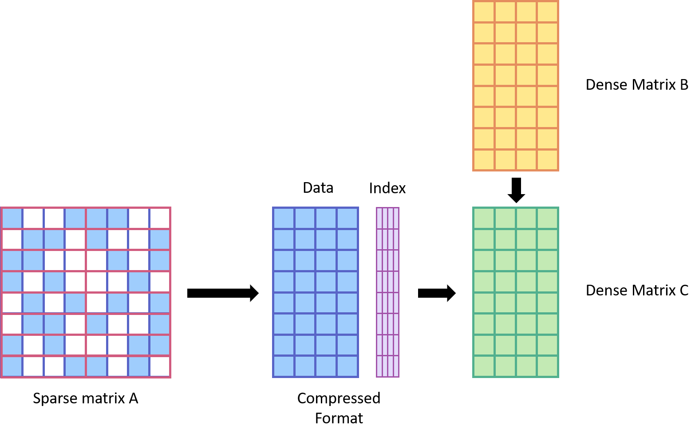
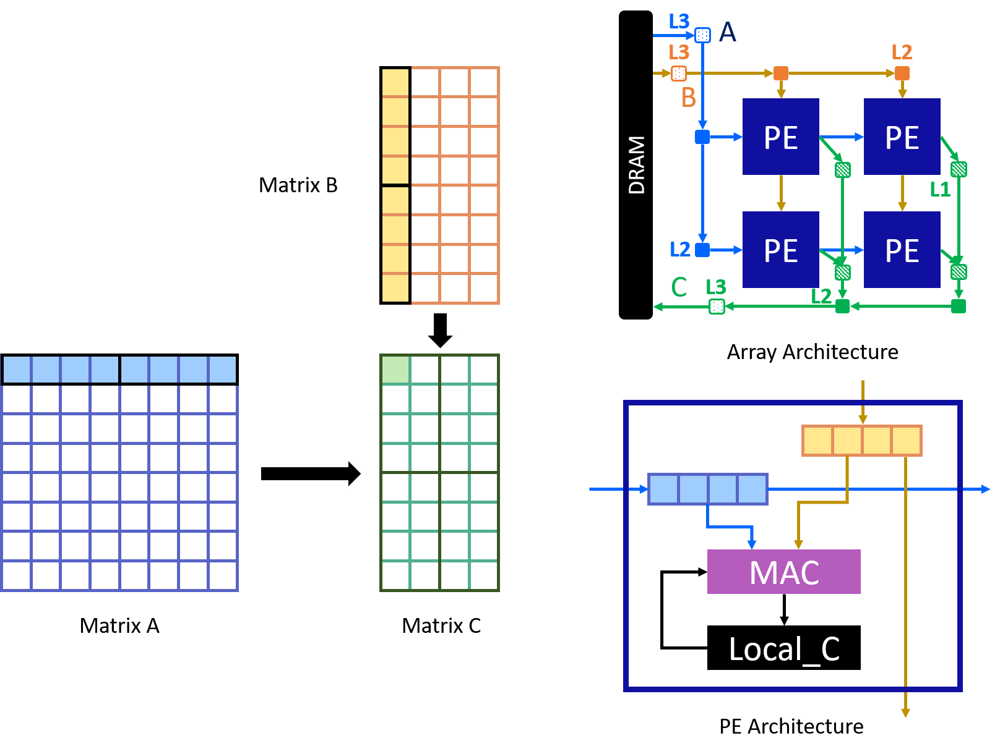
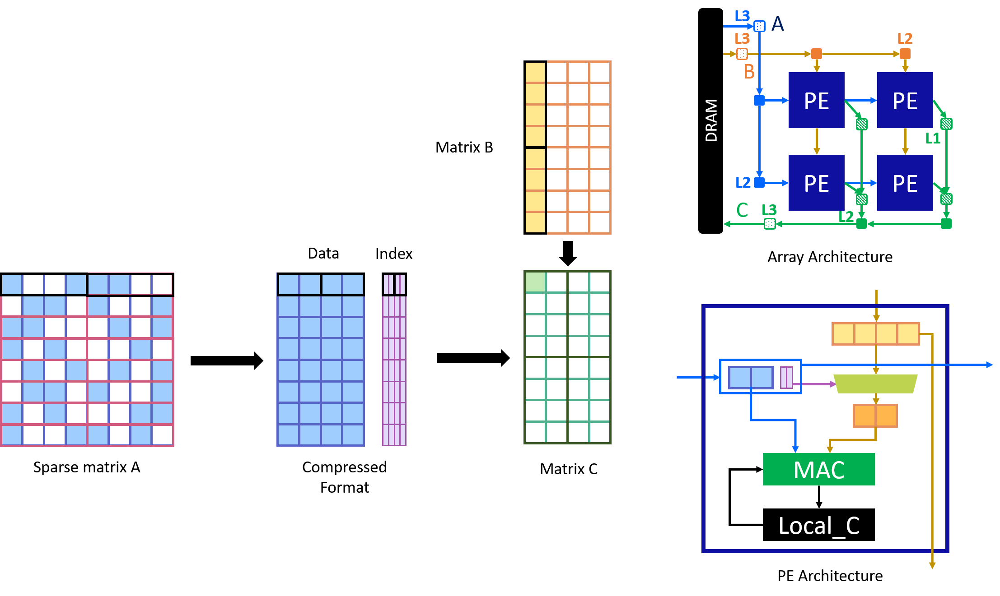
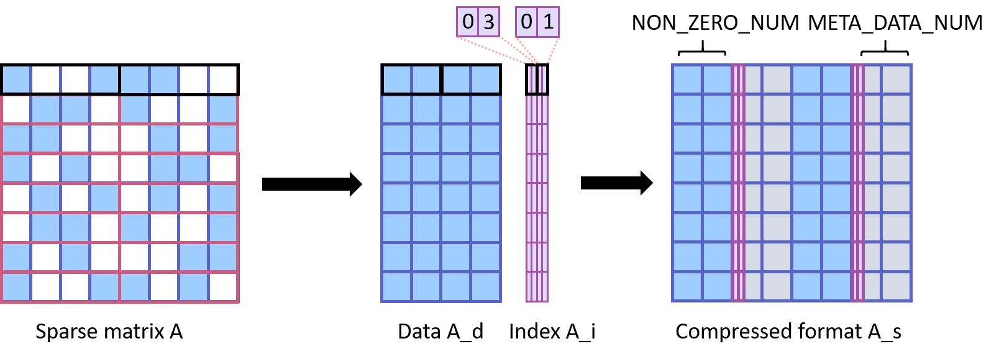
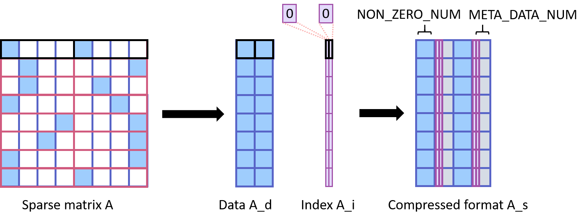

Supporting Structural Sparsity
==============================

**Author**: Jie Wang (jiewang@cs.ucla.edu)

Structural sparsity can be useful for DNN networks. This page discusses how structural 
sparsity is supported in AutoSA.

What is Strctural Sparsity?
---------------------------

AutoSA supports the similar structural sparsity that can be found in the recent Nvidia 
Ampere GPU (`link <https://developer.nvidia.com/blog/exploiting-ampere-structured-sparsity-with-cusparselt/>`_). 
The figure below shows the supported sparse matrix-dense matrix multiplication.

The figure above performs the computation of :math:`C=A\times B`.
The first input matrix A is a strutural-sparse matrix, and the second input matrix B is 
a dense matrix.
As for the matrix A, every adjacent ``VEC_LEN`` elemens are grouped together. In every group,
we allow up to ``NON_ZERO_NUM`` non-zero elements. Therefore, the sparsity of the matrix A is
``1-NUN_ZERO_NUM/VEC_LEN``.

The sparse matrix A is then stored in a compressed format, in which only the non-zero elements 
are stored, along with their relative indices inside each group.

The benefits of structural sparsity are clear. It allows the hardware to achieve higher 
effective throughput with the same amount of resource. 
It is also easy to be implemented on the systolic array architecture. 
We will show how to modify the systolic array to support the structural sparsity in the next section.

How is Structural Sparsity Implemented in AutoSA?
-------------------------------------------------

As a comparison, we first present how the dense matrix multiplication is mapped to the 
systolic array.

In the figure above, we show an example of a 2D :math:`2\times 2` systolic array.
Each PE computes a sub tile of the matrix C with the size :math:`4\times 2`.
With SIMD vectorization, each time, two vectors of 4 elements from the matrix A and 
matrix B are loaded into the PE. The PE computes the inner product of the two vectors 
and updates the elements of matrix C.

This array can be easily extended to support the structural sparsity.
The figure below shows an example in which we set the vector size :math:`v` as 4 and 
the number of non-zero elements :math:`NON_ZERO_NUM` as 2.

As the new matrix A is sparse, instead of packing 4 elements and send to PE each time, 
we will only pack 2 elements, along with their indices in the original group vector, and send them 
to PEs. When PE loads the packed data, it will use the indices of the A elements to select 
the corresponding elments from the vector of matrix B. 
Compared to the dense architecture, we introduce the packed indices of the sparse data and a MUX 
for selecting the data from matrix B.

Generating the Design
---------------------

Now let's use AutoSA to generate one sparse design.
The example used here can be found in the directory ``${AUTOSA_ROOT}/autosa_tests/mm_block_sparse``.

Use the following command to generate the design.

.. code:: bash

    ./autosa ./autosa_tests/mm_block_sparse/kernel.c \
    --config=./autosa_config/autosa_config.json \
    --target=autosa_hls_c \
    --output-dir=./autosa.tmp/output \
    --sa-sizes="{kernel[]->space_time[3];kernel[]->array_part[16,16,16];kernel[]->latency[8,8];kernel[]->simd[8]}" \
    --simd-info=./autosa_tests/mm_block_sparse/simd_info.json \
    --host-serialize \
    --hls \
    --block-sparse --block-sparse-ratio="{kernel[]->A[2,4]}"

The generated designs can be found at the directory ``${AUTOSA_ROOT}/autosa.tmp/output/src``

This command generates a design in Xilinx HLS C. You can use Xilinx HLS to verify the correctness of the design.

Copy the TCL script to the output directory.

.. code:: bash

    cp ${AUTOSA_ROOT}/autosa_tests/mm_block_sparse/hls_script.tcl ${AUTOSA_ROOT}/autosa.tmp/output/

Run the TCL script to verify the design.

.. code:: bash

    cd ${AUTOSA_ROOT}/autosa.tmp/output
    vivado_hls -f hls_script.tcl

You should be able to see the following content in the terminal if the HLS design is executed successfully.

.. code:: bash

    INFO: [SIM 211-2] *************** CSIM start ***************
    INFO: [SIM 211-4] CSIM will launch GCC as the compiler.
    make: 'csim.exe' is up to date.
    Passed!
    INFO: [SIM 211-1] CSim done with 0 errors.
    INFO: [SIM 211-3] *************** CSIM finish ***************

Now let's take a closer look at the design code.
The input code can be found at ``${AUTOSA_ROOT}/autosa_tests/mm_block_sparse/kernel.c``

At line 28, we define the original matrices used for the matrix multiplication.

.. code:: c

    data_t A[I][K], B[J][K], C[I][J], C_golden[I][J];

In this example, matrix A will be sparsified. 
The figure below illustrates how we store the sparse information.

    
In this figure, we set the vector length ``VEC_LEN`` as 4, and 
number of non-zero elements ``NON_ZERO_NUM`` as 2.
Array ``A_d`` stores the non-zero data elements. 
And the relative index of the data elements in each group in stored in the array ``A_i``.
The data and index array is concatenated to be stored in the array ``A_s``.
For each group vector, we store the index information using an ``unsigned char`` right 
after the data elements. Currently we assume that the group vector length to be a 
power of two and is no greater than 8. Besides, the data width of the matrices is 
no shorter than 8. All of these limitations can be relaxed in the future. 

After concatenating the index with the data elements, we will also pad empty elements to align the array.
Specifically, we compute the number of elements, except the data elements, denoted by 
``META_DATA_NUM`` using the following formula:

.. math::
    
    META\_DATA\_NUM = 2^{ceil(log2(NON\_ZERO\_NUM+1))} - NON\_ZERO\_NUM

In this example, we compute ``META_DATA_NUM`` as 2. Two additional data elements are inserted after 
the original data elements, And we store the index in the third element, as shown in the figure above.

Another example is shown in the figure below.

In this example, we have ``VEC_LEN`` as 4, ``NON_ZERO_NUM`` as 1, and ``META_DATA_NUM`` as 1.

For compilation, we still use the original dense matrix multiplication, as shown in lines 89-97.
We provide the sparse information to the compiler through command arguments:

* ``--block-sparse``: Specifies to use block sparsity.
* ``--block-sparse-ratio="{kernel[]->A[2,4]}"``: Specifies the sparse array as array ``A``, and the 
  number of non-zero elements and the group vector length ``[NON_ZERO_ELEMENTS, VEC_LEN]``.