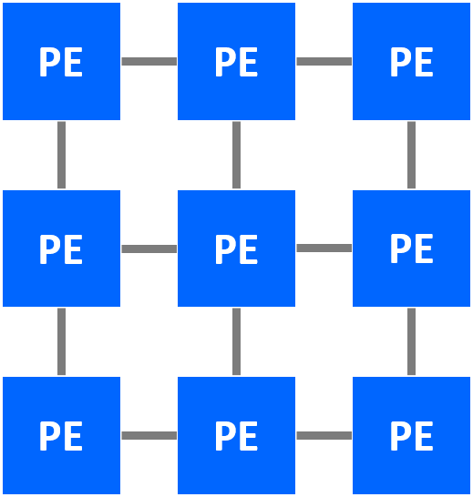
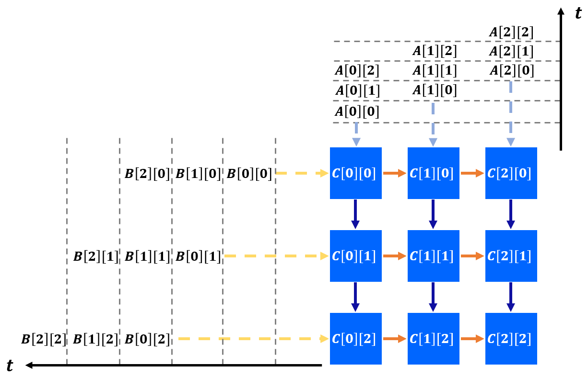

.. _theoretical-background-label:

Theoretical Background
======================

**Author**: Jie Wang (jiewang@cs.ucla.edu)

This page covers the theoretocal background of mapping algorithms to systolic arrays. 
We will start by giving an example of a systolic array for matrix multiplication to show
how systolic arrays look like and how they work. Then we will cover some basics about the 
polyhedral model and the algorithm (i.e., space-time transformation) that AutoSA uses to map
an algorithm to a systolic array.

An Example of Systolic Array
----------------------------

The example code below describes the matrix multiplication :math:`C=A\times B`.

.. code:: c

  int A[3][3], B[3][3], C[3][3];
  for (int i = 0; i < 3; i++)
    for (int j = 0; j < 3; j++) {
  S0: C[i][j] = 0;
      for (int k = 0; k < 3; k++) 
  S1:   C[i][j] += A[i][k] * B[k][j];
    }
      
This algorithm can be mapped to a systolic array depicted in the figure below.

In this figure, a 3x3 2D systolic array is generated for this algorithm.
The processing elements (PE) are connected only through local interconnects, the most 
important signature of systolic array architecture. 
The figure below futher depicts the detailed computation scheduling of this array.

Specifically, each PE computes one element of matrix C locally. Data of matrix A and B 
are fed at the boundaries and reused across PEs. The timing to feed data to different rows and columns of PEs
are skewed to match the computation scheduling inside PEs.
To explain further, at the first cycle (when t = 0), the data of ``A[0][0]`` and ``B[0][0]`` are 
fed to the PE on the top-left corner. At the next cycle (t = 1), ``A[0][0]`` is sent downward and 
``B[0][0]`` is sent rightward. In the meantime, new data ``A[0][1]`` and ``B[1][0]`` are sent to the original PE
and we also start to feed boundary PEs in the second column and row. 

After the computation is completed, each PE contains the final result of matrix C. The final results
will be drained out to the external memory at last.

As shown in the figure above, at each cycle, data are pumped into arrays and transferred across PEs rhythmically. 
This is how the name **systolic array** is coined for this type of architecture.

There are two major benefits of such an architecture.

* *Performance*. Systolic array exploits parallelism with a large number of PEs to achieve high performance.
* *Energy efficiency*. The local interconnects maximize data reuse and reduces the energy cost of data transfer, thus leading to high energy efficiency.

Due to such benefits, in the recent years, we have seen systolic arrays being widely adopted in various application domains, e.g., genomics, machine learning, 
to accelerate the computation.

Polyheral Model
---------------

The polyhedral model is a mathematical framework for loop nest optimization. 
Loop nests that satisfy the requirements of the polyhedral model are called 
static control of parts (SCoP). A SCoP is defined as a set of statements with loop bounds
and conditions as affine functions of the enclosing loop iterators and variables that are
constant during the SCoP execution.

A program in the polyhedral model is typically represented by three components: 
*iteration domains*, *access relations*, and a *schedule*. We will keep use the running example of 
matrix multiplication in the previous section to illustrate these concepts.

The iteration domain contains the loop instances of the program. The iteration domain of the statement
S1 in the example program has the form

.. math::

    \{S1[i,j,k]:0\leq i< 3 \land 0\leq j< 3 \land 0\leq k<3\}

Throughout this tutorial, to represent the components of the polyhedral model, we use the same
format as `integer set library (ISL) <http://isl.gforge.inria.fr/>`_, which is a library
for polyhedral compilation. In addition, we will only show the representation with regard to the statement
S1 for brevity.

The access relation maps a statement instance to an array index. For example, 
the access relations for the read accesses in the statement S1 have the form

.. math::

    \{S1[i,j,k]\to A[i,k];S1[i,j,k]\to B[k,j];S1[i,j,k]\to C[i,j]\}

Finally, a schedule maps instance sets to multi-dimensional time. 
The statement instances are executed following the lexicographic 
order of the multi-dimensional time. 
As an example, the schedule of the statement S1 has the form 

.. math::

    \{S1[i,j,k]\to [i,j,k]\} 
    
The schedule of a SCoP program can be represented by 
`schedule trees <http://impact.gforge.inria.fr/impact2014/papers/impact2014-verdoolaege.pdf>`_.
The figure below shows the schedule tree of the example program. 

    
The schedule tree starts with a domain node that defines the iteration domain of 
the program, followed with band nodes that encode the partial schedules at each 
loop dimension. 
The isl library manipulates the schedule tree of the program to perform the loop transformation. To generate the final code, an AST is obtained from the schedule tree which is then lowered to the target code (e.g., C).

For readers who are intereted to learn more about the polyhedral model, we recommend some resources below.

* `ISL manual <http://isl.gforge.inria.fr//manual.pdf>`_, the manual contains all the basic concepts and APIs of ISL.
* `ISCC online demonstrator <https://polyhedral.info/2014/01/21/ISCC-demo-online.html>`_, an interactive interface to most of ISl functionalities. Don't forget to check out `this tutorial <http://barvinok.gforge.inria.fr/tutorial.pdf>`_ before using ISCC.
* `Pluto framework <http://pluto-compiler.sourceforge.net/>`_, a milestone framework to get familar with the polyhedral scheduling algorithms.
* `PPCG <https://github.com/Meinersbur/ppcg>`_, a polyhedral-model-based C-to-CUDA compiler. The original paper is `here <https://dl.acm.org/doi/pdf/10.1145/2400682.2400713>`_.
* Some recent polyhedral-model-based compilation frameworks

    * `Tensor Comprehension <https://research.fb.com/downloads/tensor-comprehensions/>`_ (discontinued)
    * `Tiramisu <http://tiramisu-compiler.org/#:~:text=Tiramisu%20is%20a%20polyhedral%20compiler,be%20optimized%20by%20the%20compiler.>`_

Space-Time transformation
-------------------------

In the last section of this tutorial, we will touch another important topic that lays the foundation of AutoSA, 
the space-time transformation.
The space-time transformation applies oop transformations on the target program and assigns new semantics
*space* and *time* to the generated loops. Space loops map loop instances to different PEs that execute concurrently, while time loops describe the computation inside each PE. 

To generate a legal systolic array, the following constraints should be satisfied by the loop transformation: 

* First, the transformation should be semantics-preserving. 
* Second, all dependences should be uniform (with constant dependence distance). 
* Third, the dependence distances on space loops should be no greater than one so that the data communication only happens between neighbor PEs. 

Note that for the first and second constraints, we consider all types of dependences (flow, anti, output and input/read dependences). 
We take into account the read dependences since the data transfer needs to be managed explicitly in systolic arrays including the read-only data. 
As for the third constraint, we only examine the flow and read dependences which are associated with the inter-PE communication. 
Since each PE has its own address space, anti and output dependences do not contribute to the data communication between PEs.

For the matrix multiplication example, we obtain one flow dependence (domain constraints and the statement S0 omitted for brevity) as 

.. math::

    D1 := \{S1[i,j,k]\to S1[i,j,k+1]\} 
    
and two read dependences for array references ``A[i][k]`` and ``B[k][j]`` as 

.. math::

    D2 := \{S1[i,j,k]\to S1[i,j+1,k]\} 
    D3 := \{S1[i,j,k]\to S1[i+1,j,k]\}
    
One possible space-time transformation is 

.. math::

    S := \{S1[i,j,k]\to[i,j,k]\}
    
which is an identity mapping that keeps the original loop. 
We could calculate the dependence distances for the above-mentioned three dependences 
:math:`D1`, :math:`D2`, and :math:`D3` under the schedule :math:`S`, which are :math:`(0,0,1)`, :math:`(0,1,0)`, 
and :math:`(1,0,0)`. 
All dependences are uniform (we omit the discussion about output and anti dependences for brevity). 
Besides, dependence distances on all three loops are no greater than one. 
Therefore, all three loops are eligible to be selected as the space loops. 
As an example, we select the first two loops :math:`i` and :math:`j` as 
space loops and leave the loop :math:`k` as the time loop. 
The transformed code after space-time transformation is shown below.

.. image::  images/mm_st_code.png
    :width: 400
    :align: center

This transformation leads to the 2D systolic array as shown in `An Example of Systolic Array`_