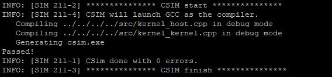
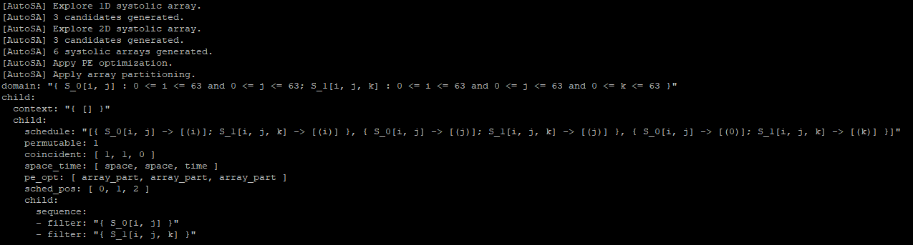
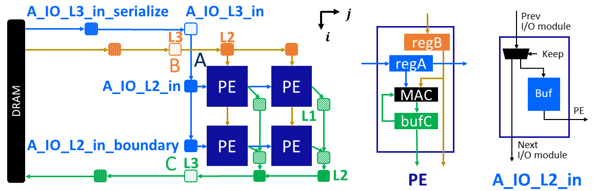

## Tutorial

This is a tutorial about how to use AutoSA, a polyhedral-based systolic array compiler on FPGA. Throughout this tutorial, we will show you how to compile a systolic array described in Xilinx HLS C. You could use Xilinx synthesis tools to synthesize the generated designs and map onto Xilinx FPGAs.

Before we start, please make sure you install AutoSA proper following the guidelines on [AutoSA Repo](https://github.com/UCLA-VAST/AutoSA). We have also provided a Docker image that you can use. Use the following command to pull the Docker image and run it directly.
```
docker pull whbldhwj/autosa:latest
```

## Example 1: Matrix Multiplication
In this example, we will show you the basic features of AutoSA that compiles a matrix multiplication kernel into a systolic array. You could also find the example [here](https://github.com/UCLA-VAST/AutoSA/tree/master/autosa_tests/mm).

Our input source code is [kernel.c](https://github.com/UCLA-VAST/AutoSA/blob/master/autosa_tests/mm/kernel.c). In this code, we use pragmas to annotate the code region to compile to systolic arrays.
```C
#pragma scop
for (int i = 0; i < I; i++)
  for (int j = 0; j < J; j++) {
    C[i][j] = 0;
    for (int k = 0; k < K; k++) 
      C[i][j] = C[i][j] + A[i][k] * B[j][k];
  }
#pragma endscop  
```

Then, run the following command to compile this code to a systolic array design.
```bash
./autosa ./autosa_tests/mm/kernel.c --config=./autosa_config/autosa_config.json --target=autosa_hls_c --output-dir=./autosa.tmp/output --sa-sizes="{kernel[]->space_time[3];kernel[]->array_part[16,16,16];kernel[]->latency[8,8];kernel[]->simd[2]}" --simd-info=./autosa_tests/mm/simd_info.json --host-serialize --hls
```

You should be able to find the generated files in the directory `autosa.tmp/output/src`. The directory looks like
```
autosa.tmp
└───output
    └── src
        ├── kernel.c
        ├── kernel.h
        ├── kernel_host.cpp
        ├── kernel_kernel.cpp
        └── kernel_kernel.h
```

The files `kernel.c` and `kerne.h` are input files. The file `kernel_host.cpp` is the host file that prepares the data for the kernel, calls the kernel, and verifies the results. The files `kernel_kernel.cpp` and `kernel_kernel.h` contain the Xilinx HLS C code that describes the systolic array.

Now let's try to run the C simulation to verify the correctness of the generate design. Copy the `hls_script.tcl` from `${AUTOSA_ROOT}/autosa_scripts/hls_scripts` to `${AUTOSA_ROOT}/autosa.tmp/output/`.
```bash
cp autosa_scripts/hls_scripts/hls_script.tcl autosa.tmp/output/
cd autosa.tmp/output/
vivado_hls -f hls_script.tcl
```

If everything goes smoothly, you should be able to see the `Passed` message in your terminal. This indicates the C simulation finished successfully without any error.

<p align="center">

</p>

To synthesize the kernel using Xilinx HLS, uncomment the line `csynth_design` in the TCL file.

Now let's take a closer look at the AutoSA command we just used to compile a systolic array. Before we start, here is a figure that shows the overall compilation flow of AutoSA.

The figure below depicts the overall compilation flow of AutoSA.

<p align="center">
  
</p>  

1. **Model extraction**: This step extracts the polyhedral model from the input C code.
2. **Scheduling**: This step leverages the [isl](http://isl.gforge.inria.fr/) scheduler to construct a new schedule using the Pluto algorithm.
3. **Legality check**: This step checks if the generated schedule is legal to be mapped to systolic arrays.
4. **Computation management**: This step constructs the PE arrays and optimizes the micro-architecture of PEs to improve the compute efficiency.
   1. **Space-time transformation**: This step applies the space-time transformation to transform programs to systolic arrays.
   2. **Array partitioning**: This step partitions the array into smaller sub-arrays. In addition, we allow partition the array twice, named as *array_part_L2*.
   3. **Latency hiding**: This step tiles and permutes the parallel loops to the innermost to hide the pipeline latency.
   4. **SIMD vectorization**: This step vectorizes the computation inside PEs.
5. **Communication management**: This step generates and optimizes the I/O network for data communication between PEs and the external memory.
6. **Code generation**: This step generates the HLS C code.
7. **Design space exploration (optional)**: This step searches for the best design (with the least latency) given the hardware constraints.

Now let's get back to the command we used to generate a systolic array for the matrix multiplication.

```bash
./autosa ./autosa_tests/mm/kernel.c --config=./autosa_config/autosa_config.json --target=autosa_hls_c --output-dir=./autosa.tmp/output --sa-sizes="{kernel[]->space_time[3];kernel[]->array_part[16,16,16];kernel[]->latency[8,8];kernel[]->simd[2]}" --simd-info=./autosa_tests/mm/simd_info.json --host-serialize --hls
```

The first argument is the input C file that contains the code segment to be mapped to a systolic array. The second argument `--config=./autosa_config/autosa_config.json` specifies the configuration file of AutoSA. If you open the configuration file, you will find the content below.
```json
{
  "space_time": {
    "mode": "manual"
  },
  "array_part": {
    "enable": 1,
    "mode": "manual"
  },
  "array_part_L2": {
    "enable": 1,
    "mode": "manual"
  },  
  "latency": {
    "enable": 1,
    "mode": "manual"
  },    
  "simd": {
    "enable": 1,
    "mode": "manual"
  },   
  "hbm": {   
    "mode": "manual"
  }
}
```

This configuration file specifies if certain passes in the compilation flow should be enabled and also the mode of this pass. By "manual" mode, user are required to provide the optimization policy to the compiler. By "auto" mode, the compiler will choose the default policy to proceed. To switch between two different modes, modify the knobs in this file.
For example, modify the content in `autosa_config/autosa_config.json` to:
```json
"array_part": {
  "enable": 1,
  "mode": "auto"
}
```
to enable the array partitioning and execute it in the auto mode.
Modify the content to:
```json
"array_part": {
  "enable": 1,
  "mode": "manual"
}
```
to execute this step in the manual mode.

The next argument `--target=autosa_hls_c` tells AutoSA that we want Xilinx HLS C as the final code. AutoSA also supports generating Intel OpenCL. However, users are recommended to use the Xilinx back-end for now as the Intel back-end is still under development and is less stable than the Xilinx counterpart. 

The argument `--output-dir=./autosa.tmp/output` tells AutoSA to place the generated files under this folder.

The next argument `--sa-sizes="{kernel[]->space_time[3];kernel[]->array_part[16,16,16];kernel[]->latency[8,8];kernel[]->simd[2]}"` provides the detailed optimization strategies for each compilation pass as we mentioend above. We will go through them one by one.

* __Space-time transformation__:
In this step, multiple systolic arrays are generated for the input program. We will need to select one systolic array to proceed. We set this step to manual mode in the AutoSA configuration file. 
```json
"space_time": {  
  "mode": "manual"
}
```
Then run the command:
```c
./autosa ./autosa_tests/mm/kernel.c --config=./autosa_config/autosa_config.json --target=autosa_hls_c --output-dir=./autosa.tmp/output
```
AutoSA will generate a file `autosa.tmp/output/tuning.json` which includes guidance information for further optimization. In this example, we have the content below:
```json
"space_time": {
  "n_kernel": 6
}
```
This tells the user that there are 6 different systolic array candidates that are generated. We may select one of them to proceed. For example, we could select the fourth candidate which is a 2D systolic array with the data from matrix `A` transferred horizontally, and data from matrix `B` transferred vertically. Each PE computes one element of `C[i][j]` locally, which is drained out at last to the external memory. The architecture of this array is depicted below. 

<p align="center">

</p>

To guide AutoSA to select this design, we will provide AutoSA with the new argument
```
--sa-sizes="{kernel[]->space_time[3]}"
```
which tells AutoSA to select the fourth array (index starting from 0) during the space-time transformation.

* __Array partitioning__: In this step, we will tile the space loops to partition the original array into smaller ones. The computation is then scheduled onto the sub-arrays in sequence. We first set this step in manual mode. Then run the command:
```c
./autosa ./autosa_tests/mm/kernel.c --config=./autosa_config/autosa_config.json --target=autosa_hls_c --output-dir=./autosa.tmp/output --sa-sizes="{kernel[]->space_time[3]}"
```
The `tuning.json` contains the content below:
```json
"array_part": {
  "tilable_loops": [64, 64, 64],
  "n_sa_dim": 2
}
```
The first line tells users there are three candidate loops that can be tiled. The upper bounds of each loop is 64. We may select any tiling factor no greater than 64. Besides, AutoSA only supports tiling factors as sub-multiples of the loop bounds for now. If the user is interested to understand which three loops are selected as the candidate loops, add the option `--AutoSA-verbose` to the command and run again.
```c
./autosa ./autosa_tests/mm/kernel.c --config=./autosa_config/autosa_config.json --target=autosa_hls_c --output-dir=./autosa.tmp/output --sa-sizes="{kernel[]->space_time[3]}" --AutoSA-verbose
```
Below is the printed information from AutoSA.



AutoSA prints the schedule tree of the program and mark the candidate loops to be optimized. Please refer to the manual of [isl](http://isl.gforge.inria.fr/) for details of the schedule tree. In this case, all the loops `i`, `j`, and `k` are tilable loops and can be used for array partitioning. Therefore, in the field of `pe_opt`, all three loops are marked `array_part`, indicating they are selected as the candidate loops.

As an example, we select the tiling factors `[16,16,16]`. Run the command below:
```c
./autosa ./autosa_tests/mm/kernel.c --config=./autosa_config/autosa_config.json --target=autosa_hls_c --output-dir=./autosa.tmp/output --sa-sizes="{kernel[]->space_time[3];kernel[]->array_part[16,16,16]}"
```

* __Latency hiding__: In this step, we will select parallel loops, tile them, permute them to the innermost to hide the computation latency. After the previous step, we will find the content below in the `tuning.json`:
```json
"latency": {
  "tilable_loops": [16, 16]
}
```
We select the tiling factors `[8,8]` to proceeed. Run the command:
```c
./autosa ./autosa_tests/mm/kernel.c --config=./autosa_config/autosa_config.json --target=autosa_hls_c --output-dir=./autosa.tmp/output --sa-sizes="{kernel[]->space_time[3];kernel[]->array_part[16,16,16];kernel[]->latency[8,8]}"
```

* __SIMD vectorization__: In this step, we will select the vectorizable loop, tile them, permute them to the innermost. The point loop will be unrolled by HLS at last. In the current AutoSA, a loop is set as the target loop for vectorization if meeting the following criteria:
  * It is a parallel loop or reduction loop annodated by users. 
  * All array references within the loop are stride-one or stride-zero in regard to this loop.
For the reduction loops, AutoSA requires users to annotate the loop manually. This is done by providing a `simd_info.json` file to the compiler. For our example, we can provide a `simd_info.json` file with the content below:
```json
"kernel3": {
  "reduction": ["y"]
}
```
AutoSA will examine each time loop in the program. For matrix multiplication example, we only have one time loop. This file tells AutoSA that the first non-parallel time loop it encounters is a reduction loop. By supplying this file to AutoSA, AutoSA will take this loop into consideration. Run the command below to proceed:
```c
./autosa ./autosa_tests/mm/kernel.c --config=./autosa_config/autosa_config.json --target=autosa_hls_c --output-dir=./autosa.tmp/output --sa-sizes="{kernel[]->space_time[3];kernel[]->array_part[16,16,16];kernel[]->latency[8,8]}" --simd-info=./autosa_tests/mm/simd_info.json
```
And we can find the updated `tuning.json`:
```json
"simd": {
  "tilable_loops": [16],
  "scores": [15],
  "legal": [1],
  "sa_dims": [2, 2]
}
```
This tells us that the candidate loop has the upper bound of 16. We assign a score based on heuristics to each candidate loop. The higher the score is, the more hardware-friendly it is when being selected as the SIMD loop. The item `legal` indicates that this loop can be directly used for optimization. Otherwise, we will need to perform further layout transformation on the arrays used by the program to expose the SIMD opportunity. AutoSA will automatically print out how to perform the layout transformation for such loops.

We select the tiling factor `[2]` and proceed. Run the command:
```c
./autosa ./autosa_tests/mm/kernel.c --config=./autosa_config/autosa_config.json --target=autosa_hls_c --output-dir=./autosa.tmp/output --sa-sizes="{kernel[]->space_time[3];kernel[]->array_part[16,16,16];kernel[]->latency[8,8];kernel[]->simd[2]}" --simd-info=./autosa_tests/mm/simd_info.json
```
After this step, you should be able to find the files of the generated arrays in `autosa.tmp/output/src`.

There are two more arguments that we haven't explained yet. 
`--host-serialize` tells AutoSA to serialize the data required by the kernel on the host CPU before sending to FPGA. This helps increase the burst length and improves the effective DRAM bandwidth. 
`--hls` tells AutoSA to generate Xilinx HLS host code. If not specified, AutoSA, by default, will generate Xilinx OpenCL host code used by Xilinx Vitis flow.

A complete list of all the compilation options can be found below.
### AutoSA Compilation Options
* __`--autosa`__: Use AutoSA to generate systolic arrays. Default: yes.
* __`--config=<config>`__: AutoSA configuration file.
* __`--data-pack`__: Enable data packing for data transfer. Default: yes.
* __`--data-pack-sizes=<sizes>`__: Data packing factors for L1/L2/L3 I/O modules. Default: `kernel[]->data_pack[8,32,64]`
* __`--double-buffer`__: Enable double-buffering for data transfer. Default: yes.
* __`--double-buffer-style=<id>`__: Choose the double buffer coding style: 0 - while loop 1 - for loop. Default: 1.
* __`--fifo-depth=<depth>`__: FIFO depth. Default: 2.
* __`--hbm`__: Use multi-port DRAM/HBM (Alpha). Default: no.
* __`--hbm-port-num=<num>`__: Default HBM port number. Default: 2.
* __`--hls`__: Generate Xilinx HLS host, otherwise, OpenCL host is generated. Default: no.
* __`--host-serialize`__: Serialize the data on the host side to improve the effective DRAM BW (Alpha). Default: no.
* __`--insert-hls-dependence`__: Insert Xilinx HLS dependence pragma (Alpha). Default: no.
* __`--int-io-dir=<dir>`__: Set the default interior I/O direction: 0 - [1,x] 1 - [x,1]. Default: 0.
* __`--loop-infinitize`__: Apply loop inifinitization optimization (Intel OpenCL only). Default: no.
* __`--local-reduce`__: Generate non-output-stationary array with local reduction (Alpha). Default: no.
* __`--reduce-op=<op>`__: Reduction operator (must be used with local-reduce together).
* __`--lower-int-io-L1-buffer`__: Lower the L1 I/O buffer for interior I/O modules. Default: no.
* __`--max-sa-dim=<dim>`__: Maximal systolic array dimension. Default: 2.
* __`--output-dir=<dir>`__: AutoSA output directory. Default: `./autosa.tmp/output`
* __`--sa-sizes=<sizes>`__: Computation management options.
* __`--sa-tile-size=<size>`__: Default tile size in computation management. Default: 4.
* __`--sa-type=sync|async`__: Systolic array type. Default: async.
* __`--simd-info=<info>`__: SIMD information.
* __`--simd-touch-space`__: Taking space loops into consideration for SIMD vectorization. Default: no.
* __`--two-level-buffer`__: Enable two-level buffering in I/O modules. Default: No.
* __`--uram`__: Use Xilinx FPGA URAM. Default: No.
* __`--use-cplusplus-template`__: Use C++ template in codegen (necessary for irregular PEs). Default: no.
* __`--AutoSA-verbose`__: Print verbose compilation information. Default: No.

You could run
```bash
./autosa --help
```
to print out the compilation options.

We have also provided several other design examples. You may find them at the front page of the AutoSA repo [here](https://github.com/UCLA-VAST/AutoSA).

### Detailed explanation of the matrix multiplication systolic array design.
Here we provide a more detailed explanation of the generated systolic array design for the matrix multiplication example. Below is the detailed architecture description of the generated systolic array.

<p align="center">

</p>

For this 2D systolic array, we map loops `i` and `j` to the row and column of the systolic array. Data from matrix `A` are reused along the `j`-axis, and data from matrix `B` are reused along the `i`-axis. Each PE computes the elements of matrix `C` locally and will be drained out once finished. To send the data from the external memory (DRAM) to the array, we construct a I/O network to transfer the data. As you may see in this figure, 

## Any Questions
If you have any difficulties using AutoSA, please feel free to open an issue in the repo or send an e-mail to me (jiewang@cs.ucla.edu).
